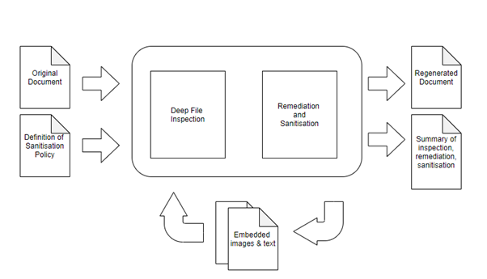
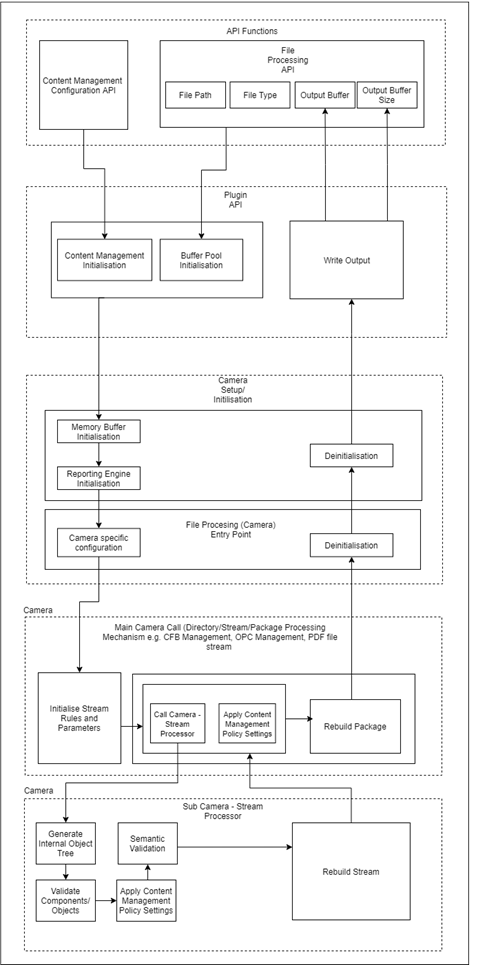

## Glossary 

|     Term            |     Description                                                                                                                                                                                         |
|---------------------|---------------------------------------------------------------------------------------------------------------------------------------------------------------------------------------------------------|
|     Validation      |     The cyclic process of evaluating and identifying the structural issues and potentially dangerous objects embedded in a file                                                                         |
|     Remediation     |     The process of correcting a file to the defined standard for its specific format                                                                                                                    |
|     Sanitisation    |     The process of removing the potentially dangerous objects from the file being processed based on the sanitisation policy or "content management switches", which are specific to the file type      |
|     Camera          |     The module responsible for processing a particular file format or stream                                                                                                                            |

## Engine Overview

The core engine processes known file types by reading in the file and a user-defined sanitisation policy file often 
called the "content management settings". The first action the engine takes is to conduct a deep file inspection. 
This is done in cycles (For example, structure, sizing,  syntax, semantics), with each cycle providing the output for 
the next cycle. The inspection outputs are all stored in memory and used later for the remediation and sanitisation 
steps which operate in a similar cyclic manner to regenerate a new file. 

See diagram below.

### Key Processing Modes

|     Mode                   |     Description                                                                                                                                                              |
|----------------------------|------------------------------------------------------------------------------------------------------------------------------------------------------------------------------|
|     Protect                |     Regeneration mode whereby the file is analysed, repaired and a safe substitute copy is produced                                                                          |
|     Analysis               |     Produces a detailed report highlighting content that is contained within a file and the actions that the Glasswall engine carries out during the regeneration process    |
|     Import & Export        |     Export and import content items from PDF and MS-Office documents                                                                                                         |
|     Determine File Type    |     Identify the file type of a provided file                                                                                                                                |
|     Protect Lite           |     A light weight version of protect mode, whereby the file is analysed and cleaned based on policy settings and a safer substitute copy is produced                                                                          |
|     Analysis Lite          |     A light weight version of analysis mode containing a detailed report highlighting content the actions that the Glasswall engine carries out during the regeneration process    |

#### Lite Mode

Glasswall has an additional processing mode known as Lite. This allows Glasswall Rebuild to be more lenient in the 
interrogation of the input file manufacturer specification, whilst still providing the same high standard protection of 
sanitising content items regular protect mode processing provides. 

| Protect Mode | Lite Mode |
| --- | --- |
| Full Content Management Usage | Full Content Management Usage |
| Full Specification Validation | Minimal Validation |
| Full Specification Remediation | No Remediation |

The table below lists the document types that are supported for lite processing.  

|File Extension|Sub Type(s)|Document Type
|---|---|---
|pdf| |                                           Portable Document Format
|doc|             dot|                            Word Binary
|xls|             xlt|                            Excel Binary
|ppt|             pot|                            PowerPoint Binary
|docx|            docm, dotx, dotm|               Office Open XML Document

|xlsx|            xlsm, xltx, xltm|               Office Open XML Workbook
|pptx|            pptm, ppsx, ppam, potm, ppsm|   Office Open XML Presentation

## Architecture Overview

The interface for the Glasswall API is broken into three main sections covering the principle functionality provided by 
the library:
-	**Glasswall Configuration Functions** - There are many processing options that enable third-party users to fine-tune the 
    library's operation to their specific needs. Changes are made to the Glasswall configuration through the 
    Configuration Management API.
-	**Glasswall Document Processing** – There are several API functions for document processing, each with different input 
    and output parameters to accommodate the various ways in which the Glasswall Rebuild engine can be integrated and 
    used. For instance:-
    -	**File to File** – Disk to disk operations
    -	**File to Memory** – Disk to memory operations
    -	**Memory to Memory** – Memory to memory operations, where no disk storage is available
-	**Glasswall Resource Management** - These utilities may be used by the client to release allocated resource once 
    Glasswall processing has been completed.

The term 'camera' refers to the mechanism responsible for processing a particular file format or file stream. A Camera 
can invoke other Cameras for reasons such as the processing of embedded objects or individual streams in documents made 
up of more than one stream. 

Similar to a plugin architecture, the Glasswall engine architecture can be visualised as a 
core system with several cameras hooked up to it. Each camera or chain of cameras provides the ability to process a 
particular file format. The design enables us to add support for file formats as camera plugins to the core application, 
providing extensibility, flexibility, and isolation of features and customs processing logic.

Excluding the cameras created during early development (referred to as legacy cameras), most existing cameras are 
created using automatic code generation via an inhouse developed toolchain called UCP (Universal Camera Platform). 
See [Auto-Generated Cameras](/) and [Legacy Cameras](/).

The diagram below provides a simplistic view of the architecture.

***Diagram***

## Related Links
- [Auto-Generated Cameras](/)
- [Legacy Cameras](/)