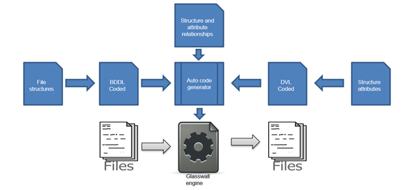
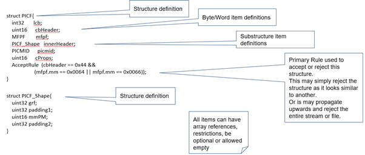
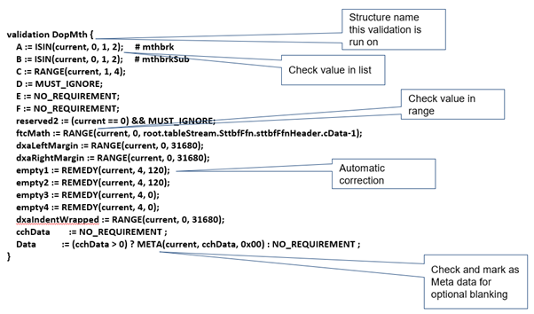

## Overview

Glasswall adds support for new file formats using automatic code generation via an inhouse developed toolchain called 
UCP (Universal Camera Platform), as shown in the diagram below.

### Binary Data Definition Language (BDDL)

Structure definitions are extracted from the file format specification and coded in a domain-specific language known as 
BDDL. BDDL allows us to define the format of a binary (or string-based) file format in terms of the sequence and layouts 
of the structures that it is comprised of. It defines the structures, how they may be used and their valid forms.

#### Example

### Data Validation Language (DVL)

Glasswall developed a second DSL (Domain Specific Language) which adds a secondary layer of validation to the process. 
It complements the BDDL Definitions in that it used to validate the properties within a BDDL structure. It defines the 
valid values (discrete and range) of variables in the file structures and the items that can be managed through content 
management policy settings.

#### Example

### Code Generation Summary

The following points provide a summary of the code generation process.

- Auto-generated C++ code from BDDL / DVL
    - BDDL file describes the physical format of each file type or component stream within compound files.
    - A viewing tool is used to visualise the structure for a single example during BDDL development. A bulk tester is 
    used to confirm the structure reads and writes the files consistently before further changes are made to the BDDL 
    file(s).
- The code generator is used to create all the read and write functions for every object (structure) described in the 
BDDL’s as well as validation functions for every object containing all the rules applying to it as described in the DVL’s
- Integration with handwritten code - gets linked to call-backs referenced in the BDDL, and any handwritten DVL Code 
gets added to a call-back from the validation iterator.

## Related Links
- [Binary Data Definition Language](/docs/2-glasswall_core/2_3-common/2_3_1-bddl/2_3_1_1-bddl)
- [Data Validation Language](/docs/2-glasswall_core/2_3-common/2_3_2-dvl)
- [Glasswall C++ Code Generators](/docs/2-glasswall_core/2_3-common/2_3_3-GlasswallCodeGenerators)
