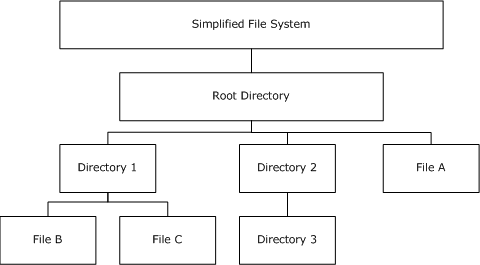
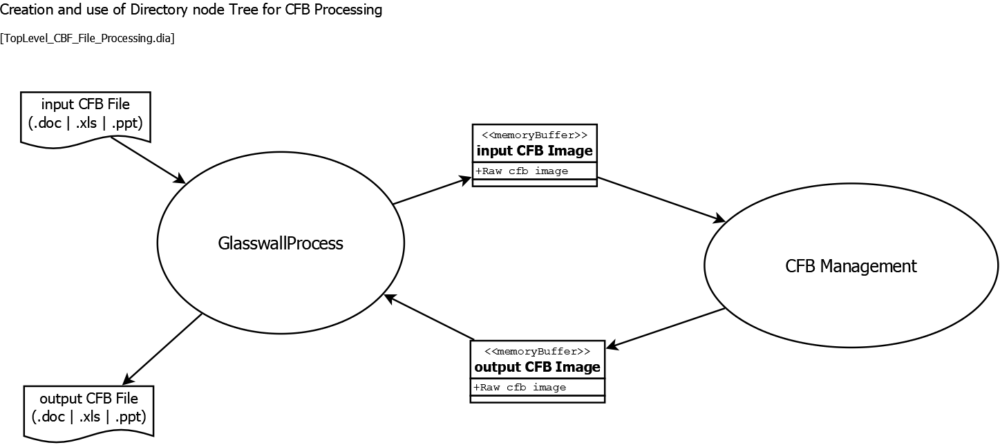
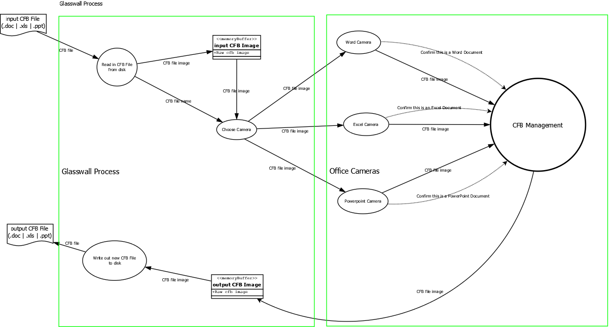
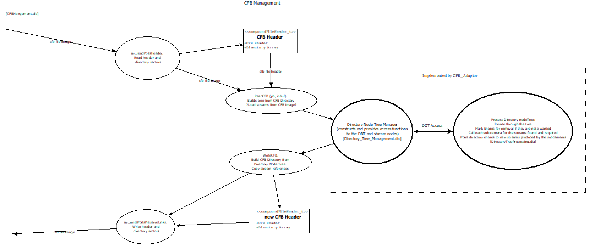

import useBaseUrl from '@docusaurus/useBaseUrl';

# Overview

## Compound File Binary (CFB)

Office binary document streams and objects are packaged in structure called the Microsoft Compound File Binary (CFB) 
file format, also known as the Object Linking and Embedding (OLE) or Compound Object Model (COM) structured storage 
compound file implementation. 

Traditional file systems encounter challenges when they attempt to efficiently store multiple kinds of objects in one 
document. A compound file provides a solution by implementing a simplified file system within a file. Structured 
storage defines how to treat a single file as a hierarchical collection of two objects, *storage objects* and *stream 
objects*.

	Storage Objects - Behave as directories.
	Stream Objects  - Behave as files.

This scheme is called *structure storage*. The purpose of the structured storage is to reduce the performance penalties 
and overhead associated with storing separate objects in a flat file.

The following figure shows a simplified file system with multiple directories and files nested in a hierarchy.

## CFB File Processing

Each office binary file type (.doc, .xls, .ppt) contain streams specific to the file type, stored within the CFB 
structure. The CFB structure must first be processed by Glasswall before individual streams are handed of to their 
related cameras (doc camera, xls camera etc.). 

The diagrams below give an overview of how Glasswall processes a CFB file.

### Top Level Diagram

[Top Level CFB File Processing](img/00_TopLevel_CBF_File_Processing.dia)

### CFB File Processing Diagram

[CFB File Processing](img/01_CFB_FILE_PROCESSING.dia)

### CFB Management

#### Overview Diagrams

##### Image Downloads
- [CFB Management](img/02_CFBManagement.dia)  

#### Description

**TBD**

## Office Binary Cameras

### Overview

**TBD**

# Related Links

- [**Binary File Format Specifications**](../../../../8-related/8_1-specifications/8_1_1-ms_office/8_1_1_2-office_binary.md)

