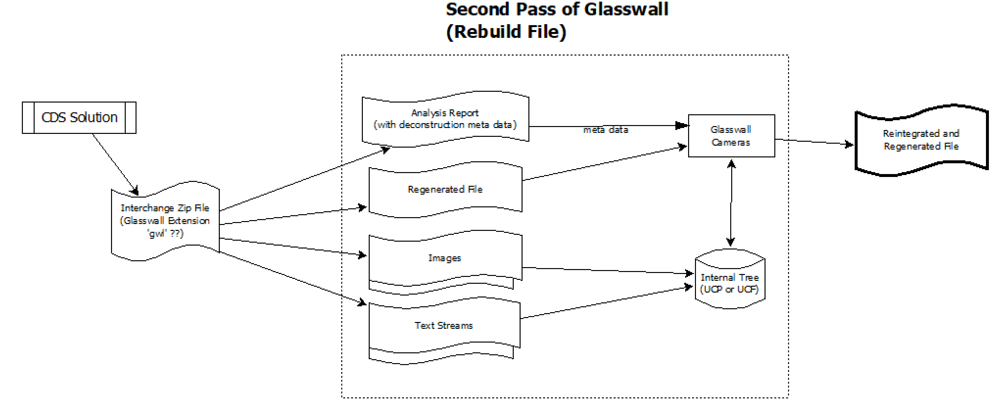
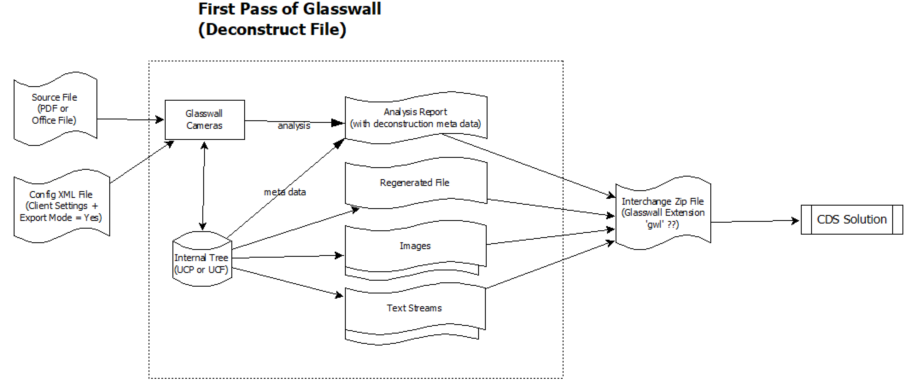

## Overview
### Description

Glasswall provides the ability to export and import certain content items from PDF and Microsoft Office documents.

In order to enable the user to carry out additional analysis on components within files, the files must be processed by 
the engine twice, once to extract a package containing a processed file and report the extracted components, and a 
second pass to reintegrate the externally analysed and/or modified components back into the document. The files are 
re-validated and regenerated for each pass to ensure file integrity.

The following bullet points list the exportable content supported in Export Mode.
- Images
    - PNG
    - JPEG
    - GIF
    - EMF
    - WMF
    - TIFF

- Text - This covers all text stored in a document.

The following bullet points list the importable content supported in Import Mode.
- Images
    - PNG
    - JPEG
    - GIF
    - EMF
    - WMF
    - TIFF

### Import Exchange Process

### Export Exchange Process

import useBaseUrl from '@docusaurus/useBaseUrl';

#### Image Downloads

- [Import Exchange Process](img/Import-Exchange-Process.dia)   

- [Export Exchange Process](img/Export-Exchange-Process.dia) 
