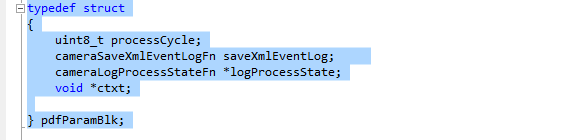
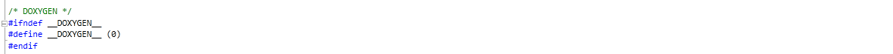
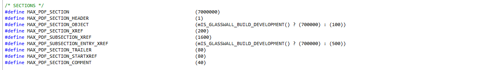
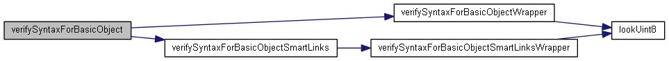

# Document History

Table 1: Document Change History


| **Issue Date**  | **Issue Number** | **Description**                    |
|---|---|---|
| 27^th^ Oct 2011 | 1.01           | Original Document                    |
| 4^th^ Nov 2011  | 1.02           | Add high-level architecture diagrams |
| 8^th^ Nov 2011  | 1.03           | Added Semantic Checking Section      |
| 8^th^ Nov 2011  | 1.04           | Added DOXYGEN call charts            |
| 9^th^ Nov 2011  | 1.05           | Added section DATA VIEW<br></br> Extend section INTERFACE_VIEW |


# REFERENCES

  *Ref Number*   *Document*
  -------------- --------------------------------------------------
  *1*            *ISO_32000-1;2008(E)-Character_PDF_document.pdf*

# SUMMARY

The document is divided into the following sections:-

-   Software Architecture (Glasswall PDF Camera and System)
    -   **Context --** the system landscape and software requirements
        -   Overview
        -   Code Review
        -   PDF Syntax checking OVERVIEW.
            -   PDF HEADER checking
            -   PDF BODY checking
                -   Non-stream objects syntax checking
                -   Stream objects inflation
                -   Stream objects syntax checking
            -   PDF CROSS-REFERENCE checking
            -   PDF TRAILER checking
        -   PDF Semantic checking
        -   PDF File Assembly and Regeneration
            -   Glasswall process intermediate output buffer
            -   Token List Processing
                -   PDF assembled output buffer
                -   XML Log output buffer
                -   XML output buffer
        -   PDF File Corrections (ie whitespace cleaning / missing
            tokens / offsets / semantic cleaning )
        -   PDF File Cleaning (i.e. standard format / file content management)
-   **Non-Functional View --** Performance, Security, Extensibility
    considerations.
-   **Architectural Principles --** What was crucial for this
    architecture -- process divided into numerous passes for reliability
    etc.
-   **Logical View --** High-level view of how all hangs together --
    i.e. tokenisation, tree walk, syntax and semantics -  suggest mainly
    pictorial.
-   **Interface View --** What are interfaces/API, who owns them etc.?
    Pictorial representation.
-   **Design View --** Lower level view of how all hangs together --
    more detail on each of the Logical view elements above.
-   **Deployment View --** maybe briefly discuss C\# app.
-   **Data View --** outputs, i.e. description of Logs/Audit trails.

## 1 PDF Camera (landscape and software requirements)

### 1.1 Overview

The Glasswall PDF software camera ensures that a PDF document conforms
to specified PDF syntax ( see ref 1 -
***ISO_32000-1;2008(E)-Character_PDF_document.pdf***), according to the
PDF version (1.0, 1.1, 1.2, 1.3, 1.4, 1.5, 1.6, 1.7) and that the use of
PDF syntax is semantically \"safe\" in view of a PDF file being opened
by a conforming PDF reader/writer.

The Wikipedia definition of the words semantic
([*http://en.wikipedia.org/wiki/Semantic*](http://en.wikipedia.org/wiki/Semantic)
) and syntactic *<http://en.wikipedia.org/wiki/Syntactic> )*

**"Semantics** (from
[Greek](http://en.wikipedia.org/wiki/Greek_language) *sēmantiká*, neuter
plural of
*sēmantikós*)^[[\[1\]](http://en.wikipedia.org/wiki/Semantic#cite_note-0#cite_note-0)[\[2\]](http://en.wikipedia.org/wiki/Semantic#cite_note-1#cite_note-1)]{.ul}^
is the study of meaning. It typically focuses on the relation between
*signifiers*, such as [words](http://en.wikipedia.org/wiki/Word),
[phrases](http://en.wikipedia.org/wiki/Phrase),
[signs](http://en.wikipedia.org/wiki/Sign) and
[symbols](http://en.wikipedia.org/wiki/Symbol), and what they stand for.<br></br>
**Semantics** in [computer
science](http://en.wikipedia.org/wiki/Computer_science) refers to the
meaning of languages instead of their form (syntax). Additionally, the
term *semantic* is applied to certain types of data structures
specifically designed and used for representing information content.<br></br>
**Syntax** (from [Ancient
Greek](http://en.wikipedia.org/wiki/Ancient_Greek)
[σύνταξις](http://en.wiktionary.org/wiki/%CF%83%CF%8D%CE%BD%CF%84%CE%B1%CE%BE%CE%B9%CF%82)
\"arrangement\" from σύν *syn*, \"together\", and τάξις *táxis*, \"an
ordering\") is the study of the principles and rules for constructing
[sentences](http://en.wikipedia.org/wiki/Sentence_(linguistics)) in
[natural languages](http://en.wikipedia.org/wiki/Natural_language)."

The PDF camera implements the Glasswall core (ANALYSE, MANAGE and
PROTECT) with

the following features:-

-   Syntax and semantic checks according to reasonable limits determined
    from analysing the PDF specification and a large sample (i.e. the
    cyber herd) of PDF files to be found available today on the World
    Wide Web.

-   Detect and correct specific PDF file errors according to an internal
    configuration of possible PDF file corrections. For example, missing
    whitespace can be restored (e.g. at the end of a PDF stream token),
    or incorrect offsets within a cross-reference table can be
    recalculated if these are detected.

-   A configurable file cleaning mechanism that allows client software
    to request the removal of specific PDF file content. For example,
    Java-script actions or the PDF document information table within a
    PDF file.

-   An innovative tokenisation mechanism to create a software map of PDF
    file content which lends itself to software
    checking/correcting/cleaning and regeneration of a file from PDF
    basic object tokens.

-   A file buffer regeneration function that assembles PDF software
    tokens into a single standard header and a body of PDF objects
    followed by a single cross-reference table and a single trailer.

-   A process cycle model (4 cycles) which activates specific camera
    functionality according to the process cycle.

    -   CYCLE 0 -- PRE-FILTER: application of a software \"stencil\" to
        include all PDF objects found in the token tree walk starting at
        the beginning of the trailer dictionary. Any PDF objects which
        are not within the token tree walk will be excluded from the
        file buffer. This cycle also makes any corrections to the 
        contents of pdf object dictionaries andregenerates a file memory
        buffer containing a single header, all PDF objects, a single
        cross-reference section and a single trailer.

    -   CYCLE 1 -- CLEANING: apply Glasswall MANAGE policies (ALLOW, REMOVE,
        DISALLOW) to file content. Apply semantic corrections to tokens
        including PDF content streams which are decompressed on this cycle.

    -   CYCLE 2 -- POST-FILTER: application of a software stencil to include
        all PDF objects found in the token tree walk starting at the
        beginning of the trailer dictionary. This cycle ensures that any
        un-wanted content from the cleaning cycle is not included in the
        regenerated file buffer.

    -   CYCLE 3 -- PROTECT: apply Glasswall PROTECT policies to file
        content. Ensures that font faces may be opened and are formed
        correctly. Perform the various semantic walks to analyse the
        document and ensure that it is formed correctly (e.g. a single
        Catalog dictionary with various name and number trees stemming from
        the catalog).

### 1.2 Code Review (PDF Camera)

The software architecture and design for the Glasswall PDF camera is
divided into code groups as shown below:-


The Glasswall PDF camera code groups are:-

-   CAMERA PROCESS CYCLES AND FILE REPORTING
-   CAMERA ARCHITECTURE (FILE STRUCTURE AND OBJECTS)
-   CONFIGURATION
-   FILTERS
-   TOKENISATION AND SYNTAX CHECKING
-   SEMANTIC CHECKING
-   CLEANING AND CONTENT MANAGEMENT
-   FILE REGENERATION
-   DEBUG/TEST SYSTEM
-   MANAGE CONTENT
-   ANALYSE CONTENT

According to the PDF specification, the PDF camera\'s codebase has been
developed to process PDF Syntax and semantic content ( see ref 1 -
ISO32000).<br></br>
The PDF Camera codebase performs multiple scans of PDF file. The content
consists of a header, body (*PDF objects)* and the cross-reference
section(s) and trailer(s).

#### 1.2.1 PDF camera processing cycle

In each camera process cycle, the PDF camera parses the header, the body
(*PDF objects)*, the cross-reference section(s) and the trailer(s) to
create a tokenised representation as basic PDF object tokens. Basic
syntax and reasonable limits check are performed during tokenisation.

**Note** that Glasswall has developed a proprietary internal software
tokenised format for PDF tokens.

During tokenisation, the PDF compressed object streams, cross-reference
streams and encrypted content are decompressed from the file compressed
format (e.g. Crypt, FlateDecode), to a decompressed format during token
processing.

After tokenisation, software tokens are further processed to verify that
the PDF file structure is correct. The various semantic data structures
(i.e. PDF Pages, etc.) are completed, and checks are carried out to
ensure reasonable limits are not exceeded.

A camera process cycle may apply content management policies or protect
policies which request removal of MANAGED content or STOP processing if
such content is deemed to be completely unacceptable.

**Note** that during tokenisation and semantic checking then tokens
which are detected as incorrect may be either corrected or removed (i.e.
a MANAGE process cycle).

There is also a tokenisation-on-demand function which allows the
compressed contents of PDF streams to be decompressed and tokenised for
further processing by the semantic processor. A notable example would be
tokenisation-on-demand of content streams when marked-content should be
removed from such content streams.

At the end of the PDF camera process cycle, the tokenised representation
is regenerated to an output file buffer. Any correction requests to
tokens are applied at this stage, and any tokens that should be removed
are not regenerated to the output buffer.

The various report file buffers are made available at this stage,
including an XML log, an XML representation and an engineering trace
log.

#### 1.2.2 PDF camera cycles

The PDF camera is applied through multiple scans (i.e. process cycles )
with swapping of each stage\'s output buffer to be the next stage\'s
input buffer, to achieve modularisation of PDF camera functionality.

This approach of multiple scans of processed file content applies a
software pipe-line concept with a filter stage at each node. The filter
stage at each node on the software pipe-line encapsulates certain
functionality which may not be easily applied simultaneously at all
pipe-line nodes.

The PDF camera requires four process cycles to fully implement its
required functionality of ANALYSE, MANAGE and PROTECT.

#### 1.2.3 PDF camera (modules)

The software architecture and design for the Glasswall PDF camera is
subdivided into software modules as shown below:-

-   [Glasswall pdf
    camera.](file:///C:\TFS\Glasswall\dev\glasswall.classic\Documentation\html\group__pdf_camera.html)
    -   [Camera architecture (file structure and
        objects)](file:///C:\TFS\Glasswall\dev\glasswall.classic\Documentation\html\group__pdf_architecure.html)
        -   [Context helper
            functions.](file:///C:\TFS\Glasswall\dev\glasswall.classic\Documentation\html\group__pdf_context.html)
            -   [Encryption context functions (GENERATE_KEY, DECRYPT,
                TEST_ENCRYPTION)](file:///C:\TFS\Glasswall\dev\glasswall.classic\Documentation\html\group__pdf_context_encryption.html)
            -   [Initialisation of the context and access to the static
                configuration.](file:///C:\TFS\Glasswall\dev\glasswall.classic\Documentation\html\group__pdf_context_init.html)
            -   [Processing of the context and management of
                messages.](file:///C:\TFS\Glasswall\dev\glasswall.classic\Documentation\html\group__pdf_context_process.html)
            -   [Management of pdf
                sections.](file:///C:\TFS\Glasswall\dev\glasswall.classic\Documentation\html\group__pdf_context_section.html)
            -   [Legacy key processor
                functions.](file:///C:\TFS\Glasswall\dev\glasswall.classic\Documentation\html\group__pdf_context_key_process.html)
            -   [Process stream data (DECOMPRESS, DECRYPT,
                TOKENISE)](file:///C:\TFS\Glasswall\dev\glasswall.classic\Documentation\html\group__pdf_context_stream.html)
            -   [Utility helper
                functions.](file:///C:\TFS\Glasswall\dev\glasswall.classic\Documentation\html\group__pdf_context_utils.html)
        -   [Toolset helper
            functions.](file:///C:\TFS\Glasswall\dev\glasswall.classic\Documentation\html\group__pdf_toolset.html)
            -   [Process toolset
                functions.](file:///C:\TFS\Glasswall\dev\glasswall.classic\Documentation\html\group__pdf_toolset_process.html)
            -   [Token tree
                walk.](file:///C:\TFS\Glasswall\dev\glasswall.classic\Documentation\html\group__pdf_toolset_token_tree_walk.html)
    -   [Cleaning helper
        functions.](file:///C:\TFS\Glasswall\dev\glasswall.classic\Documentation\html\group__pdf_cleaning.html)
        -   [Cleaning syntax
            helpers.](file:///C:\TFS\Glasswall\dev\glasswall.classic\Documentation\html\group__pdf_syntax_cleaning.html)
        -   [Stencil cleaning
            walk.](file:///C:\TFS\Glasswall\dev\glasswall.classic\Documentation\html\group__pdf_cleaning_stencil.html)
        -   [structTreeRoot cleaning
            walk.](file:///C:\TFS\Glasswall\dev\glasswall.classic\Documentation\html\group__pdf_cleaning_struct_tree_root.html)
    -   [Debug and trace helper
        functions.](file:///C:\TFS\Glasswall\dev\glasswall.classic\Documentation\html\group__pdf_debug.html)
        -   [Context information trace
            helpers.](file:///C:\TFS\Glasswall\dev\glasswall.classic\Documentation\html\group__pdf_context_info.html)
        -   [Camera test
            helpers.](file:///C:\TFS\Glasswall\dev\glasswall.classic\Documentation\html\group__pdf_camera_test.html)
        -   [Token array verification cycle
            test.](file:///C:\TFS\Glasswall\dev\glasswall.classic\Documentation\html\group__pdf_camera_token_array_verify.html)
    -   [Semantic checking
        module.](file:///C:\TFS\Glasswall\dev\glasswall.classic\Documentation\html\group__semantics.html)
        -   [Semantic checking module for Action
            dictionaries.](file:///C:\TFS\Glasswall\dev\glasswall.classic\Documentation\html\group__semantic_actions.html)
        -   [Semantic checking module for Annotation
            dictionaries.](file:///C:\TFS\Glasswall\dev\glasswall.classic\Documentation\html\group__semantic_annotations.html)
        -   [Semantic checking module for a document catalog
            dictionary.](file:///C:\TFS\Glasswall\dev\glasswall.classic\Documentation\html\group__semantic_catalog.html)
        -   [Semantic checking module for Colorspace
            dictionaries.](file:///C:\TFS\Glasswall\dev\glasswall.classic\Documentation\html\group__semantic_colorspace.html)
        -   [Semantic checking module for PDF content related objects
            and
            structures.](file:///C:\TFS\Glasswall\dev\glasswall.classic\Documentation\html\group__semantic_content.html)
        -   [Semantic checking module for PDF Font
            dictionaries](file:///C:\TFS\Glasswall\dev\glasswall.classic\Documentation\html\group__semantic_fonts.html)
        -   [Semantic checking module for Graphics State
            dictionaries.](file:///C:\TFS\Glasswall\dev\glasswall.classic\Documentation\html\group__semantic_gstate.html)
        -   [Semantic checking module for Halftone
            dictionaries.](file:///C:\TFS\Glasswall\dev\glasswall.classic\Documentation\html\group__semantic_halftone.html)
        -   [Semantic checking module for Name Tree
            objects.](file:///C:\TFS\Glasswall\dev\glasswall.classic\Documentation\html\group__semantic_name_tree.html)
        -   [Semantic checking module for Article Thread related
            structures.](file:///C:\TFS\Glasswall\dev\glasswall.classic\Documentation\html\group__semantic_threads.html)
        -   [Semantic checking module for structures within the document
            trailer.](file:///C:\TFS\Glasswall\dev\glasswall.classic\Documentation\html\group__semantic_trailer.html)
        -   [Common utility
            functions.](file:///C:\TFS\Glasswall\dev\glasswall.classic\Documentation\html\group__utilities.html)
    -   [Tokenisation and syntax checking
        functions.](file:///C:\TFS\Glasswall\dev\glasswall.classic\Documentation\html\group__pdf_syntax.html)
        -   [Font face
            validation.](file:///C:\TFS\Glasswall\dev\glasswall.classic\Documentation\html\group__pdf_syntax_font_face.html)
        -   [Contents stream (i.e. page graphical commands) stream
            processing.](file:///C:\TFS\Glasswall\dev\glasswall.classic\Documentation\html\group__pdf_syntax_stream_contents.html)
        -   [Compressed objects stream
            processing.](file:///C:\TFS\Glasswall\dev\glasswall.classic\Documentation\html\group__pdf_syntax_stream_objects.html)
        -   [Postscript type 4 stream
            processing.](file:///C:\TFS\Glasswall\dev\glasswall.classic\Documentation\html\group__pdf_syntax_stream_postscript.html)
        -   [Compressed cross-reference and trailer section stream
            processing.](file:///C:\TFS\Glasswall\dev\glasswall.classic\Documentation\html\group__pdf_syntax_stream_x_ref.html)
        -   [Standard trailer section
            processing.](file:///C:\TFS\Glasswall\dev\glasswall.classic\Documentation\html\group__pdf_syntax_trailer.html)
        -   [Standard cross-reference section
            processing.](file:///C:\TFS\Glasswall\dev\glasswall.classic\Documentation\html\group__pdf_syntax_x_ref.html)
    -   [File
        regeneration.](file:///C:\TFS\Glasswall\dev\glasswall.classic\Documentation\html\group__pdf_file_regeneration.html)
    -   [Camera process report
        files.](file:///C:\TFS\Glasswall\dev\glasswall.classic\Documentation\html\group__pdf_file_report.html)
        -   [XML
            representation.](file:///C:\TFS\Glasswall\dev\glasswall.classic\Documentation\html\group__pdf_file_report_x_m_l.html)
        -   [XML
            log.](file:///C:\TFS\Glasswall\dev\glasswall.classic\Documentation\html\group__pdf_file_report_x_m_l_log.html)
        -   [XML utility
            helpers.](file:///C:\TFS\Glasswall\dev\glasswall.classic\Documentation\html\group__pdf_x_m_l_utilities.html)
    -   [pdf
        filters.](file:///C:\TFS\Glasswall\dev\glasswall.classic\Documentation\html\group__pdf_filter.html)
        -   [Filter decompression
            cache.](file:///C:\TFS\Glasswall\dev\glasswall.classic\Documentation\html\group__pdf_filter_context_cache_compression.html)
        -   [Crypt
            filter](file:///C:\TFS\Glasswall\dev\glasswall.classic\Documentation\html\group__pdf_filter_crypt.html)
        -   [ASCIIHexDecode
            filter](file:///C:\TFS\Glasswall\dev\glasswall.classic\Documentation\html\group__pdf_filter_a_s_c_i_i_hex_decode.html)
        -   [ASCII85Decode
            filter](file:///C:\TFS\Glasswall\dev\glasswall.classic\Documentation\html\group__pdf_filter_a_s_c_i_i85_decode.html)
        -   [FlateDecode
            filter.](file:///C:\TFS\Glasswall\dev\glasswall.classic\Documentation\html\group__pdf_filter_flate_decode.html)
        -   [CCITTFaxDecode
            filter](file:///C:\TFS\Glasswall\dev\glasswall.classic\Documentation\html\group__pdf_filter_c_c_i_t_t_fax_decode.html)
        -   [DCTDecode
            filter](file:///C:\TFS\Glasswall\dev\glasswall.classic\Documentation\html\group__pdf_filter_d_c_t_decode.html)
        -   [JBIG2Decode
            filter](file:///C:\TFS\Glasswall\dev\glasswall.classic\Documentation\html\group__pdf_filter_j_b_i_g2_decode.html)
        -   [JPXDecode
            filter](file:///C:\TFS\Glasswall\dev\glasswall.classic\Documentation\html\group__pdf_filter_j_p_x_decode.html)
        -   [LZWDecode
            filter](file:///C:\TFS\Glasswall\dev\glasswall.classic\Documentation\html\group__pdf_filter_l_z_w_decode.html)
        -   [PredictorDecode filter for LZW and
            FlateDecode.](file:///C:\TFS\Glasswall\dev\glasswall.classic\Documentation\html\group__pdf_filter_predictor_decode.html)
        -   [RUnLengthEncode
            filter.](file:///C:\TFS\Glasswall\dev\glasswall.classic\Documentation\html\group__pdf_filter_run_length_encode.html)
        -   [ZLIB library also implements the FlateDecode
            filter.](file:///C:\TFS\Glasswall\dev\glasswall.classic\Documentation\html\group__pdf_filter_z_l_i_b.html)
    -   [Manage
        content](file:///C:\TFS\Glasswall\dev\glasswall.classic\Documentation\html\group__pdf_camera_manage.html)
        -   [Tag dictionaries and manage content with a stencil token
            tree
            walk.](file:///C:\TFS\Glasswall\dev\glasswall.classic\Documentation\html\group__pdf_camera_manage_tagging.html)
    -   [Analysis helper
        functions.](file:///C:\TFS\Glasswall\dev\glasswall.classic\Documentation\html\group__pdf_analyse.html)
        -   [Statistical
            analysis.](file:///C:\TFS\Glasswall\dev\glasswall.classic\Documentation\html\group__pdf_statistics.html)
            -   [Statistics for basic object types (RELEASE
                1.0)](file:///C:\TFS\Glasswall\dev\glasswall.classic\Documentation\html\group__pdf_statistics_basic_objects.html)
        -   [Analyse a token
            tree.](file:///C:\TFS\Glasswall\dev\glasswall.classic\Documentation\html\group__pdf_analyse_token_tree.html)
        -   [Analyse a token tree and tag dictionary
            tokens.](file:///C:\TFS\Glasswall\dev\glasswall.classic\Documentation\html\group__pdf_analyse_token_tree_dictionaries.html)

Additionally, sets of generic camera utility modules (i.e. the software
developer SDK) are used to process STANDARD MEMORY BUFFERS and hold
in-place strings for \"inflated/decompressed\" file content, as well as
buffered lists/arrays.

The final Glasswall processed file OUTPUT buffer are assembled from
Glasswall checked software tokens. This architecture holds to the
\"spirit\" of Glasswall as taking a digital \"**picture**\" and
re-assembling content whilst also providing complete protection given
that all content has been checked for SYNTACTIC (*appearance*) and
SEMANTIC (*meaning*) conformance before being processed to the OUTPUT
file buffer.

### 1.3 PDF Syntax Checking OVERVIEW

The syntactic checking and tokeniser pass processes the various PDF file
sections (header, body, cross-reference-table(s), trailer(s)) and fill
in various meaningful data structures within the context data structure.

This pass checks all syntax it encounters and generates an error exit if
any unexpected syntax is encountered and cannot be corrected or removed
(i.e. on a MANAGE content cycle)

#### 1.3.1 PDF HEADER checking

The first line of a PDF file consists of the 5 characters %PDF--
followed by a version number of the form 1.N, where N is a digit between
0 and 7.<br></br>
A conforming reader shall accept files with any of the following
headers:

%PDF--1.0<br></br>
%PDF--1.1<br></br>
%PDF--1.2<br></br>
%PDF--1.3<br></br>
%PDF--1.4<br></br>
%PDF--1.5<br></br>
%PDF--1.6<br></br>
%PDF--1.7<br></br>

Beginning with PDF 1.4, the **Version** entry in the document\'s catalog
dictionary (located via the **Root** entry in the file\'s trailer, *ref 1
section 7.5.5, \"File Trailer\"*), if
present, shall be used instead of the version specified in the header.

If a PDF file contains binary data, as most do (*ref 1 section 7.2,
\"Lexical Conventions\"*), the header line shall be immediately followed
by a comment line containing at least four binary characters---that is,
characters whose codes are 128 or greater. This ensures proper behaviour
of file transfer applications that inspect data near the beginning of a
file to determine whether to treat the file\'s contents as text or
binary.

The PDF file header\'s syntactic pass will ensure that the header file
content conforms to the above and may request correction of the version
number (i.e. to ensure file syntax is supported by an appropriate
version number). If the file version is corrected, then the Glasswall
binary signature token ( 0xFF 0xFF 0xFF 0xFF GLASSWALL ) is also
regenerated into the header.

On a cleaning process cycle, the PDF file header may be corrected when
it is regenerated.<br></br>
On a validate/protect process cycle, the system will abort when a PDF
file header error is detected.

#### 1.3.2 PDF BODY checking

A PDF file\'s body shall consist of a sequence of indirect objects
representing a document\'s contents.
The objects, which are of the basic types (*ref 1, section 7.3,
\"Objects,\"* ) represent components of the document such as fonts,
pages, and sampled images. Beginning with PDF 1.5, the body can also
contain object streams, each of which contains a sequence of indirect
objects. (*ref 1 section 7.5.7, \"Object Streams.\"*)

The syntactic pass of the PDF objects body will process the file content
syntax of \"obj...endobj\" representing an indirect object.

**Note** that the \"obj...endobj\" file content comprises a set of
nested PDF basic objects (Boolean, numeric, string, array, dictionary,
stream, indirect object, indirect reference, comment).

The Syntactic check of the PDF objects body is summarised into the
following steps:-

-   \(1\) Obtain object number and generation number
-   \(2\) Process a set of nested PDF basic objects (Boolean, numeric,
    string, array, dictionary, stream, indirect object, indirect
    reference, comment)
    -   determine the basic object type
    -   verify the local position of a basic object (e.g. dictionary
        keys must be NAME basic object types)
    -   store syntactically processed basic object to an intermediate
        buffer
        -   note 1- a stream object is processed to move its content to
            an intermediate buffer (i.e. even if compressed)
        -   note 2 - a compressed stream object is processed to
            decompress its content to an additional intermediate memory
            buffer. If several decompression levels are required, then
            each decompression level uses a separate memory pool within
            the intermediate buffer.
    -   Decompress a compressed STREAM basic object using a series of
        filters found in a dictionary
    -   Update token array in the context
-   \(3\) Update context object numbers AND object references AND
    process state
-   \(4\) Token array assembly and verification cycle check

The syntactic pass processes each compressed objects stream it
encounters and tokenises it into a sequence of PDF objects (i.e. each
compressed object stream contains a sequence of PDF objects). The stream
is decompressed and then syntactic tokenisation is applied to each of
the objects in sequence. Similar to that of tokenisation of standard PDF
objects (i.e. shown above).

**Note** also that any invalid PDF object file content which is detected
may be corrected using the cleaning mechanism or may cause a process to
abort if the content is entirely unacceptable.

PDF object tokens may be corrected on a cleaning process cycle when
tokens are assembled and regenerated to the output buffer.

On a validate/protect process cycle, the system will abort when a PDF
object token error is detected.

#### 1.3.3  PDF CROSS-REFERENCE checking

PDF *cross-reference tables* contain information that permits random
access to indirect objects within the file so that the entire file need
not be read to locate any particular object. These tables contain
one-line entries for each indirect object, specifying the byte offset of
that object within the file\'s body.

Beginning with PDF 1.5, some or all of the cross-reference information
may alternatively be contained in cross-reference streams (*ref 1
section 7.5.8, \"Cross-Reference Streams.\")*.

The format of a standard *cross-reference* entry is one of the
following:-

&nbsp;&nbsp;&nbsp;&nbsp;&nbsp;&nbsp;&nbsp;&nbsp;&nbsp;&nbsp;nnnnnnnnnn ggggg **n** eol % object in use

&nbsp;&nbsp;&nbsp;&nbsp;&nbsp;&nbsp;&nbsp;&nbsp;&nbsp;&nbsp;&nbsp;&nbsp;&nbsp;&nbsp;&nbsp;&nbsp;&nbsp;&nbsp;&nbsp;&nbsp;&nbsp;&nbsp;&nbsp;&nbsp;&nbsp;&nbsp;&nbsp;&nbsp;&nbsp;&nbsp;&nbsp;&nbsp;&nbsp;&nbsp;&nbsp;&nbsp;&nbsp;&nbsp;&nbsp;&nbsp;&nbsp;&nbsp;OR

&nbsp;&nbsp;&nbsp;&nbsp;&nbsp;&nbsp;&nbsp;&nbsp;&nbsp;&nbsp;oooooooooo ggggg **f** eol % object is free

&nbsp;&nbsp;&nbsp;&nbsp;&nbsp;&nbsp;&nbsp;&nbsp;&nbsp;&nbsp;KEY:&nbsp;&nbsp;&nbsp; nnnnnnnnnn shall be a 10-digit byte offset in the decoded stream*<br></br>
&nbsp;&nbsp;&nbsp;&nbsp;&nbsp;&nbsp;&nbsp;&nbsp;&nbsp;&nbsp;&nbsp;&nbsp;&nbsp;&nbsp;&nbsp;&nbsp;&nbsp; &nbsp;&nbsp;&nbsp;&nbsp;*oooooooooo shall be the 10-digit object number of the next freeobject*<br></br>
&nbsp;&nbsp;&nbsp;&nbsp;&nbsp;&nbsp;&nbsp;&nbsp;&nbsp;&nbsp;&nbsp;&nbsp;&nbsp;&nbsp;&nbsp;&nbsp;&nbsp; &nbsp;&nbsp;&nbsp;&nbsp;*ggggg shall be a 5-digit generation number*<br></br>
&nbsp;&nbsp;&nbsp;&nbsp;&nbsp;&nbsp;&nbsp;&nbsp;&nbsp;&nbsp;&nbsp;&nbsp;&nbsp;&nbsp;&nbsp;&nbsp;&nbsp; &nbsp;&nbsp;&nbsp;&nbsp;**n** shall be a keyword identifying this as an in-use entry*<br></br>
&nbsp;&nbsp;&nbsp;&nbsp;&nbsp;&nbsp;&nbsp;&nbsp;&nbsp;&nbsp;&nbsp;&nbsp;&nbsp;&nbsp;&nbsp;&nbsp;&nbsp; &nbsp;&nbsp;&nbsp;&nbsp;**f** shall be a keyword identifying this as a free entry*<br></br>
&nbsp;&nbsp;&nbsp;&nbsp;&nbsp;&nbsp;&nbsp;&nbsp;&nbsp;&nbsp;&nbsp;&nbsp;&nbsp;&nbsp;&nbsp;&nbsp;&nbsp; &nbsp;&nbsp;&nbsp;&nbsp;eol shall be a 2-character end-of-line sequence*<br></br>

The Glasswall syntactic pass detects and processes *cross-reference*
sections (i.e. standard or compressed) as encountered while processing
the file body. Analysis of PDF files\' \"cyber herd\" has shown that PDF
files typically contain one or more *cross-reference tables* in both the
standard (i.e. uncompressed) and compressed form within the same file.

Glasswall processing tokenises the multiple *cross-reference sections*
into a single tokenised *cross-reference* section.

Once all file content has been processed, a consistency check is made
between the single tokenised *cross-reference* section and the actual
offsets of PDF objects found within the file. Any differences in the
offsets are reported to the trace.

On a cleaning process cycle, the tokenised *cross-reference* table is
corrected when differences are detected.

On a validate/protect process cycle, the system will abort when a
difference is detected.

#### 1.3.4 PDF TRAILER checking

The *trailers* of a PDF file enable a conforming reader to quickly find
the cross-reference table and certain

special objects. Conforming readers should read a PDF file from its end
to detect standard trailers(i.e. not compressed trailers). For a
standard trailer, the end of the trailer shall contain the end-of-file
marker, **%%EOF**. The two preceding lines shall contain, one per line
and in order, the keyword **startxref** and the byte offset in the
decoded stream from the beginning of the file to the beginning of the
**xref** keyword in the last cross-reference section. The **startxref**
line shall be preceded by the *trailer dictionary*, consisting of the
keyword **trailer** followed by a series of key-value pairs enclosed in
double angle brackets (\<\<...\>\>) (using LESS-THAN SIGNs (3Ch) and
GREATER-THAN SIGNs (3Eh)).

The format of a standard PDF trailer is:-

**trailer**

<< *key*1 *value*1<br></br>
&nbsp;&nbsp;&nbsp;&nbsp;&nbsp;*key*2 *value*2<br></br>
&nbsp;&nbsp;&nbsp;&nbsp;&nbsp;...<br></br>
&nbsp;&nbsp;&nbsp;&nbsp;&nbsp;*keyn valuen*<br></br>
\>\><br></br>
**startxref**<br></br>
*Byte_offset_of_last_cross-reference_section*<br></br>
%%EOF

<u>KEYS and DATA (GENERIC PDF TRAILER)</u>

|||
---|---|---
/Size | INTEGER | :REQUIRED - total XREF entries<br></br>
/Prev | INTEGER | :OPTIONAL -- offset to previous xref (multiple xrefsections)<br></br>
/Root | OBJECT_REF | :REQUIRED - Catalogue dictionary<br></br>
/Encrypt | OBJECT_REF | :REQUIRED FOR ENCRYPTED DCOUMENTS (\>=PDF1.1) - Encryption Dictionary <br></br>
/Info | OBJECT_RE | :OPTIONAL -- Information Dictionary<br></br>
/ID | ARRAY | :REQUIRED if /Encrypt present (\>=PDF1.1)<br></br>:OPTIONAL if /Encrypt not present (\>=PDF1.1)

The syntactic pass processes trailers to ensure only allowed attributes
are present and will remove or disallow non-standard content.

Glasswall trailer processing will integrate multiple standard and
compressed trailers and regenerate a single standard trailer to the
output buffer.

**Note** that any compressed trailers detected will be decompressed and
re-tokenised and integrated into the single standard trailer that is
regenerated.

A cleaning process cycle applies corrections, and content management may
be applied to the single regenerated trailer section.

On a validate/protect process cycle, the system will abort when trailer
content is non-conforming.

<u>KEYS and DATA (GLASSWALL TRAILER CONFORMANCE)</u>

|||
---|---|---
/Size | INTEGER | :REQUIRED - total XREF entries<br></br>
/Root | OBJECT_REF | :REQUIRED - Catalog dictionary<br></br>
/ID | ARRAY | :OPTIONAL if /Encrypt not present (\>=PDF1.1)<br></br>
/Size | INTEGER | :REQUIRED - total XREF entries<br></br>:: ensure that XREF entries matches the number of entries found
/Root | OBJECT_REF | :REQUIRED - Catalog dictionary<br></br>:: ensure that the root matches the Catalogue dictionary found
/ID | ARRAY | :OPTIONAL if /Encrypt not present (\>=PDF1.1)<br></br> :: ensure that the array contains only two entries<br></br>::: each array entry should be a valid hex string

###  1.4 PDF Camera Regeneration File

#### 1.4.1 PDF regeneration buffer 

PDF tokens are assembled from tokens within the PDF Camera context to
create a PDF regeneration buffer with a single header, a body of
standard PDF objects, a single standard cross-reference section and a
single standard trailer.


The original PDF file before Glasswall processing will contain a
combination of standard PDF objects and compressed objects and standard
cross-reference/trailer sections that may be standard or within a
compressed cross-reference stream.

#### 1.4.2 Assembling of tokens to the PDF regeneration buffer 

When the PDF camera has completed a process pass (NB: tokenisation
complete, corrections and cleaning requests made and checking complete),
the tokens are assembled to the PDF regeneration buffer.

When tokens are assembled to this buffer, corrections are made, and
non-regenerated content is left behind. Only token content which has
been marked for regeneration are written to the regeneration buffer.

At the point of token assembly, the PDF file\'s original whitespace may
be maintained if required, or a standard whitespace scheme may be
applied to all tokens and sections. There is also an option to keep the
original order of PDF objects from the original PDF file or apply a new
PDF object order (e.g. PDF objects in numerical order). Such decisions
are part of the configuration of the PDF regeneration buffer.

Corrected/cleaned stream tokens and re-compression/re-encryption of
corrected/cleaned stream data is applied at the point of assembling the
stream tokens to the regeneration buffer. In the case of a

cleaned/corrected content stream a new content stream is firstly
regenerated from the tokens and then re-compression/re-encryption is
applied to the new stream data.

**Note** that each token assembled in the regeneration buffer must have
a status of ***checkedAndValid*** otherwise, the camera aborts and
reports a token assembly error.

This mechanism provides a double check to ensure that regenerated tokens
have also been processed and marked as ***checkedAndValid**.*

The process of assembling PDF tokens to the regeneration buffer is
demonstrated with the following code fragments:-

<u>Code fragments (assemble tokens to the PDF regeneration buffer)</u>

##### 1.4.2.1  \[pdf.camera.token.array.output.c\]


The above function processes the tokens found within the PDF context and
assembles them within the PDF regeneration buffer.

####  \[pdf.camera.c\]

<br></br>
**...**<br></br>


#### 1.4.3 Save PDF regeneration buffer to a file

A client application(e.g. a C\# application using the Glasswall DLL) may
choose to save PDF regeneration buffer to a new PDF file.

The file save for the PDF regeneration buffer is detailed in the
following code fragments:-

[Code fragments (save PDF regeneration buffer to a file)]{.ul}

##### 1.4.3.1 \[gwalllib.c\] 


**Note** that in the above, the Client application should firstly
configure Glasswall and use the PDF camera to process a PDF file. If the
Glasswall process exit status is clean or cleaned, the above function is
called by the client to save the PDF regeneration buffer to a given file
location.

### 1.5 PDF Semantic Checking.

#### 1.5.1 Overview.

Semantic checking uses a tokenised representation of a PDF document
generated as part of syntax checking to verify:

-   That all the information required to correctly render the content of
    a document is present.
-   That all preconditions for rendering a particular part of the
    document are met, and that all requirements and dependencies are
    correctly met.
-   That no unreferenced *indirect objects* (see Ref 1 7.3.10) are
    present in a document.
-   That no unresolved *indirect references* (see Ref 1 7.3.10) are
    present in a document.
-   That all values and objects within the document conform to
    reasonable limits (e.g. for the size of graphics objects, clipping
    rectangles etc.).
-   That all data sections (e.g. bitmap image data, lookup data for font
    widths, etc.) have extents compatible with their usage
-   That all data structures (linked lists, trees etc.) are well-formed
    and logically consistent and are in accordance with the structures
    described in Ref 1
-   That all graphics object content steams are well-formed, consistent,
    and internally correct (see 1.5.2).
-   That all structures within the document *trailer* dictionary (see
    Ref 1 7.5.5) are well-formed and consistent.

#### 1.5.2 Content Stream Checking.

In the case of a content stream object (see Ref 1, 7.8.2) representing a
piece of text and associated graphic content within a document, semantic
checking would need to verify the following conditions were met

-   The object\'s content is a well-formed content stream meeting the
    requirements described in Ref 1 7.8.2 -- note that this implies
    further *syntactic* checking to verify that the content meets these
    requirements.
-   The content stream belongs to a valid *page object* (see Ref 1
    7.7.3.3 which forms a leaf node within a valid *page tree* (see
    Ref 1. 7.7.3 rooted within a valid *document catalog* (see Ref 1
    7.7.2
-   All *resources* (see Ref 1 7.8.3) referenced within the content
    stream (fonts, objects, graphics state objects, etc.) are present
    and accessible.

#### 1.5.3 Content Management Policy Compliance Checking.

The semantic checking component imposes content management policies to
either block or remove undesirable content such as file attachments,
executable code, undesirable actions (e.g. external links, execution of
Javascript etc. -- see Ref 1 12.6), interactive form content (see Ref 1
12.7.2).

#### 1.5.4 Standard checks on dictionary objects.

All PDF dictionary objects have specific characteristics in common (See
Ref 1 7..3.7):

-   They must start with a dictionary start token (\"\<\<\") and end
    with a dictionary end token (\"\>\>\").
-   They contain a sequence of Key/Value pairs where the key must be a
    PDF Name object and the value a PDF object (or a PDF object
    reference to an object) of a specific type or one of a restricted
    range of types). Sometimes the keys allowed varies according to the
    value of a /Subtype key within the dictionary. Some keys are
    mandatory for a specific dictionary, and some are optional.
-   Where a **/Type** key is present its value must correspond with the
    expected type of the dictionary, which can generally be identified
    from context.
-   Where a dictionary is associated with a stream object, special keys
    specific to stream object (i.e.. /Length, /Filter, /FilterParms)
    must be present.

Information about the keys and value types can be used by simple
\"table-driven\" pieces of code to perform basic \"sanity checks\" on a
dictionary against the following conditions:

-   Start and end markers present.
-   All key values are PDF names.
-   No mandatory keys omitted.
-   /Type key (where present) has a value consistent with the expected
    dictionary type.
-   No keys are present which are not explicitly permitted in the
    dictionaries definition (note -- undocumented extra keys may be
    removed depending on content management policy settings).
-   All values have types which are consistent with those prescribed for
    the key they are associated with.

Also, for dictionaries associated with stream objects, we can check the
following:

-   That the /Length value is consistent with a number of bytes, present
    between the \"stream\" and \"endstream\" tokens (See Ref 1 7.3.8.2
-   That if a/Filter key is present its value contains only recognised
    (and implemented) filters.
-   That if a /DecodeParms key is present its value contains values
    appropriate to the content of /Filter.

##### 1.5.4.1  Data structures used for standard dictionary checks.

###### 1.5.4.1.1 Dictionary key checking.

Each dictionary type will have a table associated with it describing the
key names which are valid within it. The table will contain:

-   The name of the dictionary it is associated with in the form of a
    hash value used by the Syntactic module to represent that name. This
    value is used as the key to locate the correct table entry to check
    a dictionary instance.
-   A list of descriptions of the keys permitted to occur within the
    dictionary.

```
typedef struct
{
    ePdfName                dictionaryType ;\
    pdfValidKeyEntry_t      validKeys\[\] ;\
} pdfDictionaryCharacteristics_t ;
```

The list of valid key descriptions will consist of an array each element
of which will contain:

-   The name of the key in the form of the hash value used by the
    syntactic module to represent that name.
-   A Boolean value indicating whether or not the key is mandatory (i.e.
    must be present) within the dictionary.
-   The name of the dictionary subtypes with which this key description
    is associated with, generally indicated by the value of the
    dictionaries /Subtype key where present. However, some dictionaries
    use other keys -- a value of ePdfSubTypeAll indicates that it
    applies to all possible subtypes of the dictionary.
```
typedef struct
{
    ePdfName    key ;
    bool_t      isRequired ;
    ePdfName    subType ;
} pdfValidKeyEntry_t ;
```
###### 1.5.4.1.2 Example - Dictionary key checking table

This is an example of how the key name-checking data will be defined; in
this case, it\'s for the PDF Outline Dictionary (Ref 1, 12.3.3, table
152).

```
static pdfDictionaryCharacteristics_t pdfOutlinesDictionaryCharacteristics =
{
      ePdfName_Outlines,
      {
            {ePdfName_Type, eFalse, ePdfSubTypeAll},
            {ePdfName_First, eFalse, ePdfSubTypeAll},
            {ePdfName_Last, eFalse, ePdfSubTypeAll},
            {ePdfName_Count, eFalse, ePdfSubTypeAll},
            pdfDictionaryCharacteristicsTabEnd
      }
} ;
```
###### 1.5.4.3  Dictionary value type checking

Each dictionary type has a table associated with it, describing the
valid types for the keys within it. The table will contain:

-   The name of the dictionary it is associated with in the form of a
    hash value used by the Syntactic module to represent that name. This
    value is used as the key to locate the correct table entry to check
    a dictionary instance.

-   A list of the types allowed for each key allowed within the
    dictionary.
```
.typedef struct
{
ePdfName dictionaryType ;
pdfDictionaryValueTypesByKey_t keyValueTypes[];
} pdfDictionaryValueCharacteristics_t ;
```
The list of valid types for each key will contain:

-   The name of the dictionary key it is associated with in the form of
    a hash value used by the Syntactic module to represent that name.
    This value is used as the key to locate the correct table entry to
    check a specific key within a dictionary.

-   A list of the types which the value associated with this key is
    allowed to take.
```
typedef struct
{
ePdfName key ;
basicObjType_t type[NUM_TYPES_IN_VALUE_TYPE_TABLE] ;
} pdfDictionaryValueTypesByKey_t
```
###### 1.5.4.1.4 Example key-value type table entry definition

This is an example of how the key-value checking data will be defined;
in this case, it's for the PDF Outline Dictionary (Ref 1, 12.3.3, table
152).
```
static pdfDictionaryValueCharacteristics_t pdfOutlinesDictionaryKeyTypes =
{
      ePdfName_Outlines,
      {
            ePdfName_Type,
            {
                  eBasicObjType_NAME,
                  eBasicObjType_UNKNOWN,
                  eBasicObjType_UNKNOWN,
                  eBasicObjType_UNKNOWN
            },
            ePdfName_First,
            {
                  eBasicObjType_DICTIONARY,
                  eBasicObjType_UNKNOWN,
                  eBasicObjType_UNKNOWN,
                  eBasicObjType_UNKNOWN
            },
            ePdfName_Last,
            {
                  eBasicObjType_DICTIONARY,
                  eBasicObjType_UNKNOWN,
                  eBasicObjType_UNKNOWN,
                  eBasicObjType_UNKNOWN
            },
            ePdfName_Count,
            {
                  eBasicObjType_NUMERIC_INTEGER,
                  eBasicObjType_UNKNOWN,
                  eBasicObjType_UNKNOWN,
                  eBasicObjType_UNKNOWN
            },
            pdfDictionaryTypesTabEnd
      }
};
```
#### 1.5.5 Structured data and semantic checking

Several components within a PDF document take the form of structures
such as trees or lists, specifically:

-   The *page tree* (Ref 1, 7.7.3).
-   *Name trees* (Ref 1, 7.9.6).
-   *Number trees* (Ref 1, 7.9.7).
-   *Document Outlines* (See Ref 1, 12.3.3).
-   *Article Threads* (See Ref 1, 12.4.3).

All of these structures can be checked and traversed recursively.

##### 1.5.5.1 Page Tree.

A document can contain one and only one page tree. This structure will
contain descriptions of every page within the document. The page tree
structure is quite simple, consisting of at least one page-tree node
(See Ref1, 7.7.3.2) and one or more page objects forming the page
tree's leaf node(s).

Checking of a page node will consist of the following:

Inputs will be the current recursion depth, the reference value of the
node "above" us in the tree, and a recursion depth counter.

Outputs will be a status value indicating whether the node being checked
is well-formed, and the number of leaf modes encountered and processed
"below" this node in the tree.

Global context data modified will be the named resource array (described
elsewhere)<br></br>
For all nodes in the tree:

-   Increment a "recursion depth" counter.
-   Apply standard dictionary checks.
-   Verify that value of Parent matches actual parent.
-   Look for any inheritable values (See Ref 1, 7.7.3.3) applying
    "reasonable limits" checks to "Box" values.
-   Look for a Resources dictionary, check all content and add to a
    list of "named resources" using the correct recursion depth
    counter value as a tag to identify the value to be used in case of
    name collisions with resources previously defined further up the
    tree to indicate the value currently "in scope".

If the object is a Page Tree node:

-   Traverse Kids array from left to right checking each node in turn
    according to these rules and adding the leaf count output value to a
    count of total leaf nodes encountered
-   Check, the total number of leaf nodes value against the value of
    Count.

If the object is a leaf node.

-   Increment the leaf node counter.
-   Perform content stream checking on value of /Contents key.
-   Check other key values.

Before return

-   Remove any resources added at this recursion level from the resource
    array.

##### 1.5.5.2 Name Trees

A name tree is a generic structure used by PDF for many purposes. It
describes a mapping between a name (actually a string rather than a PDF
name) and a PDF value so that PDF objects can be referenced by name --
an example of the use of this construct would be the resolution of named
destinations for "GoTo" actions (See Ref 1, 12.6.4.2, 12.3..2.3, and
7.7.4). A Name tree will consist of several nodes, and processing will
start at the "root node" and proceed as follows:

-   Apply standard dictionary checks.
-   Check for the presence of a /Kids array, if found perform Name Tree
    check recursively on each entry.
-   Check for the presence of /Limits array, if found check number and
    type of entries.
-   Check for the presence of /Names array. If found, check that entries
    are Name/Value pairs and apply appropriate check for the "payload"
    of this particular name tree to the Value entry and if valid, add to
    the appropriate mapping array.

##### 1.5.5.3 Number Trees

A number tree is another generic structure like the Name Tree. It is
identical with the number tree other than using Numbers rather than text
strings as the indexing mechanism and as such its treatment is very
similar. See Ref 1, 7.9.7 for details.

##### 1.5.5.4 Document Outlines

The document **outlines tree** holds the information required to
generate the hierarchical navigable outline view of a PDF. Each level of
the hierarchy takes the form of a doubly linked list of nodes chained
together through object references in /Next and /Prev keys within a
dictionary and is accessed through /First and /Last keys in the parent
node. At each level, we need to check the following for each node:

-   The value of /Parent key references the parent node in the
    hierarchy.
-   The values of the nodes /Next and /Prev keys reference valid outline
    tree nodes.
-   If the node is referenced by the parents /First value, it should
    have no /Prev key.
-   If the node is referenced by the parents /Last value, it should have
    no /Next key

Checking sequence will be as follows:

Inputs will be the PDF object reference value of the parent to the node
being checked, the /First and /Last references from the parent node
(i.e. the beginning and end of the linked list the node being checked is
a part of), and where available the PDF object reference value for the
node to the "left" of the node being checked

-   Apply standard dictionary checks.
-   Check for a /Prev value, if present it must match the value passed
    in as the predecessor in the list. If it is not present then a Null
    reference should have been passed in as predecessor.
-   Check that the /parent reference corresponds with that passed in.
-   Check any "payload" data (actions, destination etc.).
-   Check flag and colour content which controls how an outline item is
    displayed.
-   If /First and /Last values are present check any outline items
    "below" us in the tree recursively passing the reference value of
    the node being processed as "parent", the /First and /Last values
    from the node being checked as beginning and end of the linked list,
    and a "NULL" value for list predecessor. Recursion terminates when
    we reach a node with no /First and /Last values present
-   If a /Next value is present check the node to the "right" of us
    recursively Recursion terminates when EITHER we reach a node with no
    /Next value OR we reach a node who\'s PDF reference value is equal
    to the /Last value passed in from the parent node.

##### 1.5.5.5 Article Threads

The PDF article thread data (Ref 1, 12.4.3) structure is used to chain
content together, logically connected but not physically contiguous. It
consists of an array of thread dictionaries. Each thread dictionary
represents a single article thread. It will contain a PDF reference to a
bead dictionary that forms the head of a doubly linked (forward and
backwards) list of bead articles representing the chain of logically
connected content.

Inputs will be a PDF reference object pointing to the thread dictionary
being processed (the list "parent"), a PDF reference object pointing
to the object to be checked, a PDF reference object pointing to the
previous object in the list of beads ("previous"), a PDF reference
object pointing to the head of the list of article beads being processed
("first").

The processing sequence for each article bead will be as follows:

-   Apply standard dictionary checks.
-   Check that (if present) the bead object being processed's "/T"
    value matches the "parent" value.
-   Check that the bead objects "/V" value matches the "previous"
    value -- note that in the case of the first bead in the list this
    should point to the last bead in the list forming a circular list so
    we can't check this until we establish where the list end is
-   Check the /P (page) and /R (rectangle) values that identify this
    bead's actual content.
-   Recursively check the next bead by following the /V pointer -- when
    we reach a node with a /V pointer which matches the "first"
    parameter we know we've reached the end of the list of beads and
    can check the first beads /P value.

#### 1.5.6 Object and Token Navigation.

Several standard mechanisms are used by semantic processing to access
and navigate the token and object arrays constructed during syntactic
processing. Together they allow any object of interest to be located and
accessed and all PDF constructs to be navigated

##### 1.5.6.1 Finding an Object By Reference.

All indirect objects can be accessed through an object array indexed by
an object number, and if we have the object number part of an object
reference, we can locate the object it represents. It is fundamental to
navigating PDF document structures. Many sdata structures rely on object
references as an indirection mechanism to represent tree structures,
linked lists, etc. the initial entry point to a PDF document (the
document catalog dictionary (Ref 1, 7.7.2). All of the structures within
a PDF document are referenced through a Root entry in the document's
File Trailer structure, in the form of an object reference.

##### 1.5.6.2 Locating Tokens Corresponding to an Object.

Each object structure within the object array will contain pointers
(start, end, length), which delineate the contiguous sequence of tokens
within the token array corresponding to the object's definition in the
PDF document. In conjunction with finding an object from the object
number part of a PDF object reference, this allows us to dereference any
valid PDF object reference to a stream of tokens representing the object
being referenced.

##### 1.5.6.3 Token Array Iteration.

The principal mechanism for navigating the content stream representing a
document is on a sequential basis, i.e. starting at the beginning of the
token sequence representing a construct and moving through it token by
token until its end is reached. In cases where a token represents a
"container" object (e.g. an array or a dictionary), we may want to
skip over the content of the object represented, an example of this
would be iterating through a dictionary object looking for a specific
key. We can do this without any requirement to "understand" the
structure of every single value token in the dictionary by using the
"container level" attribute and only considering tokens where the
container level attribute matches that of the content we're interested
in.
```
pdfBasicObjectTokenPtr skipToNextTokenAtLevel (pdfBasicObjectTokenPtrtokenPtr, uint level) ;
```
The parameters are a pointer to the current location in the token stream
and the container level for the token sequence we're currently
interested in. It returns a pointer to the next token in the stream with
the appropriate container level attribute value. If we want to consider
a container object's content, we can do so by incrementing the value
passed as the level parameter.

##### 1.5.6.4  Example of object and token navigation.

The following example illustrates the following:

-   De-referencing a PDF reference value to locate an object in the
    object array.
-   Locating the part of the token array representing an indirect
    object.
-   Iterating through the token array at a given level using
    skipToNextTokenAtLevel(...)
-   Incrementing the container level value to \"step into\" a container
    object.
```csharp
pdfStatus_t pdfCameraValidateNumericArray (pdf_context_semantic_t *ctxt, pdfBasicObjectTokenPtr arrayPtr)
{
      pdfStatus_t status = ePdfIllegalValue ;
      bool_t isReference = eFalse ;
      pdfBasicObjectTokenPtr objectPtr = arrayPtr ;
      pdfIndirectObjectTokenList_t * indirectObjectPtr = NULL ;
      uint32_t containerLevel = 0;

      arrayPtr->status = ePdfBasicObjectStatus_CheckedAndRejected ;
      if (eBasicObjType_REFERENCE == arrayPtr->objectType)
      {
            isReference = eTrue ;
            indirectObjectPtr =
            &ctxt->objects[arrayPtr->objectValue.objectReference.objectNumber];
            indirectObjectPtr->status = ePdfObjectStatus_CheckedAndRejected ;
            objectPtr = indirectObjectPtr->objectIpTokenList.start ;
            objectPtr->status = ePdfBasicObjectStatus_CheckedAndRejected ;
      }

      if (eBasicObjType_ARRAY != objectPtr->objectType)
      {
            GW_ERROR("Object must be an array or a reference to an array.");
            return ePdfIllegalValue ;
      }

      objectPtr->status = ePdfBasicObjectStatus_CheckedAndValid ;
      containerLevel = objectPtr->containerSubLevel+1 ;
      objectPtr = skipToNextTokenAtLevel(ctxt, objectPtr, containerLevel) ;
      while (eBasicObjType_ARRAY_end != objectPtr->objectType)
      {
            GW_LOOP_SEMANTIC(ctxt);
            objectPtr->status = ePdfBasicObjectStatus_CheckedAndRejected ;

            status = pdfCameraTestObjectIsNumericValue (ctxt, objectPtr) ;
            if (ePdfClean == status)
            {
                  objectPtr->status = ePdfBasicObjectStatus_CheckedAndValid ;
                  objectPtr = skipToNextTokenAtLevel(ctxt, objectPtr, containerLevel) ;
                  if (eBasicObjType_ARRAY_end == objectPtr->objectType)
                  {
                        objectPtr->status = ePdfBasicObjectStatus_CheckedAndValid ;
                  }
            }
            else
            {
                  gRETURN( ePdfIllegalValue);
            }
        }

        if ((ePdfClean == status) || (ePdfCleaned == status))
        {
              if (isReference )
              {
                    indirectObjectPtr->status = ePdfObjectStatus_CheckedAndValid ;
                    arrayPtr->status = ePdfBasicObjectStatus_CheckedAndValid ;
              }
        }
        gRETURN( status );
}
```
The code at both the beginning and the end of the function ensures that
if the object passed in is a reference, the reference object\'s status
and the indirect object array\'s entry have their status values set
appropriately.

Most PDF objects values can take the form of either a direct object or a
reference to an object; this is a widespread idiom and will \"bookend\"
the majority of checking functions.

#### 1.5.7 Resources.

Operators within a PDF content stream (Ref 1, 7.8.2) may only reference
objects (e.g. fonts, patterns, xobjects etc.) outside the content stream
through Named Resources (Ref 1, 7.8.3). Named resources are defined
using one or more Resource Dictionaries within the page tree (Ref 1,
7.7.3) that the content stream occurs within. A page tree may contain
multiple definitions of resources under the same name with "later"
definitions overriding "earlier" definitions. To correctly check
content streams, we need a mechanism to keep track of all the named
resources currently "in scope". The mechanism adopted is a simple
array with each element holding four items:

-   The resource name (in the form of a hash value generated by the
    syntactic module).
-   The type of object represented by the resource (e.g. Font, graphics
    state object, XObject, etc.).
-   A reference to the token sequence representing the object.
-   A numeric value representing the level of the page tree at which the
    resource was defined so that we can distinguish between multiple
    instances of the same name and work out which should take precedence
    when resolving a reference.

If a resource dictionary (or other named object) is encountered while
processing the page tree its name, type, and the location is placed in
the array at the location indexed by a global "stack pointer"
associated with the resource array along with the current value of the
"tree depth" recursion counter. When processing of all tree nodes
beneath the one where the resource is defined is completed (i.e. on
return from the recursive call to the page tree checking function) all
entries with a "level" value equal to or greater than the current tree
depth will be cleared and the resource array "stack pointer" adjusted
appropriately, thus removing the entire "stack frame" associated with
that page tree node.

### 1.6 CAMERA Processing Extensions

#### 1.6.1 XML (event) log 

The XML (event) log file provides XML tags that show the internal
structure of a process file and a detailed description of the file
content data structures that have been removed or rejected by Glasswall
processing.

**Note** that Glasswall processing rejects files with content that does
not conform to expected file format syntax or when reasonable limits for
file format have been exceeded or when the semantic structure is
inconsistent and considered "unsafe".

**Note** also that Glasswall reasonable limits are established by
considering a "cyber herd" of network traffic file based on a
statistical analysis of such files and establishing general network
security rules and requirements.

This section describes the following:-

-   Camera log process state event
-   Camera XML intermediate buffer
-   Camera XML intermediate buffer (save to file)

##### 1.6.1.1 Camera log process state event

When Glasswall processing detects an error, the camera processing traces
the error using the macro g*LPRINTF (...error string...)*. The macro
g*LPRINTF(..)* also calls a registered camera helper function which logs
the process state at the time of the error.

The registration and processing of a camera helper function for a PDF
camera is detailed in the following code fragments:-

<u>Code fragments (log process state generation for a PDF file)</u>

###### 1.6.1.1.1 [debug.h]

<br></br>
**...**<br></br>


###### 1.6.1.1.2 [pdf.camera.if.h]



###### 1.6.1.1.3 [gwalllib.c]

<br></br>
**...**<br></br>
<br></br>
**...**<br></br>
<br></br>
**...**<br></br>


###### 1.6.1.1.4 [pdf.camera.c]


##### 1.6.1.2  Camera XML intermediate buffer 

A camera may generate an XML LOG within an intermediate buffer at the
end of its Glasswall process cycle.

The PDF camera XML log generation is detailed in the following code
fragments:-

<u>Code fragments (camera XML LOG intermediate buffer)</u>

###### 1.6.1.2.1 [gwalllib.c]


###### 1.6.1.2.2 [pdf.camera.c]

<br></br>
**...**<br></br>
<br></br>
**...**<br></br>


##### 1.6.1.3 XML intermediate buffer (save to file)

A client application(e.g. a C\# application using the Glasswall DLL) may
choose to save the XML LOG intermediate buffer for the last process file
to an XML file.

The file save for the PDF XML LOG is detailed in the following code
fragments:-

<u>Code fragments (save XML intermediate buffer to file)</u>

###### 1.6.1.3.1 [gwalllib.c]


The above code writes the XML log memory buffer to a file.

**...**<br></br>


The above code selects memory buffer "intermediate_b" for the XML Log.

#### 1.6.2 (Token) XML Output 

The (Token) XML output file provides XML tags that map all the PDF data
structures assembled into the regenerated PDF file buffer. This buffer
contains printable XML tags and all binary content within the PDF file
has been converted into printable XML values containing standard XML
escape sequences.

This section describes the following:-

-   Camera save XML Output event
-   Camera XML Output intermediate buffer
-   Camera XML Output intermediate buffer (save to file)

##### 1.6.2.1 Camera save XML Output event

When Glasswall camera processing is complete then as part of its clean
up processing a registered camera helper is activated to regenerate a
tagged version of the PDF file assembled into an intermediate memory
buffer.

The registration and processing of the save XML camera helper function
for a PDF camera is detailed in the following code fragments:-

<u>Code fragments (camera save XML Output event)</u>

###### 1.6.2.1.1 [pdf.camera.if.h]


Data registered helper function (pdfParamBlk_t *)*saveXmlOutput()* for
the PDF camera.

###### 1.6.2.1.2 [pdf.camera.c]


The above code registers helper pdfSaveOutputXML into the parameter
block for the PDF camera.

###### 1.6.2.1.3 [gwalllib.c]


The above activates registered helper function
*pdfParamBlock->saveXmlOutput* for the PDF camera as part of the
clean-up when camera processing is complete.


The above function selects memory buffer "intermediate_a" for the
(Token) XML output buffer.

### 1.7 CAMERA Cleaning Extensions

#### 1.7.1 Overview

Glasswall process cleaning is an extension to Glasswall core processing
which allows:-

-   \(a\) files with minor whitespace and correctable errors to be
    returned to a standard file format.
-   \(b\) rules of content management of what may be assembled to the
    output file.

The Glasswall processing extensions are:-

-   Cleaning To Correct Content (CTCC)
-   Cleaning To Manage Content (CTMC)

#### 1.7.2 Cleaning to Correct Content (CTCC)

 - CLEANING TO CORRECT WHITESPACE (CTCW)
 - CLEANING TO STANDARD WHITESPACE (CTSW)
 - CLEANING TO CORRECT TOKENS (CTCT)
 - CLEANING TO STANDARD TOKENS (CTST)
 - CLEANING TO STANDARD CONTENT (CTSC)

##### 1.7.2.1 CLEANING.TO.CORRECT.WHITESPACE (CTCW)

      :: ctcw.1.EOL  (cleaning.to.correct.whitespace.eol) <br></br>
          ::: ctcw.1.a.transform.header.signature.EOL.to.CRLF
                ::::scenario.header.signature.EOL.LFCR                                            *(test set created)*<br></br>
                :::: scenario.header.signature.EOL.missing                       *(test set created)*<br></br>       
         ::: ctcw.1.b.transform.stream.EOL.to.CRLF<br></br>
               ::::scenario.stream.EOL.invalid.LFCR                              *(test set created)*<br></br>
               ::::scenario.stream.EOL.invalid.missing                           *(test set created)*<br></br>
         ::: ctcw.1.c.transform.stream.data.EOL.to.CRLF<br></br>
              ::::scenario.stream.data.EOL.invalid.LFCR                          *(test set created)*<br></br>
              ::::scenario.stream.data.EOL.invalid.missing                       *(test set created)*<br></br> 
         ::: ctcw.1.d.transform.EOL.to.LF<br></br>
               :::: scenario.token.trailer.EOL.invalid                           *(test set created)*<br></br>       
               :::: scenario.section.trailer.dictionary.EOL.invalid              *(test set created)*<br></br>       
               :::: scenario.token.startxref.EOL.invalid<br></br>
               :::: scenario.section.startxref.EOL.invalid<br></br>
      :: ctcw.2.space  (cleaning.correct.whitespace.space)<br></br>
         ::: ctcw.2.a.transform.non.string.space.sequence.to.1.space<br></br>
              :::: scenario.limit.exceeded.max.space.sequence<br></br>
         :::ctcw.2.b.transform.whitespace.pattern.after.obj.marker.to.first.obj.pattern<br></br>
              ::::scenario.whitespace.pattern.after.obj.marker.different.from.first.obj.pattern<br></br>

##### 1.7.2.2 CLEANING.TO.STANDARD.WHITESPACE (CTSW)

      :: ctsw.1.EOL  (cleaning.to.standard.whitespace.eol)<br></br>
         ::: ctsw.1.a.transform.header.signature.EOL.to.CRLF<br></br>
               :::: scenario.stream.header.EOL.valid<br></br>
         ::: ctsw.1.b.transform.stream.EOL.to.CRLF<br></br>
               :::: scenario.stream.EOL.valid<br></br>
         ::: ctsw.1.c.transform.stream.data.EOL.to.CRLF         *(test files)*<br></br>
               :::: scenario.stream.data.EOL.valid<br></br>
         ::: ctsw.1.d.transform.EOL.to.LF<br></br>
               :::: scenario.token.EOL.valid<br></br>

##### 1.7.2.3 CLEANING.TO.CORRECT.TOKENS (CTCT)

      ::ctct.1.header  (cleaning.to.correct.tokens.header)<br></br>
         :::ccw.5.transform.header.signature.to.signature.glasswall.C0.C1.C2.C3<br></br>
::::scenario.header.signature.unknown<br></br>
      ::ctct.2.obj.stream.length (cleaning.to.correct.tokens.obj.stream.length)<br></br>
         :::ctst.2.a.transform.obj.stream.attribute.length.to.stream.length<br></br>
              ::::apply this rule if the stream length attribute isfound to be inaccurate by 1 or 2 bytes. Note that any                     cleaned EOL for thestream should be taken into account when cleaning.

##### 1.7.2.4 CLEANING.TO.STANDARD.TOKENS (CTST)

      :: ctst.1.header  (cleaning.to.standard.tokens.header)<br></br>
         :::ctst.1.a.transform.header.signature.to.signature.glasswall.C0.C1.C2.C3<br></br>
              :::: scenario.header.signature.glasswall.invalid

##### 1.7.2.5 CLEANING.TO.STANDARD.CONTENT (CTSC)

      :::[discussion]{.ul}: The main theme with this form of cleaningis for an intelligent assessment of tokens against          an allowed set of "good" tokens. Normally these "good" tokens are all of the tokens which the system                   currently supports. Another way of looking at this is to consider that content which is not known "good"                   should not be marked for assembly to the output buffer.

#### 1.7.3 Cleaning to Manage Content (CTMC)
 - CLEANING TO MANAGE CONTENT (CTMC)

##### 1.7.3.1 CLEANING.TO.MANAGE.CONTENT (CTMC)

      ::: <u>[discussion]</u>: The main theme with this form of cleaning is for an intelligent assessment of tokens under the             content management rules. Normally these managed content tokens are a subset of the token types which              the system currently
supports. 

             File content management is configured with a list of allowed "good"
content profiles and also a list of                        "good" content profiles which are not wanted. Glasswall
itself will support both wanted and unwanted                         "good" file content. Any file content which
is outside of Glasswall's "understanding" of file content will                         always be stopped by
Glasswall.

#### 1.7.4 Software Requirements (Cleaning)

##### 1.7.4.1 PDF TOKEN CLEANING FLAGS (8 BITS)


|  BitMask    | Description    |     Notes    |
|---|---|---|
|BIT0 (0x01)  | Output clean <EOL\> after token |The format of the <EOL\> in-place string depends on   the actual token type (e.g. single LF(0x0A) or CRLF(0x0D0A)|
|BIT1 (0x02)  | Output clean   token value |  Use the token   value to generate a standard format token in-place string and send to the   output buffer. The in-place string from the input buffer is discarded.    |
|BIT7 (0x80) |  No Output  |  Do not send the   token to the output buffer |
                                                   

##### 1.7.4.2 PDF OBJECT CLEANING FLAGS (8 BITS)

|BitMask | Description  |    Notes    |
|-|-|-|
| BIT0 (0x01) | Output clean <EOL\> after object | The format of the <EOL\> in-place string depends on the actual token type (e.g. single LF(0x0A) or CRLF(0x0D0A) |
| BIT1 (0x02) | Output clean token values | Use the object token values to generate a standard format token in-place strings. NB: the in-place strings from the input buffer are discarded. |
| BIT7 (0x80) |  No Output | Do not send the object tokens to the output buffer |
                                                   
#### 1.7.5 Software Implementation (Cleaning)

##### 1.7.5.1 MODULES

-   glasswall.h                                              [ .\\glasswall]
-   build.options.cleaning.h                        [ .\\glasswall\\build]
-   pdf.camera.internal.cleaning.h             [ .\\application\\pdf]
-   pdf.camera.syntax.cleaning.c                [ .\\application\\pdf]
-   pdf.camera.cleaning.c                             [ .\\application\\pdf]

###### 1.7.5.1.1 Glasswall.h

Contains settings for the Glasswall buffers, errors, supported cameras and cleaning flags. *eGWCleaningFlags* enables cleaning operations on a cleaning pass.<br></br>
*eGWCleaningControlFlags* is used internally by the program to request and control cleaning operations whenever cleanable file content is detected on a cleaning pass.

<u>Example ( cleaning )</u>

```
typedef enum
{
        eGLASSWALL_CLEANING_NONE                                    = 0x00,
                /* no cleaning to be applied : pure and absolute Glasswall processing*/

        eGLASSWALL_CLEANING_CORRECTS_WHITESPACE                     = 0x01,
                /* correct minor whitespace erros such as too many consecutive spaces, missing EOLs, inconsistence white spaceing for similar sections */

        eGLASSWALL_CLEANING_TO_STANDARD_WHITESPACE                  = 0x02, 
                /* apply standard whitespace patterns to sections */

        eGLASSWALL_CLEANING_CORRECTS_TOKENS                         = 0x04,
                /* correct minor problems with tokens which may have inconsistencies in data values owing to whitespace errors */

        eGLASSWALL_CLEANING_TO_STANDARD_TOKENS                      = 0x08, 
                /* recreate file content from tokenised values to a published file de-facto standard */

        eGLASSWALL_CLEANING_TO_STANDARD_CONTENT                     = 0x10, 
                /* filter file content to contain only the Glasswall Engine supported section types and tokens */

        eGLASSWALL_CLEANING_TO_MANAGED_CONTENT                      = 0x20 
                /* apply a content management policy to filter file content from a subset of the Glasswall Engine supported section types and tokens */

        eGLASSWALL_CLEANING_UNWANTED_CONTENT                        = 0x40, 
                /* apply a content management policy to filter out "good" but unwanted file content : NB option is overridden by eGLASSWALL_CLEANING_TO_MANAGED_CONTENT */

        eGLASSWALL_CLEANING_CORRECTS_FILE_STRUCTURE                 = 0x80, 
                /* correct minor problems with the file structure (e.g. a missing trailer)*/

        eGLASSWALL_CLEANING_CORRECTS_VERSION                        = 0x100,
                /* correct minor problems with pdf content used which is not supported by the actual file version in the header */

} eGWCleaningFlags;

typedef enum
{
        eGLASSWALL_CLEANING_CONTENT_NONE                            = 0x00, 
                /* CLEANING CONTROL RESET - no cleaning is requested */

        eGLASSWALL_CLEANING_CONTENT_RECREATE_STANDARD_EOL           = 0x01,
                /* CLEANING CONTROL FLAG - set(1) to recreate a standard EOL after a section or token */

        eGLASSWALL_CLEANING_CONTENT_RECREATE_STANDARD_TOKEN         = 0x02,
                /* CLEANING CONTROL FLAG - set(1) to regenerate a token to a published file content standard */

        eGLASSWALL_CLEANING_CONTENT_RECREATE_STANDARD_SECTION       = 0x04,
                /* CLEANING CONTROL FLAG - set(1) to regenerate an entire section according to a published file content standard */

        eGLASSWALL_CLEANING_CONTENT_REMOVE_TOKEN                    = 0x40,
                /* CLEANING CONTROL FLAG - remove a token from the process output file content */

        eGLASSWALL_CLEANING_CONTENT_REMOVE_SECTION                  = 0x80
                /* CLEANING CONTROL FLAG - remove a section from the process output file content */

        eGLASSWALL_CLEANING_CONTENT_KEEP_TOKEN                      = 0x40, 
                /* CLEANING CONTROL FLAG - keep a token in the process output file content */

        eGLASSWALL_CLEANING_CONTENT_KEEP_SECTION                    = 0x80,
                /* CLEANING CONTROL FLAG - keep a section in the process output file content */

        eGLASSWALL_CLEANING_CONTENT_RECREATE_STANDARD_EOL_FIRST     = 0x100,
                /* CLEANING CONTROL FLAG - set(1) to recreate the first standard EOL after a section or token when there is more than one standard EOL */

} eGWCleaningControlFlags;
```

###### 1.7.5.1.2 build.options.cleaning.h

Contains settings to enable/disable cleaning and configure the cleaning flags.

<u>Example</u>


```
#define mGLASSWALL_CLEANING_FLAGS_CONFIG()
        (mGLASSWALL_CLEANING_ALLOWED() ? (eGLASSWALL_CLEANING_UNWANTED_CONTENT + eGLASSWALL_CLEANING_CORRECTS_WHITESPACE +
        eGLASSWALL_CLEANING_CORRECTS_TOKENS + eGLASSWALL_CLEANING_CORRECTS_FILE_STRUCTURE + eGLASSWALL_CLEANING_CORRECTS_VERSION) : (0))
```


###### 1.7.5.1.3 pdf.camera.internal.cleaning.h

Contains function prototypes for the various cleaner helper functions
called from syntax processing, post syntax processing and assembly of
tokens into the output buffer.

The current cleaning support level is - stream length correction under
particular circumstance, stream EOL missing or invalid correction,
numeric integer and object reference regeneration.
```
#if mIS_PDF_CLEANING_ALLOWED()

/* module pdf.camera.syntax.cleaning.c */
inline extern uint32_t processCleaningStreamLength(
                        pdf_context_t *ctxt, uint32_t streamLength, uint32_t *streamLengthExpected );
inline extern uint32_t processCleaningStreamEOL(
                        pdf_context_t *ctxt, pdfBasicObjectToken_t *token );
inline extern uint32_t pushCleanedIndirectObjectStartToOutput(
                        pdf_context_t *ctxt, memoryBuffer *outBuf,pdfIndirectObjectTokenList_t *object );
inline extern uint32_t pushCleanedNumericIntegerToOutput(
                        pdf_context_t *ctxt, memoryBuffer *outBuf, pdfBasicObjectToken_t *token );
inline extern uint32_t pushCleanedObjectReferenceToOutput(
                        pdf_context_t *ctxt, memoryBuffer *outBuf, pdfBasicObjectToken_t *token );
inline extern uint32_t pushCleanedStreamToOutput(
                        pdf_context_t *ctxt, memoryBuffer *outBuf, pdfBasicObjectToken_t *token );

#endif /* mIS_PDF_CLEANING_ALLOWED() */
```

###### 1.7.5.1.4 pdf.camera.syntax.cleaning.c

Contains function implementations for the various cleaner helper
functions called from syntax processing, post syntax processing and
assembly of tokens into the output buffer.

The current cleaning support level is (stream length correction under
specific circumstance, stream EOL missing or invalid correction, numeric
integer and object reference regeneration.
```
/* module pdf.camera.syntax.cleaning.c */
extern uint32_t processCleaningRequestApplyStencilFilterContentManagementToTrailer
                                           ( pdf_context_t *ctxt, eBoolean *cleaningRequestGranted );
extern uint32_t processCleaningRequestRecreateStandardToken(pdf_context_t *ctxt,
                                                                              pdfBasicObjectToken_t *token);
                       inline extern uint32_t processCleaningRequestRemoveTokenKeyAndValue(pdf_context_t *ctxt, pdfBasicObjectToken_t 
                       *keyToken, inPlaceTokenList_t *valueInPlaceTokenList);
inline extern uint32_t processCleaningRequestRemoveToken( pdf_context_t *ctxt,
                                                                            pdfBasicObjectToken_t *token );

inline extern uint32_t processCleaningRequestRemoveTokenOnly(pdf_context_t *ctxt,
                                                                            pdfBasicObjectToken_t *token );
extern uint32_t processCleaningRequestRemoveTokenTree( pdf_context_t *ctxt,
                                                                         pdfBasicObjectTokenPtr token );

static inline uint32_t processCleaningRequestRemoveTokenTreeObjects(pdf_context_t *ctxt,
                                                   pdfBasicObjectToken_t * tokenTree,
                                                   pdfBasicObjectToken_t *tokenAttributeKeyContext,
                                                   eBoolean *cleaningRequestGranted );
static inline uint32_t processCleaningRequestRemoveTokenTreeObjects_configure( pdf_context_t *ctxt pdfBasicObjectToken_t 
*tokenAttributeKeyContext);
static inline uint32_t lookPdfCleaningValidBackLinkToken( pdf_context_t *ctxt, pdfBasicObjectToken_t *token);
static inline uint32_t processCleaningRequestRemoveTokenTreeObjects_BackLinkToken( pdf_context_t *ctxt 
                                                                        pdfBasicObjectToken_t *tokenReference, char *strLabel);
inline extern uint32_t processCleaningRequestRemoveInPlaceTokenList( pdf_context_t *ctxt, inPlaceTokenList_t *inPlaceTokenList );
inline extern uint32_t processCleaningRequestRemoveDictionaryAttribute( pdf_context_t *ctxt inPlaceTokenList_t *objectInPlaceTokenList,
                                                                            ePdfName nameKey, eBoolean keyRequiredFlag);
extern uint32_t processCleaningRequestRemovalDictionaryFilterAttributes(pdf_context_t *ctxt inPlaceTokenList_t *objectInPlaceTokenList);
inline extern uint32_t processCleaningStreamUseDecompressedLength( pdf_context_t *ctxt, inPlaceTokenList_t *objectInPlaceTokenList,
                                                                pdfBasicObjectToken_t *streamToken);
inline extern uint32_t processCleaningStreamLength( pdf_context_t *ctxt, uint32_t streamLength, uint32_t *streamLengthExpected );
inline extern uint32_t processCleaningStreamLengthToken( pdf_context_t *ctxt, uint32_t streamLength, uint32_t *streamLengthExpected
                                                      pdfBasicObjectToken_t *LengthToken);
inline extern uint32_t processCleaningMissingEndObjToken( pdf_context_t *ctxt);
inline extern uint32_t processCleaningStreamEOL( pdf_context_t *ctxt, pdfBasicObjectToken_t *token );
inline extern uint32_t processCleanedSyntaxStreamContent( pdf_context_t *ctxt, inPlaceString *streamCleanedIps);
inline extern uint32_t processCleanedSyntaxStreamFilters( pdf_context_t *ctxt, inPlaceTokenList_t *attTokenList_Filter);
static inline uint32_t setLengthStreamCleaned( pdf_context_t *ctxt, uint32_t streamLength, inPlaceTokenList_t *attTokenList_Length);
inline extern uint32_t processCleaningUnwantedNonStandardTrailerAttributeSequence( pdf_context_t *ctxt, pdfBasicObjectToken_t **token 
                                                                                       inPlaceTokenList_t *inPlaceTokenList);
inline extern uint32_t pdfContextPostProcessRequestManage_PostSyntaxSetCleanedStreamLength( pdf_context_t *ctxt, uint32_t objectNumber 
                                                              uint32_t objectRevision, inPlaceTokenList_t *inPlaceTokenList, uint32_t objectNumberVerify,
                                                              uint32_t objectRevisionVerify, pdfBasicObjectToken_t *steamCleanedLengthToken);
inline extern uint32_t pushCleanedIndirectObjectStartToOutput( pdf_context_t *ctxt, memoryBuffer *outBuf,
                                                                  pdfIndirectObjectTokenList_t *object );
inline extern uint32_t pushCleanedNumericIntegerToOutput( pdf_context_t *ctxt, memoryBuffer *outBuf, pdfBasicObjectToken_t *token );
inline extern uint32_t pushCleanedStringHexToOutput( pdf_context_t *ctxt, memoryBuffer *outBuf, pdfBasicObjectToken_t *token );
inline extern uint32_t pushCleanedNameToOutput( pdf_context_t *ctxt, memoryBuffer *outBuf, pdfBasicObjectToken_t *token );
inline extern uint32_t pushCleanedObjectReferenceToOutput( pdf_context_t *ctxt, memoryBuffer *outBuf, pdfBasicObjectToken_t *token );
inline extern uint32_t pushCleanedStringLiteralToOutput( pdf_context_t *ctxt, memoryBuffer *outBuf, pdfBasicObjectToken_t *token );
inline extern uint32_t pushCleanedStreamToOutput( pdf_context_t *ctxt, memoryBuffer *outBuf, pdfBasicObjectToken_t *token );
static inline uint32_t pushStreamIpsCleanedFirstEolToOutput( pdf_context_t *ctxt, memoryBuffer *outBuf, inPlaceString *streamIps);

#endif /* mIS_PDF_CLEANING_ALLOWED() */
```

###### 1.7.5.1.4 pdf.camera.cleaning.c

It contains helper functions called post-syntax processing to \"clean\"
the pdf objects during a cleaning pass. Currently, this includes
applying a zero generation to object numbers and object references for
updated PDFs, recreating a standard EOL after stream data with
adjustment of the stream length attribute to match this.
```
#if mIS_PDF_CLEANING_ALLOWED()

extern uint32_t pdfInitialiseCleaning ( pdf_context_t *ctxt );
extern uint32_t cleanTokenArrayObjects( pdf_context_t *ctxt);
extern uint32_t postCleaningContentManagementReport( pdf_context_t *ctxt,
                                                uint32_t *NewObjectNumberMaxAfterContentmanagement,
                                                eBoolean showRegeneratedFlag,
                                                eBoolean showNotRegeneratedFlag, eBoolean showAllFlag);

extern uint32_t postCleaningFileSectionProcessing( pdf_context_t *ctxt);
static inline uint32_t cleanInplaceTokenList( pdf_context_t *ctxt, inPlaceTokenList_t *inplaceTokenList);

/* helpers */

inline extern uint32_t isCleaningUnwantedContentProfile( pdf_context_t *ctxt,
                                                ePdfName typeAttribute, ePdfName subTypeAttribute);
inline extern uint32_t isCleaningUnwantedContentProfileAllowed( pdf_context_t *ctxt,
                                                ePdfName typeAttribute, ePdfName subTypeAttribute);
inline extern uint32_t pdfInitialiseCleaningUnwantedContentProfile( pdf_context_t *ctxt, 
                                 uint8_t command /* 0=remove all 1=reserved and required 2=allowed*/);
inline extern uint32_t addPdfCleaningUnwantedContentProfile( pdf_context_t *ctxt, 
                                                 ePdfName typeAttribute, ePdfName subTypeAttribute);
inline extern uint32_t getPdfClientCleaningUnwantedProfileSupportedString( pdf_context_t *ctxt, 
                                                 char *strConfigSupported, uint32_t stringLengthMax );
inline extern uint32_t getPdfClientCleaningUnwantedProfileSupportedBitmask( pdf_context_t *ctxt, 
                                         ePdfContentManagementBitmask *pdfContentManagementBitmask );
inline extern uint32_t getPdfClientCleaningUnwantedProfileBitmaskFromString( pdf_context_t *ctxt, 
                  char *strConfigClient, ePdfContentManagementBitmask *pdfContentManagementBitmask );
inline extern uint32_t getPdfClientCleaningUnwantedIndividualProfileBitmaskFromIps( pdf_context_t *ctxt,
                 ePdfContentManagementBitmask *pdfContentManagementBitmask, inPlaceString *profileIps );
static inline uint32_t isCleaningUnwantedContentOrphanObject( pdf_context_t *ctxt, 
                                                       pdfIndirectObjectTokenList_t *object);
static uint32_t processCleaningUnwantedContentToPruneOrphan( pdf_context_t *ctxt, 
                        pdfIndirectObjectTokenList_t *object, uint32_t treeWalkID); /*recursive */

#endif

```
### 1.8 CAMERA Build System

#### 1.8.1 Overview
Glasswall provides two builds systems for Glasswall core processing which allow:-
-   \(a\) build of the Glasswall Dynamic Link library
    (glasswall.classic.dll)
-   \(b\) build of the Glasswall demonstrator application GUI
    (GWDemonstrator.exe)
-   \(c\) build of the Glasswall professional engineering GUI
    (GWProfessional.exe)

#### 1.8.2  Build of the Glasswall Dynamic Link library (glasswall.classic.dll)

The Glasswall dynamic link library (Glasswall.classic.dll) is created
using *Microsoft Visual Studio* IDE running on a *Windows or Linux*
operating system.

Glasswall source code is written in the "C" programming language with a
specific DLL source code module that provides an Application Programming
Interface (API) for client software to use glasswall.classic.dll.

The Glasswall DLL may be compiled and linked in several ways as required
for production releases to customers and internal software development
releases for engineers:-
-   customer releases (ANALYSE / MANAGE / PROTECT)
-   engineering releases ( STATISTICS / SOFTWARE_DEVELOPMENT )


The Glasswall DLL Application Programming Interface (API) is defined in
the following modules :-

-   gwalllib.c / .h                                               \[ .\\glasswall\]

The Glasswall DLL is configured through altering settings in the
following modules :-

-   build.h                                                             \[ .\\glasswall\\build \]
-   build.options.h                                               \[ .\\glasswall\\build \]
-   pdf.camera.internal.config.h                        \[ .\\application\\pdf \]
-   pdf.camera.test.h                                          \[ .\\application\\pdf \]
-   debug.h                                                            \[ .\\utils \]


##### 1.8.2.1 gwalllib.c

Contains the Application Programming Interface (API) for the Glasswall
dynamic link library (Glasswall.classic.dll)


##### 1.8.2.2 Build.h 

Contains macros which can be used for compile-time and run-time
decisions within the DLL code for the various software releases.

Control the build selection with the macro mGLASSWALL_BUILD_SELECTION
-   mGLASSWALL_BUILD_SELECTION (mGLASSWALL_BUILD_DEVELOPMENT)


The following macros should be used in code for conditional compilation
of code or run time decision making:-
-   mIS_GLASSWALL_BUILD_PRODUCTION_RELEASE()
-   mIS_GLASSWALL_BUILD_DEVELOPMENT()
-   mIS_GLASSWALL_BUILD_STATISTICS_RUN()
-   mIS_GLASSWALL_BUILD_PROFILE_RUN()


The individual bits for conditional compilation of code are as follows:-


The MAIN integrated bitmasks for conditional compilation of code are as
follows:-
```
/* MAIN integrated build option bit-masks */

#define mGLASSWALL_BUILD_INTEGRATED_PRODUCTION              (mGLASSWALL_BUILD_PRODUCTION_RELEASE)
#define mGLASSWALL_BUILD_INTEGRATED_DEVELOPMENT             (mGLASSWALL_BUILD_DEVELOPMENT | mGLASSWALL_BUILD_CLEANING_REMOVES_ORPHANS |
                                                            mGLASSWALL_BUILD_NO_CLEANING_DECOMPRESSION)

#define mGLASSWALL_BUILD_INTEGRATED_CUSTOMER_ANALYSIS       (mGLASSWALL_BUILD_CUSTOMER_RELEASE | mGLASSWALL_BUILD_DEVELOPMENT | mGLASSWALL_BUILD_CLEANING_REMOVES_ORPHANS |
                                                            mGLASSWALL_BUILD_NO_CLEANING_DECOMPRESSION)

#define mGLASSWALL_BUILD_INTEGRATED_CUSTOMER_ANALYSIS_STATISTICS_CSV_FILE
              (mGLASSWALL_BUILD_STATISTICS_RUN_GENERATES_CSV_FILE | mGLASSWALL_BUILD_STATISTICAL_RESULT_STATUS | mGLASSWALL_BUILD_CUSTOMER_RELEASE |
              mGLASSWALL_BUILD_DEVELOPMENT | mGLASSWALL_BUILD_CLEANING_REMOVES_ORPHANS | mGLASSWALL_BUILD_NO_STREAM_TOKENISATION |
              mGLASSWALL_BUILD_NO_CLEANING_DECOMPRESSION | mGLASSWALL_BUILD_NO_DECOMPRESSION_OVERIDE)

#define mGLASSWALL_BUILD_INTEGRATED_DATAFILTER_SYNTACTIC_CENTURIAN
           (mGLASSWALL_BUILD_STATISTICAL_RESULT_STATUS | mGLASSWALL_BUILD_NO_DECOMPRESSION_OVERIDE | mGLASSWALL_BUILD_DEVELOPMENT |mGLASSWALL_BUILD_1PASS |
           mGLASSWALL_BUILD_2PASS_CLEANING | mGLASSWALL_BUILD_NO_SEMANTIC_CHECK | mGLASSWALL_BUILD_NO_DECOMPRESSION | mGLASSWALL_BUILD_CLEANING_REMOVES_ORPHANS |
           mGLASSWALL_BUILD_NO_STREAM_TOKENISATION)

#define mGLASSWALL_BUILD_INTEGRATED_CUSTOMER_WITH_MANAGED_CONTENT
            (mGLASSWALL_BUILD_CUSTOMER_RELEASE | mGLASSWALL_BUILD_DEVELOPMENT | mGLASSWALL_BUILD_CLEANING_REMOVES_ORPHANS |mGLASSWALL_BUILD_NO_CLEANING_DECOMPRESSION
           | mGLASSWALL_BUILD_NO_SEMANTIC_CHECK)
```
The PROTECT build bitmasks for conditional compilation of code are as
follows :-
```
#define mGLASSWALL_BUILD_SELECTION_PROTECT   (mGLASSWALL_BUILD_INTEGRATED_CUSTOMER_ANALYSIS + mGLASSWALL_BUILD_WITH_PREFILTER_CYCLE + 
                                             mGLASSWALL_BUILD_REMOVE_ANY_ENCRYPTION_ON_PREFILTER_CYCLE + mGLASSWALL_BUILD_WITH_POSTFILTER_CYCLE +
                                             mGLASSWALL_BUILD_TOOLSET_MINIMISE_TRACE)

#define mGLASSWALL_EXTENDED_BUILD_SELECTION_PROTECT (0x00)
```
The MANAGE build bitmasks for conditional compilation of code are as
follows :-
```
#define mGLASSWALL_BUILD_SELECTION_MANAGE   (mGLASSWALL_BUILD_INTEGRATED_CUSTOMER_WITH_MANAGED_CONTENT | mGLASSWALL_BUILD_WITH_PREFILTER_CYCLE |
                                            mGLASSWALL_BUILD_REMOVE_ANY_ENCRYPTION_ON_PREFILTER_CYCLE |mGLASSWALL_BUILD_WITH_POSTFILTER_CYCLE |
                                            mGLASSWALL_BUILD_TOOLSET_MINIMISE_TRACE)

#define mGLASSWALL_EXTENDED_BUILD_SELECTION_MANAGE    (mGLASSWALL_EXTENDED_BUILD_MANAGE_CONTENT |mGLASSWALL_EXTENDED_BUILD_NO_VALIDATE_CYCLE |
                                                      mGLASSWALL_EXTENDED_BUILD_WITH_SEMANTIC_CLEANING |
                                                      mGLASSWALL_EXTENDED_BUILD_WITH_SEMANTIC_CLEANING_OF_CONTENT_STREAMS_DISABLED)

#define mGLASSWALL_BUILD_SELECTION_TAGGING_MANAGE     (mGLASSWALL_BUILD_INTEGRATED_CUSTOMER_WITH_MANAGED_CONTENT |mGLASSWALL_BUILD_WITH_PREFILTER_CYCLE |
                                                      mGLASSWALL_BUILD_REMOVE_ANY_ENCRYPTION_ON_PREFILTER_CYCLE |mGLASSWALL_BUILD_WITH_POSTFILTER_CYCLE |
                                                      mGLASSWALL_BUILD_TOOLSET_MINIMISE_TRACE | mGLASSWALL_BUILD_NO_SEMANTIC_CHECK)

#define mGLASSWALL_EXTENDED_BUILD_SELECTION_TAGGING_MANAGE   (mGLASSWALL_EXTENDED_BUILD_WITH_MANAGE_STENCIL_CYCLE |mGLASSWALL_EXTENDED_BUILD_MANAGE_CONTENT |
                                                              mGLASSWALL_EXTENDED_BUILD_NO_VALIDATE_CYCLE )
```
The overall PROTECT build bitmasks for conditional compilation of code
are as follows:-
```
/* THE BUILD SELECTION bit masks */

#define mGLASSWALL_BUILD_USER_OPTIONS                       (0 /*| mGLASSWALL_BUILD_NO_TRACE */)
#define mGLASSWALL_EXTENDED_BUILD_USER_OPTIONS              (0 /*| mGLASSWALL_EXTENDED_BUILD_MANAGE_CONTENT_ABORT_PREFILTER |
                                                            mGLASSWALL_EXTENDED_BUILD_TOOLSET_PROCESS_TAG_UNSPECIFIED_DICTIONARY_DISALLOW|
                                                            mGLASSWALL_EXTENDED_BUILD_OPTIMISE_REDUCE_BUFFER_SIZES_FOR_IDE_ENVIRONMENT |
                                                            mGLASSWALL_EXTENDED_BUILD_VALIDATE_CRYPT_FILTER_REENCRYPTION_SYMMETRY*/ )

#define mGLASSWALL_BUILD_SELECTION                          (mGLASSWALL_BUILD_SELECTION_PROECT | mGLASSWALL_BUILD_USER_OPTIONS)
#define mGLASSWALL_EXTENDED_BUILD_SELECTION                 (mGLASSWALL_EXTENDED_BUILD_SELECTION_PROTECT | mGLASSWALL_EXTENDED_BUILD_USER_OPTIONS)
```
The overall MANAGE build bitmasks for conditional compilation of code
are as follows:-
```
/* THE BUILD SELECTION bit masks */

#define mGLASSWALL_BUILD_USER_OPTIONS                        (0 /*| mGLASSWALL_BUILD_NO_TRACE */)
#define mGLASSWALL_EXTENDED_BUILD_USER_OPTIONS               (0 /*| mGLASSWALL_EXTENDED_BUILD_MANAGE_CONTENT_ABORT_PREFILTER |mGLASSWALL_EXTENDED_BUILD_TOOLSET_PROCESS_TAG_UNSPECIFIED_DICTIONARY_DISALLOW |
                                                            mGLASSWALL_EXTENDED_BUILD_OPTIMISE_REDUCE_BUFFER_SIZES_FOR_IDE_ENVIRONMENT|
                                                            mGLASSWALL_EXTENDED_BUILD_VALIDATE_CRYPT_FILTER_REENCRYPTION_SYMMETRY */ )

#define mGLASSWALL_BUILD_SELECTION                           (mGLASSWALL_BUILD_SELECTION_TAGGING_MANAGE | mGLASSWALL_BUILD_USER_OPTIONS)
#define mGLASSWALL_EXTENDED_BUILD_SELECTION                  (mGLASSWALL_EXTENDED_BUILD_SELECTION_TAGGING_MANAGE |mGLASSWALL_EXTENDED_BUILD_USER_OPTIONS)
```
##### 1.8.2.3 build.options.h 

Contains additional build options which may be camera independent such
as the number of cameras in the system or additional global level build
control for specific cameras---for example, switching on GLASSWALL PDF
profiling or enabling/disabling the PDF semantic check for a PDF profile
build.

<u>Example</u>

```
#if (mIS_GLASSWALL_BUILD_PRODUCTION_RELEASE() || mIS_GLASSWALL_BUILD_DEVELOPMENT())

/* PDF ALGORITHM/SECTION CONTROL */
#define GLASSWALL_PDF_PROFILE                                 (1)
#define GLASSWALL_PDF_SEMANTIC_CHECK                          (1)
#define GLASSWALL_PDF_SEMANTIC_CHECK_STREAM_LENGTHS           (1)
#define GLASSWALL_PDF_ONLYONE_CYCLE                           (0)
#define GLASSWALL_PDF_VERIFY_CYCLE                            (0)

#endif /* (mIS_GLASSWALL_BUILD_PRODUCTION_RELEASE() \|\| mIS_GLASSWALL_BUILD_DEVELOPMENT()) */
```

The build options to optimize the PDF camera and its process control:-


The build options for code checking within the system and PDF camera
trace:-


The build options for the PDF tool-set and the various PDF tool-set
tree-walks:-


The build options for content management:-


The build options for pdf process cycle algorithms and tokenisation:-


The build options the DOXYGEN and SPLINT software utilities:-


##### 1.8.2.4 pdf.camera.internal.config.h

Contains detailed settings which configure the PDF camera for the
current build.

These settings are used to set the size of sections, enable or disable
file content checking and also set the various limits (min/max)
according to the current build selection (i.e. mIS_GLASSWALL_BUILD_xxx()
macros )

Configure the section size and limits for the PDF camera:-


Configure content supported by the PDF camera:-


Configure reasonable limits for the PDF camera:-


Configure process control limits for the PDF camera:-


Configure semantic checking limits for the PDF camera:-


##### 1.8.2.5 pdf.camera.test.h 

Contains settings which configure various test scenarios within the PDF
camera for a build.

Such things as enabling/disabling decompression, forcing tokens and
objects to verified as correct for test purposes, error checking while
assembling the output buffer., name processing and selection of the
decompression library ZLIB (i.e. for test purposes)

Configure camera tests for the PDF camera:-


##### 1.8.2.6 debug.h

Contains debug settings and macros for the trace system within the PDF
camera for the current build.

Macros are used to configure the Glasswall trace system for the current
build:-


The Glasswall general error and pointer check macros are defined :-

| GW_ERROR | ( … ) | /* printf style ... */ |
|-|-|-|
| GW_WARNING | ( … ) | /* printf style ... */ |
| GW_POINTER | (pointer) |  |
| gRETURN | (value) |  |

The general trace macros are defined :-

| gLPRINTF | ( … ) | /* printf style ... */ |
|-|-|-|
| gLPRINTF_IPS | (ips) |  |


The Glasswall trace macros are defined:-

| GW_WARNING_TRACE | ( … ) | /* printf style ... */|
|-|-|-|
| GW_SECTION_TRACE | ( … ) | /* printf style ... */ |
| GW_CLEANING_TRACE | ( … ) | /* printf style ... */ |
| GW_CLEANING_TRACE_IPS | (ips) |  |
| GW_SEMANTIC_TRACE | ( … ) | /* printf style ... */ |
| GW_HIGHLEVEL_SEMANTIC_TRACE ( … ) | /* printf style ... */ |
| GW_DECOMPRESS_FILTER_TRACE | ( … ) | /* printf style ... */ |

## 2 Non-Functional View -- Performance, Security, Extensibility considerations. 

This section considers the system performance in terms of average
processing speed, memory and deployed code size. There is also a review
of the code design\'s current security level and how the architecture
may be extended to include additional Glasswall cameras for other file
formats (e.g. JPEG or GIFF).

### 2.1  Security Considerations (PDF Camera)

The software architecture for the PDF camera includes the following
features which provide a level of security against malicious violation
by malware:-

-   a distributed codebase means that checking is performed across
    several modules, making it more difficult for mal-ware to violate
    the pdf camera process.
-   Most configuration and reasonable limits are achieved from static
    settings using MACROs which compile into hard-coded values when
    reasonable limits are to be checked. This avoids the possibility of
    malicious code changing the limits via a software interface to a RAM
    area.
-   A single-threaded model is used throughout making it difficult for
    process control within the Glasswall processing DLL to be subverted.
-   Where possible local versions of library functions have been written
    in the PDF camera to optimise speed and ensure that process control
    may not easily be subverted by an external call to a library
    function within another DLL.

### 2.2 Extensibility Considerations (PDF Camera)

The Glasswall processing system architecture is designed in a modular
way using a "c" codebase so that additional cameras may easily be added
to the system. For example, a JPEG or GIFF file format camera.

The use of a DLL means that the Glasswall code may easily be integrated
into software environments which support standard dynamic link
libraries.

Given that the Glasswall DLL may be built offering various functions
(e.g. a PROTECT only DLL or a MANAGE only DLL), the option exists to
deploy different DLL instances on a network to achieve faster throughput
in non-critical areas which may have heavier network traffic. For
example, the fastest performance version of the DLL (ANALYSE) would
regenerate the original file into the standard PDF regeneration file
format in a single process cycle. However, it would still achieve
protection from mal-formed files (i.e. missing PDF sections and syntax
errors) 99.9% of the time.

The codebase is also cross-platform compatible since it is written in
standard "C" code using standard "C" library functions where
appropriate. By suitable optimisation of the handling of dynamic buffers
within the code (i.e. for memory critical hardware platforms such as
mobile phones), it will be possible to build the library for operating
systems that support "C" source code applications/libraries. For
example, the Glasswall DLL could be integrated as a library into mobile
phones, set-top boxes, digital television, and web-based server
solutions.

A typical integration assessment would involve overviewing the software
utilities (i.e. "C" compilers and integrated development environment)
and memory model for a particular product range (e.g. a mobile phone
product).

## 3 Architectural Principles 

The key to the Glasswall camera architecture was to break down camera
functionality into manageable areas (i.e. SYNTAX_TOKENISATION /
SEMANTICS / CLEANING / DECOMPRESSION / REGENERATION / REPORTING), and
four camera process cycles with distinct functionality:-

-   PRE-FILTER (0): correct file content and standardize
-   CLEANING (1): apply Glasswall MANAGE policies (ALLOW, REMOVE,
    DISALLOW) and semantic cleaning
-   POST-FILTER (2): correct file content and standardize after
    cycle (1)
-   VALIDATE (3): apply Glasswall VALIDATE/PROTECT policies

The Glasswall architecture is highly effective using multiple process
cycles for a PDF camera and proposes an architecture which may be
generalized for future Glasswall cameras as follows:-

-   Glasswall camera cycle model (4 cycles) which activates distinct
    camera functionality according to the process cycle and camera file
    type:-

    -   CYCLE 0 -- PRE-FILTER: application of a software "stencil" to
        include syntactic elements which may be linked together with
        minimal processing, involving only token walks and few calls to
        decompression functions, except when it is necessary to obtain
        syntactic objects for the required token tree walk. Any file
        type objects which are not within the token tree walk for the
        file type will be excluded from the file buffer. This cycle also
        makes corrections to syntactic objects' contents and
        regenerates a file memory buffer formatted according to the
        camera's supported file type.

    -   CYCLE 1 -- CLEANING: apply Glasswall MANAGE policies (ALLOW,
        REMOVE, DISALLOW) to file content for a camera. Apply semantic
        corrections to file type tokens and syntactic content
        decompressed on demand by semantic processing in a camera.

    -   CYCLE 2 -- POST-FILTER: application of a software stencil for a
        camera to include all file type objects found in the token tree
        walk starting at the root of a file type token tree walk. This
        cycle ensures that any un-wanted file-type content from the
        cleaning cycle is not included in the camera\'s regenerated file
        buffer.

    -   CYCLE 3 -- PROTECT: apply Glasswall PROTECT policies to file
        content. Ensures that syntactic content like font faces may be
        opened and are formed correctly. Perform the various semantic
        walks to analyse the document and ensure that it is formed
        correctly for the current camera file type.

A Glasswall camera is applied through multiple scans (i.e. process
cycles ) with the swapping of each stage's output buffer to be the next
stage's input buffer to achieve modularization of camera functionality.

This approach of multiple scans of processed file content applies a
software pipe-line software concept with a filter stage at each node.
The filter stage at each node on the software pipe encapsulates certain
functionality which may not be easily applied simultaneously at all
pipe-line nodes.

A Glasswall camera requires four process cycles to fully implement its
required functionality of ANALYSE, MANAGE and PROTECT.

## 4 Logical View - How It All Hangs Together

This section diagrammatically illustrates a high-level view of how a
typical Glasswall camera hangs together in terms of camera activation,
tokenisation of syntax, tree walks and semantic processing.

Essentially, an application initialises, configures and activates
Glasswall processing for each processed file ( *see section* *1.1 'Pdf
camera configuration and activation' )*. Of particular note is the DLL
function *GlassWALLProcessConfig()* which configures Glasswall content
management. Also at the heart of Glasswall processing is the core DLL
function, *GlassWALLProcess() which* activates Glasswall processing for
a supported file type and manages the camera process activation cycles
(e.g. *pdfCamera()* in our example*)* as explained in the previous
section 'Architectural *Principles*'.


###  4.1 PDF Camera


## 5 Interface View 

This section will describe and show call graphs demonstrating the use of
function interfaces for Glasswall processing:-


||||
|-|-|-|
| 5.1 | GlassWALLProcessConfig | Configure Glasswall processing |
| 5.2 | GlassWALLProcess | Activate Glasswall processing |
| 5.3 | pdfCamera | Glasswall PDF camera |
| 5.4 | pdfContextFinaliseSyntacticProcess | Finalise PDF syntactic processing |
| 5.5 | pdfContextPostSyntacticProcess | PDF post syntactic processing |
| 5.6 | pdfValidateRootObjectTokenList | PDF semantic checking from the root |
| 5.7 | pdfContextPostSemanticProcess | PDF post semantic processing |
| 5.8 | pdfProcessOutput | Create the PDF regeneration buffer |
| 5.9 | pdfCloseProcess | Close PDF camera |

###  5.1 GlassWALLProcessConfig 

Configure the Glasswall Camera.

The following commands are supported :-
command == 0(SET) Set XML configuration string IN: strXml
command == 1(GET) get XML configuration string OUT: strXml
command == 2(GET_SUPPORTED) get supported XML string from the required
camera. IN: wcType == \".pdf\" OUT: strXml

**Parameters:**

||||
|-|-|-|
|\[in\]   |    command   |command selection (0=set 1=get 2=get supported)
|\[in\]   |    wcType    |file type (e.g. "pdf")
|\[in,out\]|   strXml    |XML configuration string. Depends upon the camera type.

:param \[in,out\] gwCameraConfigXmlString

**Returns:** is not used.


###  5.2 GlassWALLProcess

Glasswall process camera main entry point.

**Parameters:**

||||
|-|-|-|
|\[in\]  |  inBuffer   | input memory buffer
|\[out\] |  outBuffer |  output memory buffer
|\[in\]  |  filename |   file path
|\[in\] |   wcType     | file type (e.g. \"pdf\")

**Returns:**

Glasswall process status :: 0x00(cameraClean) conforms to the spec. ::
0x40(cameraCleaned) some data doesn\'t conform to spec. and has been
removed. :: 0x41(cameraIsolate) the file should be put into isolation.
:: 0x80(cameraInvalid) data doesn\'t conform to spec. and hasn\'t been
cleaned. :: 0xb0(cameraStatistical) data has been processed
statistically but not fully checked. :: 0xFF(cameraPass2Invalid)


#### 5.2.1  Cleanup

Tidy up after processing Glasswall camera(s).

This function also stores the XML log and XML Output for the last
Glasswall process file to intermediate buffers.

**Parameters:**

||||
|-|-|-|
|\[in\]  | fileType   |  file type. Only fileTypePdf Supported
|\[in\]  | paramBlock | Camera parameter block
|\[in\]  | iStatus    |  Glasswall process status

**Returns:** is not used.


###  5.3 pdfCamera

Main entry point into the PDF Camera.

**NOTE** that the parameter list is standard across all cameras.

**Parameters:**

||||
|-|-|-|
|\[in\] |  inBuf   |   The memory buffer containing the content to be checked.|
|\[in\]  | outBuf   |  The memory buffer where the checked content should be placed.|
|\[in\]  | errorJmp |  The location to jump to when a critical error is found. Not generally used in this camera since all error conditions are passed back to the caller. The exception is when the memory buffer handling code decides that it needs to pass control directly back to GlassWALL (when there\'s not enough data to satisfy a read, for example).|
|\[in\]  | paramBlk |  pointer to a camera-specific parameter block:: set to point to a data structure of type 'pdfParamBlk_t'|

**Returns:**

ePdfClean if successful.


####  5.3.1 processPdfSection

Process a PDF section type (header, object, xref, trailer, startxref,
comment)

Looks up the next ctxt-\>inBuf file as follows :-

:: HEADER :: process file content PDF-N.N\<binary/ascii comment\> ::
OBJECT :: process file content OOOO GGGG obj \... endobj\<eol\> :: XREF
:: process file content xref\<EOL\>0 18159\<EOL\> :: process xref
subsections file format :- OOOOOO NNN nnnnnnnnnn ggggg f\<eol\>
nnnnnnnnnn ggggg n\<eol\> \... :: TRAILER :: process file content :-
trailer \<eol\> \<\< key1 value1 key2 value2 ... keyn valuen \>\> ::
STARTXREF :: process file content :- startxref
Byte_offset_of_last_cross-reference_section %EOF :: COMMENT :: detect
token from "%\..."

**Note** that ctxt-\>InBuf should already been position to the next non
whitespace character

**Parameters:**

||||
|-|-|-|
|\[in\] |  ctxt        |  a structure holding all the required PDF data |
|\[in\] |  sectionType  | section type detected |

**Returns:**

ePdfClean if successful.


####  5.3.2 processIndirectObject {#processindirectobject .list-paragraph}

This function will process a PDF indirect object.

The content syntax to be processed is:-

OOOOO GGGGG obj \... endobj

OOOOO is an integer object number GGGGG is the generation number for the
object

**Parameters:**

  \[in\]   ctxt   a structure holding all the required PDF data :param \[in\] ctxt-\>inBuf input memory buffer

**Returns:**

ePdfClean if succesful.


####  5.3.3 verifySyntaxForBasicObject {#verifysyntaxforbasicobject .list-paragraph}

Verify the syntax for a basic object.

This function calls the wrapper, verifying the syntax for a basic PDF
object, and calls the wrapper function to verify and create the
smart-links between tokens.

**Parameters:**

||||
|-|-|-|
|\[in\]  | ctxt      |   a structure holding all the required PDF data
|\[in\]  | objectType |  the type of basic object for syntax checking in the current context

**Returns:**

 ePdfClean if successful.



####  5.3.4 processSyntaxBasicObject

Process the syntax for a basic PDF object.

**Parameters:**

||||
|-|-|-|
|\[in\]  | ctxt        |   a structure holding all the required PDF data :param \[in\] ctxt-\>inBuf input memory buffer |
|\[in\]  | objectNumber  | PDF object number |
|\[in\]  | objectType   |  PDF object type expected |

**:param** 

\[out\]
ctxt-\>ctxtSemantic.tokens\[ctxt.ctxtSemantic.tokenCount++\] Global
token array :: is updated. Error exit if this has already been updated
:param \[out\] ctxt-\>pdfObjectTokenList.objectIpTokenList.end :param
\[out\] ctxt-\>pdfObjectTokenList.objectIpTokenList.len++

**Returns:**

ePdfClean if succesful.


####  5.3.5 processSyntaxStreamContent

Process a stream start token and stream contents in the expected format
\"stream \... \" from \"stream \... endstream\"

**Parameters:**

  \[in\]   ctxt   a structure holding all the required PDF data :param \[in\] ctxt-\>inBuf input memory buffer :param \[out\] ctxt-\>objectValue.streamValue basic object token value in place string (STREAM\...)

**:param**

 \[out\] ctxt-\>ctxtEncrypt.algorithmsParms.streamLength :param
\[out\] ctxt-\>ctxtEncrypt.algorithmsParms.objectNumber :param \[out\]
ctxt-\>ctxtEncrypt.algorithmsParms.objectRevision

**Returns:**

ePdfClean if succesful.


####  5.3.6 inflatePdfBuffer

Decompress a PDf memory buffer

**Parameters:**

||||
|-|-|-|
|\[in\]  |  ctxt     |        a structure holding all the required PDF data |
|\[in\]  |  inBuff          |  input memory buffer |
|\[out\] |  outBuff          | output memory buffer |
|\[out\] |  inflatedLength  |  number of decompression bytes in the output buffer |
|\[out\]  | totalBytesRead  |  number of compression bytes processed from the input buffer |
|\[in\] |   algorithmParms   | decompression algorithm parameters |
|\[in\] |   inBufferDataLen  | number of decompression bytes expected in the input buffer |

**Returns:**

ePdfClean if successful.


####  5.3.7 pdfDCTFilter 

This function implements a PDF DCTDecode filter algorithm, as documented
in ISO-32000 (7.4.8 DCTDecode Filter).

Decompresses data encoded using a DCT (discrete cosine transform)
technique based on the JPEG standard, reproducing image sample data that
approximates the original data.

The DCTDecode filter decodes grayscale or colour image data that has
been encoded in the JPEG baseline format. See Adobe Technical Note
\#5116 for additional information about the use of JPEG �markers.�

NOTE 1 \-\-\-\-\-- JPEG encoding is a lossy compression method,
explicitly designed for the compression of sampled continuous-tone
images and not for general data compression.

Data to be encoded using JPEG shall consist of a stream of image
samples, each consisting of one, two, three, or four colour components.
The colour component values for a particular sample shall appear
consecutively. Each component value shall occupy a byte.

During encoding, several parameters shall control the algorithm and the
information loss. The values of these parameters, including the
dimensions of the image and the number of components per sample, are
entirely under the encoder's control and shall be stored in the encoded
data. DCTDecode may obtain the parameter values it requires directly
from the encoded data. However, in one instance, the parameter need not
be present in the encoded data but shall be specified in the filter
parameter dictionary; see Table 13.

NOTE 2 \-\-\-\-\-- The details of the encoding algorithm are not
presented here. However, they are in the ISO standard and JPEG: Still
Image Data Compression Standard, by Pennebaker and Mitchell (see the
Bibliography). Briefly, the JPEG algorithm breaks an image up into
blocks that are 8 samples wide by 8 samples high. Each colour component
in an image is treated separately. A two-dimensional DCT is performed on
each block. This operation produces 64 coefficients, which are then
quantized. Each coefficient may be quantized with a different step size.
It is this quantization that results in the loss of information in the
JPEG algorithm. The quantized coefficients are then compressed

**Parameters:**

||||
|-|-|-|
|\[in\]  |  inBuff      |     in buffer for application of the decompression algorithm |
|\[out\] |  outBuff         | out buffer for decompressed data |
|\[out\] |  inflatedLength |  out buffer bytes processed |
|\[out\] |  totalBytesRead |  in buffer bytes processed |
|\[out\] |  width         |   image width |
|\[out\]  | height         |  image width |
|\[out\] |  bpc            |  bits per colour |
|\[out\]  | bytesCleaned   |  bytes cleaned |

**Returns:**

ePdfClean if successful.

*Interface View (pdfDCTFilter )*


###  5.4 pdfContextFinaliseSyntacticProcess 

This function will finalise syntactic processing

This function is intended to finalise processing for the syntax pass
before the file consistency checks (i.e. document structure and
integrated cross-reference table check)

The process list is as follows:-:: normalise object numbers processed::
handle post syntactic messages

**Parameters:**

\[in\]   ctxt   a structure holding all the required PDF data

**Returns:**

ePdfClean if successful.


###  5.5 pdfContextPostSyntacticProcess

This function will process the PDF context after being loaded by
processing the PDF file body syntax.

This function is intended to handle post-processing for the syntax pass
and verify that data structures detected within the file are currently
supported and a conformance level to the detection PDF file version.

The context checklist is as follows:- :: verify that every object
reference detected refers to an existing object :: process the object
token list array ::: ensure that contents stream names exist in the
context

**Parameters:**

  \[in\]   ctxt   a structure holding all the required PDF data

**Returns:**

ePdfClean if successful.


### 5.6 pdfValidateRootObjectTokenList 

Launch SEMANTIC protect.

**Parameters:**

  \[in\]   ctxt   the structure holding all the required PDF data

**Returns:**

ePdfClean if successful.


###  5.7 pdfContextPostSemanticProcess

This function will process the PDF context after it has been processed
by semantic checking.

**Parameters:**

  \[in\]   ctxt   a structure holding all the required PDF data

**Returns:**

ePdfClean if successful.


###  5.8 pdfProcessOutput

Processes the token array to assemble the output pdf file using tokens.

**Parameters:**

  \[in\]   ctxt   a structure holding all the required PDF data

**:param**

 \[out\] ctxt-\>outBuf rewind to the beginning and assemble pdf
file contents from checked tokens

**Returns:** ePdfClean if succesful.


### 5.9 pdfCloseProcess

Process control close. Manage file statistics for the end of the process
run. Manages the PDF verification cycle process end.

**Parameters:**

||||
|-|-|-|
|\[in\]  | ctxt    |      a structure holding all the required PDF data |
|\[in\] | pdfParamBlk  | PDF camera parameter block |

**Returns:**

 ePdfClean if successful.


## 6 Design View 

This section provides a lower level diagrammatic data view of how
Glasswall software hangs together and provides more detail on the
logical view elements from section 'Logical View - How It All Hangs
Together' from a data flow perspective.

Essentially, this section describes the flow of data from an original
file type into memory buffers and then tokens and the assembly of tokens
into a final stage regenerated output buffer for Glasswall PROTECT
processing:-

The diagrammatic data flow view for Glasswall software is shown on the
next page:-

*( General Glasswall Camera File Type Data Flow )*


## 7 Deployment View

*(WINDOWS ENVIORNMENTl)*


Currently, the Glasswall software has been deployed as a Windows dynamic
link library (glasswall.classic.dll). Section *'Pdf camera configuration
and activation'* describes this DLL and its usage by a windows
application.

The Glasswall DLL is used in conjunction with a Glasswall GUI (C\#
windows application) which configures both the look (i.e. skin) of the
GUI and its functionality according to the configuration of Glasswall
functions within a Glasswall DLL (e.g.. ANALYSE / MANAGE / PROTECT
functions in various combinations)

Essentially, the look (i.e. skin) of the Glasswall GUI configures itself
accordingly as different versions and functions are detected within the
Glasswall DLL.

The Glasswall MANAGE only GUI is described and shown in the section
*'C\# client application ( Glasswall MANAGE Demonstrator)'*.

The Glasswall PROTECT only GUI is described and shown in the section
'*C\# client application ( Glasswall PROTECT Demonstrator)'*.

The Glasswall ENGINEERING MODE GUI is described and shown in the section
*'*C\# client application ( Glasswall Professional -- ANALYSE, MANAGE,
PROTECT )*.*

## 8 Data View

The section describes the generation of output files from Glasswall
processing of a single file type process file (e.g. a ".PDF" file ):-

-   Regenerated buffer file

-   XML (event) LOG file or OUTLINE file

-   XML output file or TOKEN file

-   Engineering Log file

### 8.1 Regenerated buffer file

The regenerated buffer file is created by assembling the tokens (i.e.
digital snapshots) of parts of a file type back into an original format
for the file type.

**Note** that the regenerated buffer format will be a variant of the
allowed syntax for the file type and need not be precisely the same as
an original input file.

According to the Client's requirement, then managed content (e.g.
Javascript actions for PDF files) from the original file type will not
be regenerated to the output file.

**Note** that specific encoding systems may be removed when assembling
file type tokens into the regenerated output buffer. For example, the
Client can request a MANAGE or PROTECT Glasswall DLL which for a PDF
file type will remove or add document encryption or keep the current
level of document encryption if any.

In general, each file type will have different content management
requirements which may be grouped into the general areas of METADATA
(e.g. document information such as creation date etc.) and SCRIPTS (i.e.
things like javascript and action links to URLs).

*File Type Regeneration Buffer*

||
|-|
|                HEADER  FOR FILE TYPE (NB: may not be present)                                       |
|                SYNTACTIC  SECTIONS  FOR FILE_TYPE|
|                CROSS-REFERENCE SECTION  FOR FILE TYPE  (NB: may not be present)                     |
|               TRAILER SECTION FOR FILE TYPE  (NB: may not be present|


In PDF\'s case, the PDF regenerated output file will always contain a
single PDF standard header, followed by a body of PDF objects and a
single standard cross-reference section and a single standard trailer
section.

Any original PDF file linearization, compressed objects,
cross-reference/object streams will not be regenerated to the PDF
regeneration buffer.

An example of the PDF camera\'s regeneration buffer file format is
described in section 'PDF regeneration buffer'.

### 8.2 XML (event) LOG file or OUTLINE AUDIT file

The XML Outline AUDIT file provides an outline report of what is to be
found within a file type and what content is not regenerated within the
regenerated buffer file. XML tags provide compatibility with modern-day
software tools and file content viewers that support XML.

The naming convention for the XML outline is to extend the original
process file name with "\_audit" with a file type of ".XML".

For example, *file1_audit.xml* is the outline file for the input file
*file1.pdf*.

The general structure of a typical XML OUTLINE AUDIT File is as
follows:-

*(XML OUTLINE AUDIT File - general structure )*

|||
|-|-|
|                 START TAG | (e.g. <PdfDoc\>) |
|                 PROCESS SECTION | (e.g. <Process\>) |
|                  HEADER SECTION	 | (e.g. <Header\>) |
|                SYNTACTIC BODY SECTION  | (e.g. <Body\>)           |
|END TAG|(e.g. <\/pdfDoc\>)|

NB: The process section will contain Glasswall process information such
as Conforming or NonConforming.

An example of a PDF XML OUTLINE AUDIT file is shown as follows:-

/* PDF File Document section */ <br></br>


/* PDF Document process section */ <br></br>


/* PDF header section */ <br></br>


/* PDF objects body section descriptor */ <br></br>


/* PDF objects body profile section */ <br></br>


/* PDF objects as outline descriptors */ <br></br>


/* end of the PDF objects body section */  <br></br>


/* end of PDF File Document section */\#   <br></br>


###  8.3 XML output file or TOKEN file

The XML TOKEN file provides a report of tokens which were assembled into
the regenerated output file.

**Note** that the order of tokens within the XML token file reflects the
order of tokens assembled into the PDF regenerated buffer file.

XML values of tags within the XML TOKEN file correspond exactly with
binary content within the PDF regenerated buffer file.

Therefore, it is possible to use non-Glasswall software to process the
tokens within the XML token file and create a binary file that will be
identical to the regenerated output buffer\'s binary content.

Alternatively, the Glasswall professional windows application has a
facility to convert the XML TOKEN file into a binary file. It then
compares with the contents of the PDF regenerated buffer file to ensure
that these files are identical at a binary level. This check ensures
that the XML TOKEN file contains a "true" tokenised representation of a
camera's regeneration buffer, in which individual tokens are XML values.

**Note** that to ensure whitespace equivalence, XML PDF whitespace
tokens are provided and PDF basic object tokens.

The naming convention for the XML TOKEN file is to extend the original
process file name with "\_token" with a file type of ".XML".

For example, *file1_token.xml* is the token file for the input file
*file1.pdf*.

The general structure of a typical XML TOKEN File is as follows:-

*(XML TOKEN File - general structure )*

|||
|-|-|
|                START TAG|(e.g. <PdfFile\>)|
|       SYNACTIC FORMAT  SECTIONS| (e.g. 	<pdfFormatHeader\> <br></br><pdfFormatObjects\><br></br><pdfFormatXRef\><br></br><pdfFormatTrailer\>  <br></br>  )|
|END TAG|(e.g. </PdfFile\>)|

The XML tags for a PDF TOKEN file contains a start-tag followed by
sections which contain the XML escaped sequence binary content of a PDF
file and an end tag.

An example of a PDF XML TOKEN file is shown as follows:-

/* PDF File section */<br></br>


/* PDF format file header section */<br></br>


/* PDF format objects section title */<br></br>


/* PDF objects contain XML tags representing real PDF objects syntax */<br></br>
<br></br>
...<br></br>


/* PDF standard cross-reference XML tags representing real PDF
cross-reference table syntax */

<br></br>
...<br></br>
<br></br>

/* PDF standard trailer XML tags representing real PDF trailer syntax */


### 8.4 Engineering log file

The Engineering log file provides a detailed process trace file which
shows Glasswall processing events in sequential order. The engineering
log is intended for software engineers developing/maintaining software
and who require a viewable and detailed report of the Glasswall
program\'s operation.

This log is essential for engineers to assess the current level of
performance of the Glasswall software on a file type reported as
nonconforming. The trace shows a "blow by blow "account of the events
leading to the non-conformance process error. This allows engineers to
quickly assess whether Glasswall is performing as expected during the
development of software cameras.

Another use for engineering logs is to provide reference mile-stones of
Glasswall software performance based on a small reference file set
(i.e., demonstrate Glasswall non-conformance and conformance checks).
Such reference files may be used for comparison purposes when extensions
may be applied to the Glasswall software architecture at a later date.

The Glasswall Professional Windows Application may be configured to
generate a single engineering log for all process files. Additional
configuration configures the generation of individual engineering log
files for each processed file.

The naming convention for the engineering log file is to extend the
original process file name with "\_debug" with a file type of ".txt".

For example, *file1_debug.txt* is the engineering log file for the input
file *file1.pdf*.

The following examples show the engineering log file generated by
Glasswall PROTECT software processing (4 process cycles) for a simple
PDF file with a single PDF header, several PDFobjects and a single
standard cross-reference section and trailer.
```
\...\...\...\...\..... PASS 0 \...\...\...\...\...\.....

\...\...\...\...\..... PRE-FILTER PASS 0 \...\...\...\...\.....

PDF camera called

Context = 280960 bytes

Static buffers = 3413480 bytes

Dynamic buffers = 1203675680 bytes

Context and buffers = 1207370120 bytes

inBuf = 58902da8

outBuf = 58902e00

inBuf initial offset = 0

outBuf initial offset = 0

intermediate buffer initial offset = 0

Parsing the PDF document structure

... inbuf read pos = 0; outbuf write pos = 0

... intermediate buffer wite pos = 0

Parsing the PDF header

... file version PDF-1.4

... header signature\[\<e2\<e3\<cf\<d3\]

Parsing PDF sections

... 7 0 obj indirect start position = 16

... 1 0 obj indirect start position = 78

... 3 0 obj indirect start position = 112

... 8 0 obj indirect start position = 163

... 34 0 obj indirect start position = 385

... 10 0 obj indirect start position = 7912

... 13 0 obj indirect start position = 8658

... 19 0 obj indirect start position = 9313

... 20 0 obj indirect start position = 9686

... 27 0 obj indirect start position = 10057

... 26 0 obj indirect start position = 10285

... 25 0 obj indirect start position = 10523

... 24 0 obj indirect start position = 10761

... 28 0 obj indirect start position = 10999

... 2 0 obj indirect start position = 11076

... xref start position = 11100

... .0 35

... object(4.0) free.

... object(5.0) free.

... object(6.0) free.

... object(9.0) free.

... object(11.0) free.

... object(12.0) free.

... object(14.0) free.

... object(15.0) free.

... object(16.0) free.

... object(17.0) free.

... object(18.0) free.

... object(21.0) free.

... object(22.0) free.

... object(23.0) free.

... object(29.0) free.

... object(30.0) free.

... object(31.0) free.

... object(32.0) free.

... object(33.0) free.

... trailer start position = 11810

... .Root = (7)

... .Size = 35

... .ID

... startxref start position = 11917

Finalise syntactic processing

Manage Syntactic Post Process Requests

Checking the PDF file structure

Comparing actual data found and the cross reference table(s)

Context post syntactic processing

PRE-FILTER content management ...

... Set regeneration status of objects to NotRegenerated

ANALYSIS Token Tree walk started ...

... Tokens Tree end detected.

... Tokens Tree max level found = 5.

... Tokens processed = 936.

... 0 objects with NOT regenerated status

PRE-FILTER content management complete.

Creating the output file from PDF tokens

inBuf = 58902da8

outBuf = 58902e00

inBuf initial offset = 11941

outBuf initial offset = 0

inBuf = 58902da8

outBuf = 58902e00

inBuf final offset = 11941

outBuf final offset = 11942

Pre-filter pass clean

Checking output

\...\...\...\...\..... PASS 1 \...\...\...\...\...\.....

\...\...\...\...\..... CLEANING PASS 1 \...\...\...\...\...\.....

PDF camera called

inBuf = 58902e00

outBuf = 58902da8

inBuf initial offset = 0

outBuf initial offset = 0

intermediate buffer initial offset = 0

Parsing the PDF document structure

... inbuf read pos = 0; outbuf write pos = 0

... intermediate buffer wite pos = 0

Parsing the PDF header

... file version PDF-1.4

... header signature\[\<e2\<e3\<cf\<d3\]

Parsing PDF sections

... 7 0 obj indirect start position = 16

... 1 0 obj indirect start position = 78

... 3 0 obj indirect start position = 112

... 8 0 obj indirect start position = 163

... 34 0 obj indirect start position = 385

... 10 0 obj indirect start position = 7912

... 13 0 obj indirect start position = 8658

... 19 0 obj indirect start position = 9313

... 20 0 obj indirect start position = 9686

... 27 0 obj indirect start position = 10057

... 26 0 obj indirect start position = 10285

... 25 0 obj indirect start position = 10523

... 24 0 obj indirect start position = 10761

... 28 0 obj indirect start position = 10999

... 2 0 obj indirect start position = 11076

... xref start position = 11100

... .0 35

... object(4.0) free.

... object(5.0) free.

... object(6.0) free.

... object(9.0) free.

... object(11.0) free.

... object(12.0) free.

... object(14.0) free.

... object(15.0) free.

... object(16.0) free.

... object(17.0) free.

... object(18.0) free.

... object(21.0) free.

... object(22.0) free.

... object(23.0) free.

... object(29.0) free.

... object(30.0) free.

... object(31.0) free.

... object(32.0) free.

... object(33.0) free.

... trailer start position = 11810

... .Root = (7)

... .Size = 35

... .ID

... startxref start position = 11917

Finalise syntactic processing

Manage Syntactic Post Process Requests

Checking the PDF file structure

Comparing actual data found and the cross reference table(s)

Context post syntactic processing

Cleaning/Tagging action in semantic processing

... object(07) DICTIONARY /Catalog

... object(03) DICTIONARY /Pages

... object(08) DICTIONARY /Page

... object(08) DICTIONARY /Page.direct.1.9

... object(28) DICTIONARY /ExtGState

... object(10) DICTIONARY /Font /TrueType

... object(24) DICTIONARY /FontDescriptor

... object(13) DICTIONARY /Font /TrueType

... object(25) DICTIONARY /FontDescriptor

... object(19) DICTIONARY /Font /TrueType

... object(26) DICTIONARY /FontDescriptor

... object(20) DICTIONARY /Font /TrueType

... object(27) DICTIONARY /FontDescriptor

... object(34) STREAM /Contents (7456)

... 34 0 obj indirect start position = 385

PdfInflate()

... object(01) DICTIONARY /NumberTreeNode

... object(02) DICTIONARY /Nums

... Trailer Dictionary virtual object(0)

... object(00) DICTIONARY /Trailer

Cleaning PDF sections

... + object(07) DICTIONARY /Catalog

... + object(01) DICTIONARY /NumberTreeNode

... + object(03) DICTIONARY /Pages

... + object(08) DICTIONARY /Page

... + object(34) STREAM /Contents (19019)

... + object(10) DICTIONARY /Font /TrueType

... + object(13) DICTIONARY /Font /TrueType

... + object(19) DICTIONARY /Font /TrueType

... + object(20) DICTIONARY /Font /TrueType

... + object(27) DICTIONARY /FontDescriptor

... + object(26) DICTIONARY /FontDescriptor

... + object(25) DICTIONARY /FontDescriptor

... + object(24) DICTIONARY /FontDescriptor

... + object(28) DICTIONARY /ExtGState

... + object(02) DICTIONARY /Nums

Creating the output file from PDF tokens

inBuf = 58902e00

outBuf = 58902da8

inBuf initial offset = 11942

outBuf initial offset = 0

inBuf = 58902e00

outBuf = 58902da8

inBuf final offset = 11942

outBuf final offset = 11942

First pass clean

Checking output

\...\...\...\...\..... PASS 2 \...\...\...\...\...\.....

\...\...\...\...\..... POST-FILTER PASS 2 \...\...\...\...\.....

PDF camera called

inBuf = 58902da8

outBuf = 58902e00

inBuf initial offset = 0

outBuf initial offset = 0

intermediate buffer initial offset = 0

Parsing the PDF document structure

... inbuf read pos = 0; outbuf write pos = 0

... intermediate buffer wite pos = 0

Parsing the PDF header

... file version PDF-1.4

... header signature\[\<e2\<e3\<cf\<d3\]

Parsing PDF sections

... 7 0 obj indirect start position = 16

... 1 0 obj indirect start position = 78

... 3 0 obj indirect start position = 112

... 8 0 obj indirect start position = 163

... 34 0 obj indirect start position = 385

... 10 0 obj indirect start position = 7912

... 13 0 obj indirect start position = 8658

... 19 0 obj indirect start position = 9313

... 20 0 obj indirect start position = 9686

... 27 0 obj indirect start position = 10057

... 26 0 obj indirect start position = 10285

... 25 0 obj indirect start position = 10523

... 24 0 obj indirect start position = 10761

... 28 0 obj indirect start position = 10999

... 2 0 obj indirect start position = 11076

... xref start position = 11100

... .0 35

... object(4.0) free.

... object(5.0) free.

... object(6.0) free.

... object(9.0) free.

... object(11.0) free.

... object(12.0) free.

... object(14.0) free.

... object(15.0) free.

... object(16.0) free.

... object(17.0) free.

... object(18.0) free.

... object(21.0) free.

... object(22.0) free.

... object(23.0) free.

... object(29.0) free.

... object(30.0) free.

... object(31.0) free.

... object(32.0) free.

... object(33.0) free.

... trailer start position = 11810

... .Root = (7)

... .Size = 35

... .ID

... startxref start position = 11917

Finalise syntactic processing

Manage Syntactic Post Process Requests

Checking the PDF file structure

Comparing actual data found and the cross reference table(s)

Context post syntactic processing

POST-FILTER content management ...

... Set regeneration status of objects to NotRegenerated

ANALYSIS Token Tree walk started ...

... Tokens Tree end detected.

... Tokens Tree max level found = 5.

... Tokens processed = 936.

... 0 objects with NOT regenerated status

POST-FILTER content management complete.

Creating the output file from PDF tokens

inBuf = 58902da8

outBuf = 58902e00

inBuf initial offset = 11942

outBuf initial offset = 0

inBuf = 58902da8

outBuf = 58902e00

inBuf final offset = 11942

outBuf final offset = 11942

Post-filter pass clean

Checking output

\...\...\...\...\..... PASS 3 \...\...\...\...\...\.....

\...\...\...\...\..... VALIDATE PASS 3 \...\...\...\...\.....

PDF camera called

inBuf = 58902e00

outBuf = 58902da8

inBuf initial offset = 0

outBuf initial offset = 0

intermediate buffer initial offset = 0

Parsing the PDF document structure

... inbuf read pos = 0; outbuf write pos = 0

... intermediate buffer wite pos = 0

Parsing the PDF header

... file version PDF-1.4

... header signature\[\<e2\<e3\<cf\<d3\]

Parsing PDF sections

... 7 0 obj indirect start position = 16

... 1 0 obj indirect start position = 78

... 3 0 obj indirect start position = 112

... 8 0 obj indirect start position = 163

... 34 0 obj indirect start position = 385

PdfInflate()

... 10 0 obj indirect start position = 7912

... 13 0 obj indirect start position = 8658

... 19 0 obj indirect start position = 9313

... 20 0 obj indirect start position = 9686

... 27 0 obj indirect start position = 10057

... 26 0 obj indirect start position = 10285

... 25 0 obj indirect start position = 10523

... 24 0 obj indirect start position = 10761

... 28 0 obj indirect start position = 10999

... 2 0 obj indirect start position = 11076

... xref start position = 11100

... .0 35

... object(4.0) free.

... object(5.0) free.

... object(6.0) free.

... object(9.0) free.

... object(11.0) free.

... object(12.0) free.

... object(14.0) free.

... object(15.0) free.

... object(16.0) free.

... object(17.0) free.

... object(18.0) free.

... object(21.0) free.

... object(22.0) free.

... object(23.0) free.

... object(29.0) free.

... object(30.0) free.

... object(31.0) free.

... object(32.0) free.

... object(33.0) free.

... trailer start position = 11810

... .Root = (7)

... .Size = 35

... .ID

... startxref start position = 11917

Finalise syntactic processing

Manage Syntactic Post Process Requests

Checking the PDF file structure

Comparing actual data found and the cross reference table(s)

Context post syntactic processing

Validating the root object and all objects that follow

Validate action in semantic processing

... object(07) DICTIONARY /Catalog

... object(03) DICTIONARY /Pages

... object(08) DICTIONARY /Page

... object(08) DICTIONARY /Page.direct.1.9

... object(28) DICTIONARY /ExtGState

... object(10) DICTIONARY /Font /TrueType

... object(24) DICTIONARY /FontDescriptor

... object(13) DICTIONARY /Font /TrueType

... object(25) DICTIONARY /FontDescriptor

... object(19) DICTIONARY /Font /TrueType

... object(26) DICTIONARY /FontDescriptor

... object(20) DICTIONARY /Font /TrueType

... object(27) DICTIONARY /FontDescriptor

... object(34) STREAM /Contents (7456)

... object(01) DICTIONARY /NumberTreeNode

... object(02) DICTIONARY /Nums

... Trailer Dictionary virtual object(0)

... object(00) DICTIONARY /Trailer

Objects processed = 15

Objects validated = 15

Objects rejected = 0

Objects cleaned = 0

Objects not semantic checked = 0

Objects unchecked = 0

Indirect Objects unchecked = 0

Orphan objects found = 0

Creating the output file from PDF tokens

inBuf = 58902e00

outBuf = 58902da8

inBuf initial offset = 11942

outBuf initial offset = 0

inBuf = 58902e00

outBuf = 58902da8

inBuf final offset = 11942

outBuf final offset = 11942

Second pass clean

Output check PASSED

Glasswall process exit status = 0(CLEAN)
```