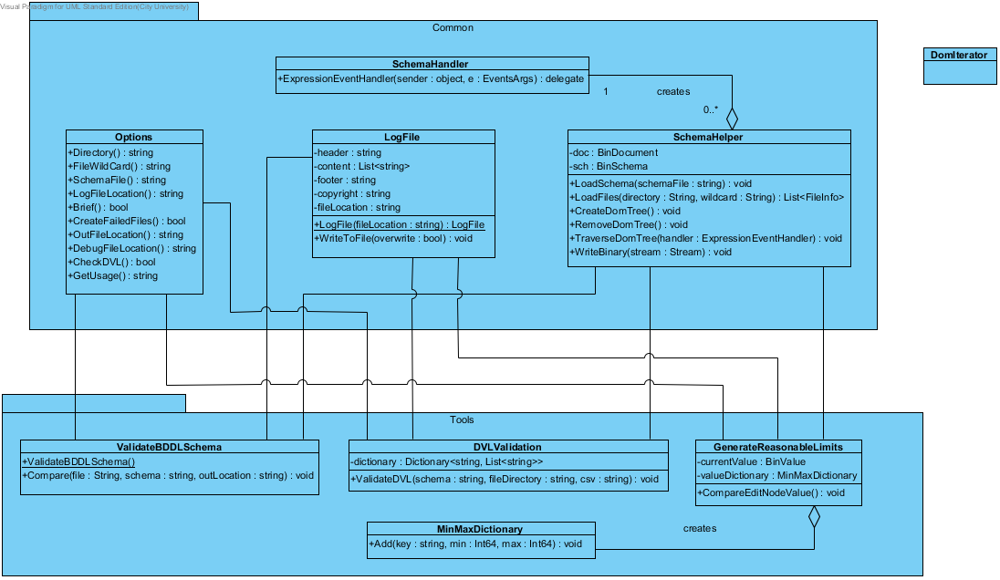

# **BinDirectoryReader**

The BinDirectoryReader is split into 3 separate tools so that each tool does one task. The original name for DVLValidation was ValidateBinaryDOMTree but this was renamed as we wanted a clearer and an easy to understand name; both these names can be used interchangeably.

**Tools:**

_ValidateBDDLSchema_

1. Compares input binary file against an internally generated file using BDDL.
2. Report any differences between these 2 files and optionally create the internally generated file if it is different.

_DVLValidation_

1. Validate the expanded DVL file (DVL that&#39;s been converted to BDDL) against the Binary DOM tree generated from a BDDL file.

_GenerateReasonableLimits_

1. Parse through a Binary DOM tree and analyse the minima and maxima for the data, updating the minima and maxima if needed.
2. Provide a report of minima and maxima values for every node in the Binary DOM tree.

**Common:**

These 3 tools all access fields and use methods of the commonly used classes

1) _Options_

2) _LogFile_

All log files each have a standard header and footer, and processing statistics at the end.

Example header includes name of the file, when it was created, and a copyright statement, which is all sandwiched between a series of 72 hyphens.

The &#39;Z&#39; suffixed in the date denotes &#39;Zulu&#39; time which is GMT. If this is not possible to implement, then remove the &#39;Z&#39;

------------------------------------------------------------------------

FILE c:\DevTestData\doc\BDDL\validateDVL\validateBinaryDOMTree\_REPORT.txt closed at 2013-09-25 07:23:24Z

Copyright © 2013 Glasswall Solutions Limited

------------------------------------------------------------------------

Example footer includes name of the file, time and date stamp to show when the document file was last saved, and a copyright statement, which is all sandwiched between a series of 72 hyphens.

------------------------------------------------------------------------

FILE c:\DevTestData\doc\BDDL\validateDVL\validateBinaryDOMTree\_REPORT.txt closed at 2013-09-25 07:23:24Z

Copyright © 2013 Glasswall Solutions Limited

------------------------------------------------------------------------

Log file content includes number of processed file and number of warnings/errors thrown.

Example for ValidateBDDLSchema:

123,000 files processed

BDDL Schema validation: 200 warnings, 3 errors

Example for DVLValidation:

23,543 files processed.

DVL validation: 12 warnings, 450 errors

Example for GenerateReasonableLimits:

34,234 files processed.

1. _SchemaHelper_

SchemaHelper is essentially a utility class that provide functions such as:

- Loading schemas and other files

Schemas are stored in the &quot;sch&quot; field in the SchemaHelper class.

- Creating, removing, and traversing DOM trees.

The traverse method goes through every node in the tree and each node is processed in some way, depending on the tool being used. For example, the GenerateReasonableLimits tool would apply a check on the minima and maxima of each node and then updates the already existing dictionary of min/max values where appropriate.

- Writing information into a stream.

This functionality is used by ValidateBDDLSchema exclusively. There are 2 streams; one contains the original binary data and the other contains the binary data after the DOM tree is generated. This function is used to write this binary data into the stream, allowing us to compare the 2 streams and retrieve the result.

# **Pseudo code**

**DVLValidation class**

Create DVL Dictionary instance

Load DVL-converted-to-BDDL csv file

Create SchemaHelper instance

Load BDDL schema into the SchemaHelper instance

FOREACH file {
 Create DOM Tree (BDDL schema)

Traverse DOM Tree (DVLExpressionHandler(BinNode))

Remove DOM Tree ()

}

**DVLExpressionHandler(BinNode)**  **class**

Find matching DVL rules for current BinNode in DVL Dictionary instance

Test all expressions against it

==============================================================

**GenerateReasonableLimits class**

Create MinMaxDictionary instance

Create SchemaHelper instance

Load BDDL schema into the SchemaHelper instance

FOREACH file {

Create DOM Tree (BDDL Schema)

Traverse DOM Tree (GenerateReasonableLimitsHandler(BinNode))

Remove DOM Tree ()

}

Output log file

**GenerateReasonableLimitsHandler(BinNode) class**

Compare min/max of current BinNode

Update min/max for current BinNode to MinMaxDictionary instance

==============================================================

**ValidateBDDLSchema class**

Create SchemaHelper instance

Load BDDL schema into the SchemaHelper instance

FOREACH file {

Load file into original stream

Create DOM Tree (BDDL Schema)

Write binary to generated stream

Compare original stream against generated stream

Report results

}