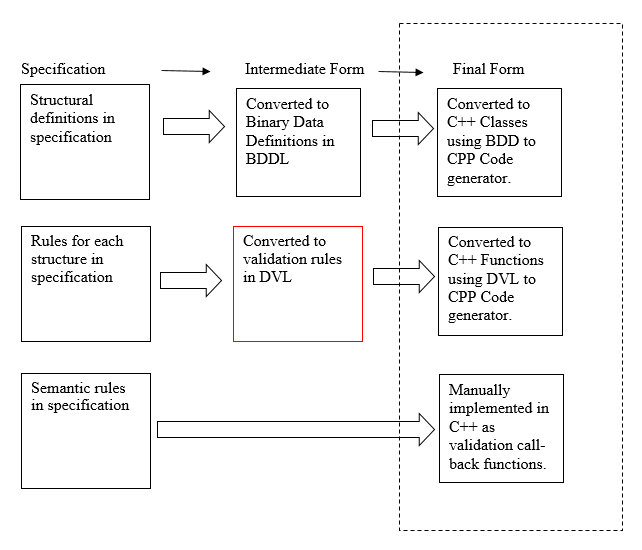
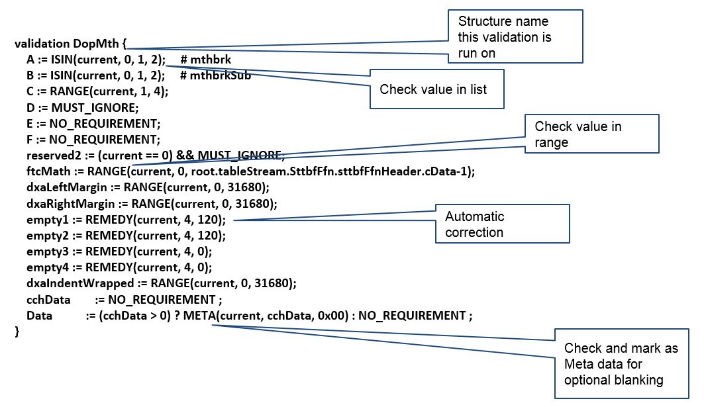
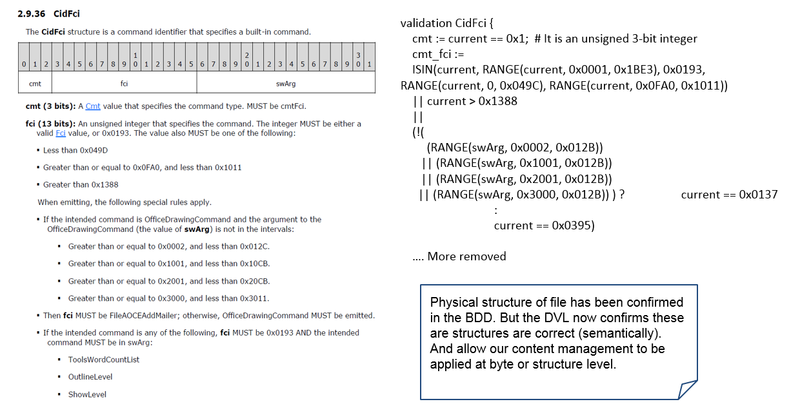

# Overview

Glasswall developed a Domain Specific Language (DSL) named Data Validation Language (DVL) which adds a secondary layer of validation to the process and is used after Syntax checking has been performed using code generated from the Binary Data Definition Language (BDDL). DVL defines the valid values (discrete and range) of variables in the file structures and the items that can be controlled by content management policy settings. The diagram below shows the various stages involved in the code generation process and where DVL fits in.

# Data Validation Language 

The data validation language was designed to add an extra layer of validation on top of the structure definitions implemented in BDDL. 

The language enables an additional layer of integrity checks on the structural data contained in the file by allowing rules defined in the specification to be applied to specific structures or fields within those structures.

DVL also includes a set of functions that add content remediation and sanitisation capabilities. This is a vital part of the document regeneration process, cleaning or correcting structures according to specification.

## Key DVL functions and flags 

The bullet points below contains a list of key functions and checks that can be applied to items within a structure.

•	VERSION - Returns true if the current document is the version of Office specified.

•	GETCPCHAR - Retrieves the character specified by parameter CP and returns it.

•	RANGE - If the content of 'field' has any of the values in the range min to max inclusive, the function returns TRUE, otherwise it returns FALSE.

•	ISIN - If the content of 'field' has any of the values listed, the function returns TRUE, otherwise it returns FALSE.

•	ISIN_STR - If the content of string 'field' has any of the values listed, the function returns TRUE, otherwise it returns FALSE.

•	REGEX - If the test string in 'regex' matches on the content of string 'field' the function returns TRUE, otherwise it returns FALSE.

•	UNIQUE - determines whether the value of a field is unique within all the structures specified.

•	EXISTS - determines whether the named node exists in the Binary DOM tree. It returns TRUE if it does exist, otherwise it returns FALSE.

•	META - Specifies that the marked object contains Metadata which can be blanked.

•	HYPERLINK - Specifies that the marked object contains a hyperlink which can be blanked.

•	REMEDY - Specifies that the marked object contains a data which can be blanked. Should only be used as specified on a line of its own. Used like HYPERLINK and META but applied to padding areas at the end of structures or strings to clear data that is suggested to be undefined and ignorable.

•	REMEDY_COPY - Specifies that the marked object contains a data which should be equal to another field. Should only be used as specified on a line of its own or as part of a test, if the remedy is conditional.

•	EMBEDDED - Specifies that the marked object contains embedded data which can be blanked. Should only be used as specified on a line of its own. Used like HYPERLINK and META but applied to padding areas at the end of structures or strings to clear data that is suggested to be undefined and ignorable.

•	MACRO - Specifies that the marked object contains macro data which can be blanked. Should only be used as specified on a line of its own. Used like all other Mark and Convert Functions but applied to data structures, fields, records that either contain Macro content, or flags/values that imply Macros are present, which may trigger a Product to start looking for actual Macros that we have removed and warning user of their presence erroneously.

•	REJECTED - Specifies that the marked object contains data which can be removed from the output file. Should only be used as specified on a line of its own. Used like all other Mark and Convert Functions but applied to data structures, fields, records that either contain and manageable content.

•	MUST_IGNORE - Specifies that the value must be ignored under certain conditions.

•	IS_VALID - Specifies that the value is valid under certain conditions.
 
•	EXISTS - Specifies that the field exists under certain conditions.

•	NOT_EXISTS - Specifies that the value does not exist under certain conditions.
 
•	TBD - Specifies that the rule for the member has not been defined yet.

•	NO_REQUIREMENT - Specifies that there is no MUST rule that needs to be tested. 

## Example 1

The diagram below displays an example of data validation rules applied to an MS-Word structure using the DVL language.

## Example 2

The diagram below contains an example of a set of data validation rules applied to a structure along-side the definition of those rules in the Microsoft Word Binary MS-DOC specification, using the DVL language.

# DVL Guide

The DVL guide is intended to provide advice on writing DVL and its intent is to produce DVL in a consistent format, and to provide the syntax of
DVL. 

# DVL Syntax Checker

A tool that was developed with purpose of performing syntax checking on
the DVL files and highlighting any incorrect syntax. More information
on the DVL Checker can be found in the [DVL Checker](2_1_3_4_6-dvl_checker) page.

