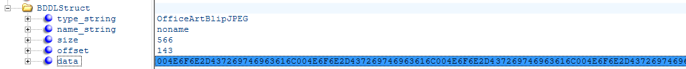
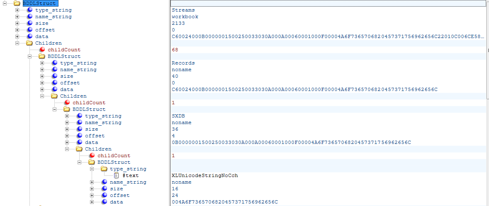
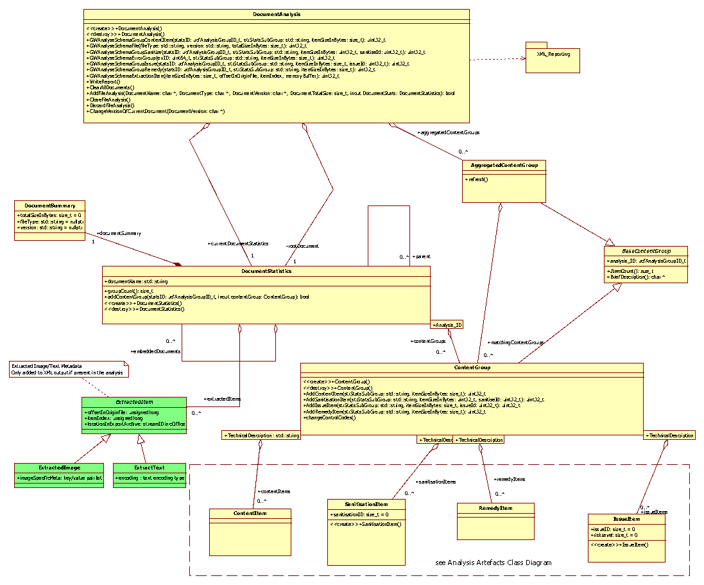

Import-Export-System Design Document with extension for bidirectional text extraction and optional external
processing

© 2018 Glasswall Solutions Ltd 
ALL RIGHTS RESERVED

Information contained herein is the property of Glasswall Limited and is
proprietary and confidential.

*Glasswall Solutions Ltd.* 
*email: [Glasswall Support](support@glasswallsolutions.com)* 

*Creation Date: 2017-05-17* 
*Version: H*

**Document History**

Table 1: Document Change History

| *Issue Date* | *Issue Number* | *Author*  | *Description*                                                               |
|--------------|----------------|-----------|-----------------------------------------------------------------------------|
| 2017-05-17   | A              | SMW       | Initial draft                                                               |
| 2017-06-01   | B              | SMW       | Typo corrections from Review                                                |
| 2017-06-19   | C              | CORE TEAM | Meeting additions                                                           |
| 2017-06-19   | D              | SMW       | Review integration                                                          |
| 2017-07-10   | E              | SMW       | Review amendments and Expansion of internal API details                     |
| 2017-07-14   | F              |           | Model updates                                                               |
| 2017-07-17   | G              | SMW/MO’B  | API parameters corrected; interchange file layout changed; cosmetic changes |
| 2018-08-02   | H              | SMW       | Extension to support text import and external text search library           |
| 2018-09-11   | I              | SMW       | Detail of Text location determination and reporting                         |

**Document Distribution**

Table 2: Document Distribution

| *Name*     | *Position*                | *Date* | *Signature* |
|------------|---------------------------|--------|-------------|
| Sam Hutton | CTO - Glasswall Solutions |        | .           |
|            |                           |        |             |
|            |                           |        |             |

**Copyright and Contact Details**

The copyright in this work is vested in Glasswall Solutions Limited, and the
document is issued in confidence for the purpose for which it is supplied. It
must not be reproduced in whole or in part or used for tendering or
manufacturing purposes except under agreement or with the consent in writing of
Glasswall Solutions Limited and then only on condition that this notice is
included in any such reproduction. No information as to the contents or subject
matter of this document or any part thereof arising directly or indirectly there
from shall be given orally or in writing or communicated in any manner
whatsoever to any third part being an individual firm or company or any employee
thereof without the prior consent in writing of Glasswall Solutions Limited.

&copy; 2018 Glasswall Solutions Limited

If there are any questions related to this report, these should be addressed to:

Sam Hutton

Glasswall Solutions Limited

e-mail: <shutton@glasswallsolutions.com>

# Glasswall Import-Export System

## Stage 1 - Original Currently Implemented System

This has been reviewed in relation to implemented code and sections highlighted
where errors exist

### **Requirements**

We are required to make some internal components of processed files available to
external programs for additional processing outside of our domain, then
recompose the files to include those externally modified files.

### **External Process View**

#### ***External API Use***

##### **Basic use**

A new export processing API for the cameras is to be defined and must produce
and export package as an output. To simplify the process, parts of the existing
file processing API for the cameras will be reused.

To enable CDS to carry out additional analysis on components within
files, we propose to run the file through Glasswall library twice. Once to
extract a package containing a processed file, report and extracted components.
Second pass to reintegrate the files processed by CDS into a new validated

###### ***First (Export) phase***

First phase, a call to the Export API function is made and we process our file
as normal (with whatever level of content management is required).

In this phase we will internally produce:

-   The Analysis Report XML

-   The Managed File

-   The extracted embedded images (as separate binary streams)

-   Plain text of the document (as one or more separate streams)

All of which will be packed into a directory structure in a zip file with
extension ‘.zip’

Structure of ZIP file

*Suggested layout:*

*filename*.zip

**managed** (stream) 
&nbsp;&nbsp;&nbsp;&nbsp;*managed file*

**analysis** (stream) 
&nbsp;&nbsp;&nbsp;&nbsp;*analysis file*

**images** (directory) 
&nbsp;&nbsp;&nbsp;&nbsp;image1.bin 
&nbsp;&nbsp;&nbsp;&nbsp;… 
&nbsp;&nbsp;&nbsp;&nbsp;image*N*.bin

**text** (directory) 
&nbsp;&nbsp;&nbsp;&nbsp;textStream1.bin 
&nbsp;&nbsp;&nbsp;&nbsp;… 
&nbsp;&nbsp;&nbsp;&nbsp;textStream*N*.bin

Image from original not available.

###### Second (Import) Phase

Second phase, a call to the Import API function is made. The function will
expect a Glasswall Import ‘.zip’ package back from CDS which we will use to
recreate our internal document tree and then we will execute our file
reconstruction phase from the tree to make new files containing our amendments
and CDS’s amendments.

Image from original not available.

### **Internal Structure**

#### **PDF (UCF)**

##### **Identifying Images**

The internal structure of a PDF file loaded into Glasswall retains all the
information required to uniquely identify, locate, and access content within a
file using the “object reference” mechanism used by PDF.

When a bitmapped object is encountered within a PDF document it will generally
be in the form of an Image XObject dictionary which can be identified by a
unique (within the document) object number, its properties (bit depth,
dimensions, encoding type, color space, etc.) can be found by reference to the
appropriate entries within the tokenised representation dictionary, and the data
stream itself can be referenced through the STREAM token associated with the
dictionary.

In this case the only information required to identify the image data's “point of
origin” with the document is the object number. Sometimes bitmap image data may
be held in-“line” within one of the content stream objects containing page
content and controlling its rendering, in this case the image data will be
delimited within the content stream by BI (begin image) and EI (end of image)
content stream operators. As a content stream may contain multiple images the
object number for the content stream alone is not sufficient to identify the
point of origin for image data but we can use an index number to identify a
particular image data section within a content stream.

##### **Identifying Text**

Similarly text content may be held either in the form of a Form
XObjectdictionary with the text itself being contained/encoded within the
sequence of content stream operators and operands associated with the Form X, in
this case the object number alone is sufficient to identify the point of origin.

Alternatively it may be held in one or more content streams associated with the
Contents entry of a Page dictionary (in the case of multiple content streams the
value of the Contents key is an array), in either case the content data will be
held in the form of a Stream object so again an object number is sufficient to
identify the point of origin.

#### **Office (UCP)**

The internal structure of a UCP file loaded into Glasswall is loosely based on
DOM tree structures, so that it can be traversed to identify the internal file
components and potentially send to an XML file.

##### **Sample XML File snippet – identifying a specific image field **

Images are mainly stored in OfficeArtBlip{*typename*} structures, where *typename*
is the image type.

So again, we can highlight the structures and export the hexadecimal of the
structures data…

However, once again this is a structure (see below) which would need to be post
processed to reach the actual image data

Sample from \[MS-DOC\]

##### Sample XML File snippet – identifying a specific text field 

Text is stored in various structures in each file format, so we would have to
list all of the various ones we are aware of.

For example one of the many structures in Excel is XLUnicodeStringNoCch (see
**2.5.296 of [MS-XLS].PDF from Microsoft**)

Our output format would currently present a BDDLStruct with the name
‘XLUnicodeStringNoCch’, its size and raw data in hexadecimal.

The actual data of ‘XLUnicodeStringNoCch’ breaks down into this structure which
we separate internally but cannot easily present to the outside world.

However, in this case the data should be fairly easy to scan for dubious
characters.

### **Internal Process**

#### **Export**

##### **Steps – UCP cameras (Office Binary and OOXML)**

*If the Export API has been the entry-point into Glasswall the
Export-Callback mentioned here will be called, otherwise it will not in
normal file processing.*

-   Original File Delivered to Glasswall for processing.

-   As each stream is processed by directoryObjectProcessor the cOfficeStreamID
    is passed down to the generated camera. When the internal tree stage has
    been completed a validation pass is called. The normal validation Call-back
    is augmented by the Export Call-back.

-   In Export Call-back, on each tree object checked, we look for items (such as
    images or text blocks) that need marking and storing. When seen, the Export
    API is called for that object and its location is added to the Analysis and
    its data is added to a stream in the Export Package and the ID of that
    stream is associated with the ‘location metadata’.

-   When all streams are processed. The fully regenerated file and the analysis
    file are added to the export package with the extracted elements already
    there.

##### **Steps – UCF cameras (PDF)**
-   Original File Delivered to Glasswall for processing.

-   It is assumed that at each stage where PDF content has been parsed into its
    internal tree form, a suitable iterator can search for images and text
    sections and call the Export API functions to mark and select the data.

-   When all streams are processed. The fully regenerated file and the analysis
    file are added to the export package where the extracted elements already
    are.

#### **Pseudo-code**

##### **Phase one DLL interfaces**

###### GWFileToFileAnalysisProtectAndExport

DLLAPI int GWFileToFileAnalysisProtectAndExport(const wchar_t \*
inputFilePathName, const wchar_t \* exportFilePathName)

TBD

DLLAPI int GWFileToFileProtectAndImport(const wchar_t \* inputFilePathName,
const wchar_t \* outputFilePathName)

TBD

DLLAPI int GWFileToMemoryAnalysisProtectAndExport(const wchar_t \*
inputFilePathName, void \*\*outputFileBuffer, size_t \*outputLength)

-   Create Local buffer for managedFile (managedFileBuf)

-   Call GlasswallProcess on inputFilePathName and store output in
    managedFileBuf

-   COfficeDocument_t \*\*ppOfficeDoc = NULL

-   importExportModule::createInterchangePackage(ppOfficeDoc)

-   importExportModule::addManagedFileToInterchangePackage(ppOfficeDoc,
    managedFileBuf)

-   importExportModule::sendInterchangePackageToBuffer(ppOfficeDoc,
    outputFileBuffer)

-   importExportModule::closeInterchangePackage(ppOfficeDoc)

###### GWFileToMemoryProtectAndImport

DLLAPI int GWFileToMemoryProtectAndImport(const wchar_t \* inputFilePathName,
void \*\*outputFileBuffer, size_t \*outputLength)

-   Create Local buffer for importFile (importFileBuf)

-   Load file ‘inputFilePathName’ into buffer ‘importFileBuf’

-   COfficeDocument_t \*\*ppOfficeDoc = NULL

-   importExportModule::importInterchangePackage(ppOfficeDoc, importFileBuf)

-   importExportModule::extractManagedFileFromInterchangePackage(ppOfficeDoc,
    outputFileBuffer)

-   importExportModule::closeInterchangePackage(ppOfficeDoc)

##### importExportModule 

###### createInterchangePackage

-   Predefinded streamIds for fixed parts of Interchange Package

    -   MANAGEDFILE_ID = 1

    -   ANALYSISFILE_ID = 2

    -   IMAGESDIRECTORY = 3

    -   TEXTSTREAMSDIRECTORY = 4

-   importExportModule::createInterchangePackage(COfficeDocument_t
    \*\*ppOfficeDoc)

    -   OfficeDocument_create(ppOfficeDoc, eOfficeDocOPC))

    -   OfficeDocument_addStream (ppOfficeDoc,’ /managed’, 1,
        STREAM_OBJECT_TYPE) // placeholder for managed file 🆕

    -   OfficeDocument_addStream (ppOfficeDoc,’ /analysis’, 2,
        STREAM_OBJECT_TYPE) // placeholder for analysis file 🆕

    -   OfficeDocument_addStream(ppOfficeDoc,’ /images’, 3, STORAGE_OBJECT_TYPE)
        // images directory 🆕

    -   OfficeDocument_addStream (ppOfficeDoc,’ / text’, 4, STORAGE_OBJECT_TYPE)
        // text directory 🆕

###### addManagedFileToInterchangePackage

-   importExportModule::addManagedFileToInterchangePackage(COfficeDocument_t
    \*\*ppOfficeDoc, memoryBuffer \*managedFileBuf)

    -   OfficeDocument_setStreamPtr (ppOfficeDoc, MANAGEDFILE_ID,
        managedFileBuf)

    -   **// might need to create copy of the buffer before its attached as PDF
        sometimes reuses image expansion buffer**

###### addAnalysisFileToInterchangePackage

-   importExportModule::addAnalysisFileToInterchangePackage(COfficeDocument_t
    \*\*ppOfficeDoc, memoryBuffer \*analysisFileBuf)

    -   OfficeDocument_setStreamPtr (ppOfficeDoc, ANALYSISFILE \_ID,
        analysisFileBuf)

    -   **// might need to create copy of the buffer before its attached as PDF
        sometimes reuses image expansion buffer**

###### sendInterchangePackageToBuffer

-   importExportModule:: sendInterchangePackageToBuffer (COfficeDocument_t
    \*\*ppOfficeDoc, memoryBuffer \*outputFileBuf)

    -   OfficeDocument_setOPCDocumentOutputBuffer (ppOfficeDoc , outputFileBuf)
        🆕

    -   OfficeDocument_saveOPCDocumentContentIntoBuffer (ppOfficeDoc)

###### extractManagedFileFromInterchangePackage

-   importExportModule::
    extractManagedFileFromInterchangePackage(COfficeDocument_t \*\*ppOfficeDoc,
    memoryBuffer \*outputFileBuffer)

    -   Copy buffer from attached stream ...

    -   OfficeDocument_loadStream(ppOfficeDoc, MANAGEDFILE_ID, pManagedFileBuf)

###### importInterchangePackage

-   importExportModule:: importInterchangePackage (COfficeDocument_t
    \*\*ppOfficeDoc, memoryBuffer \*importFileBuf)

    -   OfficeDocument_create(ppOfficeDoc, eOfficeDocOPC))

    -   OfficeDocument_loadOPCDocumentContent (ppOfficeDoc, importFileBuf, NULL)

###### addImageToInterchangePackage

-   importExportModule:: addImageToInterchangePackage (COfficeDocument_t
    \*\*ppOfficeDoc, memoryBuffer \*imageFileBuf)

    -   TBD

    -   Need to add child to stream IMAGESDIRECTORY_ID

    -   **// might need to create copy of the buffer before its attached as PDF
        sometimes reuses image expansion buffer**

###### addTextToInterchangePackage

-   importExportModule:: addTextToInterchangePackage (COfficeDocument_t
    \*\*ppOfficeDoc, memoryBuffer \*imageFileBuf)

    -   TBD

    -   Need to add child to stream TEXTSTREAMSDIRECTORY_ID

    -   **// might need to create copy of the buffer before its attached as PDF
        sometimes reuses image expansion buffer**

###### closeInterchangePackage

-   importExportModule::closeInterchangePackage(COfficeDocument_t
    \*\*ppOfficeDoc)

    -   OfficeDocument_destroy (ppOfficeDoc)

##### New Adaptor Functions

Functions to add to
‘glasswall.classic\\code\\framework\\camera.resource\\utils\\coffice.document.adaptor.h’

###### OfficeDocument_addStream

-   OfficeDocument_addStream (COfficeDocument_t \*\*ppOfficeDoc, char
    \*filepath, \*\*streamID, ObjectType_t streamType)

###### OfficeDocument_setDocumentOutputBuffer 

(was setOPCDocumentOutputBuffer)

-   OfficeDocument\_ setDocumentOutputBuffer (COfficeDocument_t \*\*ppOfficeDoc,
    memoryBuffer \*outputFileBuf)

    -   // Override the output buffer, as it may not have been set during
        initialisation of a new OPC file

        ppOfficeDoc-\>setDocumentOutputBuffer(outputFileBuf)

##### Adaptor Functions to Change

Functions to change in
‘glasswall.classic\\code\\framework\\camera.resource\\utils\\coffice.document.adaptor.h’

###### OfficeDocument_loadOPCDocumentContent

-   OfficeDocument_loadOPCDocumentContent(COfficeDocument_t \*pOfficeDocument,
    memoryBuffer \*pInMemBuf, memoryBuffer \*pOutMemBuf);

    -   Change to allow ‘pOutMemBuf’ to be NULL

-   OfficeDocument_saveOPCDocumentContentIntoBuffer(COfficeDocument_t
    \*pOfficeDocument)

    -   Change to throw error if ‘m_pFileOutputMemoryBuffer’ is NULL

##### cOffice Methods to Add or Change

###### Add

setDocumentOutputBuffer (memoryBuffer \*pOutMemBuf)

-   m_pFileOutputMemoryBuffer = **pOutMemBuf**;

#### Import

##### Steps – common

-   ‘.zip’ Export-Import file passed to Glasswall by client

-   gwlCamera: Will process the core file in the package in the normal way
    (manage) but when the internal tree stages (UCP or UCF) are exposed, the
    validation or iterator will then look for items in the package that match
    locations in the trees. If found, the new elements will be inserted
    (assuming size constraints allow – if not – error thrown)

-   new trees will be written to output buffers

-   final regenerated file should be repassed through management camera without
    any further reinsertion enabled to confirm it is viable before sending out
    to the client

#### Analysis Data and Export Use

(from the Analysis Repository documentation -
…\\glasswall.classic\\models\\UniversalCameraPlatform\\UniversalCameraPlatform.uml)

#### Internal API

Additional Elements will be added to the Analysis Repository object to support
the metadata and object extraction

#### ie_EndImportExportMode(memeoryBuffer importOrExportBuffer managedFileOutBuffer)

>   If Export mode, the managed file needs to be written to cOffice document
>   being used as the zip model

>   Then the analysis need to be written to cOffice document

>   and finally the cOffice document needs to be written to the export buffer

importOrExportBuffer

pointer to buffer for construction of final zip file

managedFileOutBuffer

pointer to managed file ready for export to the cOffice document

#### uint32_t ie_ExportText(int mode offsetInOriginFile itemIndex memoryBufferKey/Value List CustomMetaData)

Add a content item or increment the count of the same one

Mode

enum that indicates to the called what is going on.

>   0: No action - normal analysis or managment mode

>   1: Export - the data in the memoryBuffer will lbe written to the export zip
>   file

>   2: Import - the data in the memoryBuffer has been imported from the zip and
>   should replace the image data in the file being reconstructed

OffsetInOriginFile

Where the image is in the original file

ItemIndex

>   index of node in document tree

MemoryBuffer

>   containing data to be extracted into export archive

CustomMetaData

>   information specific to image type, eg width, height, encoding

>   usually only needed if the attached image does not have that intrinsically
>   within it

#### uint32_t ie_ImportExportImage(int mode offsetInOriginFile itemIndex memoryBufferKey/Value List CustomMetaData)

Add a content item or increment the count of the same one

Mode

enum that indicates to the called what is going on.

>   0: No action - normal analysis or managment mode

>   1: Export - the data in the memoryBuffer will lbe written to the export zip
>   file

>   2: Import - the data in the memoryBuffer has been imported from the zip and
>   should replace the image data in the file being reconstructed

OffsetInOriginFile

Where the image is in the original file

ItemIndex

>   index of node in document tree

MemoryBuffer

>   containing data to be extracted into export archive

CustomMetaData

>   information specific to image type, eg width, height, encoding

>   usually only needed if the attached image does not have that intrinsically
>   within it

#### ie_StartExportMode(memoryBuffer exportBuffer)

Prepare cOffice doc for creating the export zip file in Set internal
analysisMode to 'Export' Retain pointer to Export buffer which contains the
export ZIP file tp be contracted

#### ie_StartImportMode(memoryBuffer importBuffer)

Prepare cOffice doc for loading the import zip file to Set internal analysisMode
to 'Import' Retain pointer to Import buffer which contains the import ZIP file

Export / Import Sequence Diagrams - TBD

### <Test Requirements

To enable automated testing of the Import and Export API functions the GW
Regression Test Application must be modified to include the modes illustrated in
the diagrams below.

#### Extend GW Regression Test Application

##### Test Mode 1: Export – Positive Test

##### Test Mode 2: Export – Negative Test

##### Test Mode 3: Import – Positive Test

##### Test Mode 4: Import – Positive Test 2

**Key requirements**

A summary of the key requirements for the GW Regression Test Application are
listed below.

1.  Image extraction for all file supported file types (Use Spire).

2.  Integrate file opener (Using Spire).

3.  Integrate file comparison tool.

4.  Add new test modes.

## Stage 2 – New Features to support Text Import and External Analysis

### Requirements

-   We need to retrofit text location information to our text export functions

-   Modify and text integration functions to collect and present text location
    information to the underlying text export API

-   Create text import API calls

-   Store text location and offset in an efficient form

-   Replace the use of external file during import

    -   Already done in Changeset 30023

-   Create optional mode for text searching that allows use of the export/import
    feature to carry out text analysis and modification ‘in-situ’ without using
    the final ‘write to file’ stage

-   Separate the import / export features into subsystems that can be called
    independently

-   Connect the file import plugin api to the import subsystem and retrieve its
    data from external file source

-   Connect the file export plugin api to the export subsystem and retrieve its
    data from external file source

-   Connect the NEW file text search plugin api to the export, import subsystems
    ‘back to back’ with the call to text search engines in-between

### Text Export Updates

#### Text collection functions

There are existing text export functions, but they will require modification.

Changes to text export api (in analysis.repository.if.[c\|h])

**Existing Text Export Functions are defined as:**

*uint32_t analysis_GWAnalyseSchemaExportTextString (*

*size_t offset, char \*location, size_t length, const char \*encoding)*

*Called from:*

-   ExportText_WordDocumentStream

    -   From wordValidationCallback

-   ExportSttbText

-   *template\<class Iterator\> ucfStatus_t* exportText

    -   Export_TxOText

-   *template\<class T\> ucfStatus_t exportText*

*uint32_t analysis_GWAnalyseSchemaExportTextMembuf (*

*size_t offset, memoryBuffer \*mb, char \*encoding)*

*Called from*

-   flushPdfExtractedText

Notes on parameters:

>   *offset: Offset from begining of file where the text was found - optional*

>   *location: char pointer to first character in the 'string' of text - char
>   boundary - will ignore zero terminator*

>   *length: The number of bytes in the string.*

>   *mb: memorybuffer, (mirror or IPS probably) containing the 'string' of text
>   it is expected that the 'start' to 'end' in the buffer delimits the string
>   for export*

>   *Encoding: char pointer to zero terminated C style string defining the type
>   of text in the export string - optional*

**Replacement Text Export Functions will be defined as:**

*uint32_t analysis_GWAnalyseSchemaExportTextString (*

*size_t offset, char \*location, size_t length, const char \*encoding, const
TextIF_LocationInfo \*textLocMeta)*

*uint32_t analysis_GWAnalyseSchemaExportTextMembuf (*

*size_t offset, memoryBuffer \*mb, char \*encoding, const TextIF_LocationInfo
\*textLocMeta)*

Notes on parameters:

See above for existing parameters

The ‘*encoding’ parameter may become redundant, but for now, it remains to
support the existing text stream output mode implemented in Stage 1 of
development.*

*Text Location information structures need to be defined by the calling code to
clearly locate the stream of text in the file, to assist in its reinsertion.
They also contain more detailed data describing the individual chucks of text,
their encoding and type (meta/readable…etc)*

*Both of these call a ‘bridge’ version of themselves. This needs a call to
‘*GWAnalyseSchemaExtractedText’ to be added in the same style as
‘GWAnalyseSchemaExtractedImage’ in ‘*analysis_GWAnalyseSchemaExportImage…..*’
functions.

#### Text Analysis Reporting

*‘DocumentAnalysis::GWAnalyseSchemaExtractedText’ function needs
‘TextIF_LocationInfo \*textLocMeta’ argument added to it as it will be called
from ‘analysis_GWAnalyseSchemaExportText…..’ functions*

### New Text Import System

#### Text insertion functions

**New Text Import Functions will be defined as:**

*uint32_t analysis_GWAnalyseSchemaImportTextString (*

*size_t offset, char \*location, size_t length, const char \*encoding, const
TextIF_LocationInfo \*textLocMeta)*

*uint32_t analysis_GWAnalyseSchemaImportTextMembuf (*

*size_t offset, memoryBuffer \*mb, char \*encoding, const TextIF_LocationInfo
\*textLocMeta)*

#### Text Location information collection

*TextIF_LocationInfo*

-   *page/sheet (size_t) : leave as zero if meta data*

-   *line (size_t) : leave as zero if meta data or if not applicable*

-   *name (char \*) : if text based description better for location (e.g.
    internal meta section)*

*One or more of these MUST be populated to uniquely identify the text segment*

### Modifications to Text Import calls in Glasswall

**List changes to every entry style where text exports currently exist, with
examples**

#### uint32_t analysis_GWAnalyseSchemaExportTextString (size_t offset, char \*location, size_t length, const char \*encoding)

##### Called By

###### exportText

template\<class T\> ucfStatus_t exportText(std::vector\<T\> \*textData, const
char \*encoding, size_t offset = 0)

template\<class Iterator\> ucfStatus_t exportText(Iterator begin, Iterator end,
const char\* encoding, size_t offset = 0)

**Called by:**

Excel Export_TxOText - Which collates text segments in TxO objects.

**Work to be done**

##### Calls

bridge_GWAnalyseSchemaExportTextString

which calls bridge_GWAnalyseSchemaExportTextMembuf

while wrapping the text in a memory buffer

##### Work to be done

Ensure detailed location information is passed down to
GWAnalyseSchemaExportTextMembuf

Fully reversible location information is required in order to reinsert text

#### uint32_t analysis_GWAnalyseSchemaExportTextMembuf (size_t offset, memoryBuffer \*mb, char \*encoding)

##### Called By

##### Calls

bridge_GWAnalyseSchemaExportTextMembuf

which converts text encoding and concatenates into a vector with byte order mark
separators ready for storage in interchange file

##### Work to be done

Extracted text details need to be sent to the analysis report (as originally
intended)

Or sibling stream created with stream of binary objects that identify each text
snippet in the text data stream, its original location and encoding.

### Restructure of import/export into reusable subsystem

#### Mode for text searching that allows use of the export/import feature to carry out text analysis and modification ‘in-situ’ without using the final ‘write to file’ stage

##### Option 1 - Another Glasswall Classic API Entry

Our existing API requires one or more new entries to support a ‘text search
mode’

They would need to support similar structure to a manage and report API call.
But the addition of request to use an internal text search function or an
external text search function housed in a glasswall developed DLL or a third
part DLL

The external DLL would either have to be a specific name or the name/path to the
DLL that needs to be loaded would have to be an extra path in the API call

Or a dedicated API call would be added to the SDK that selects the external DLL
before further file processes occur.

##### Option 2 - Glasswall Supervisor multipurpose ‘threadable’ API Entry

The Glasswall_Supervisor.dll option would add to the existing method of the
supervisor wrapping around the glasswall.classic.dll and any other dlls as
required and integrate the functional requirements across them all.

Adding a text search DLL at this level might reduce the complexities in
glasswall.classic

In order to simplify the SDK for Threadable operation I propose a SDK that
comprises of calls to initialise a session, register
files/configuration/outputwith the session then trigger the mode of process and
close of the session. This would make adding new modes and features a lot
simpler. See Appendix 1 for suggested SDK extensions.

#### Separate the import / export features into subsystems that can be called independently

-   Create MemoryToMemory version of GWFileToMemoryAnalysisProtectAndExport

-   Make AnalysisModePass clearly a stage of Export

-   Integrate ‘addManagedFileToInterchangePackage &
    sendInterchangePackageToBuffer’ into ProtectModePass

-   Create MemoryToMemory version of GWFileToMemoryProtectAndImport

### Connection to text search subsystem (glasswall or 3rd party)

Connect the NEW file text search plugin api to the export, import subsystems
‘back to back’ with the call to text search engines in-between.

### Appendix 1 – Proposed extensions to Glasswall API (added via supervisor)

**/\* Ask for a new file processing session. Handle to the session returned or
-1 if none available. \*/**

**HANDLE GW2OpenSession(void );**

**/\* Request close of a session. Return 0 if successful, -1 if fails. \*/**

**int GW2CloseSession(HANDLE handle);**

**/\* Load the config XML file for this session \*/**

**int GW2FileConfigXML(HANDLE handle, wchar_t \* xmlstring);**

**/\* Load the config XML data from memory for this session \*/**

**int GW2MemoryConfigXML(HANDLE handle, void \*\* xmlCfgFileBuffer, size_t \*
xmlCfgLength);**

**/\* Identify file for processing \*/**

**int GW2RegisterInputFile(HANDLE handle, wchar_t\* inputFilePathName);**

**/\* Identify file image for processing \*/**

**int GW2RegisterInputMemory(HANDLE handle, void \*\* inputFileBuffer, size_t \*
inputLength);**

**/\* Identify filepath for managed output \*/**

**int GW2RegisterOutFile(HANDLE handle, wchar_t\* outputFilePathName);**

**/\* Identify memory for managed output \*/**

**int GW2RegisterOutputMemory(HANDLE handle, void \*\* outputFileBuffer, size_t
\* outputLength);**

**/\* Identify filepath for analysis output \*/**

**int GW2RegisterAnalysisFile(HANDLE handle, wchar_t\* analysisFilePathName);**

**/\* Identify memory for analysis output \*/**

**int GW2RegisterAnalysisMemory(HANDLE handle, void \*\* analysisFileBuffer,
size_t \* analysisoutputLength);**

**/\* Identify filepath for Report output \*/**

**int GW2RegisterReportFile(HANDLE handle, wchar_t\* ReportFilePathName);**

**/\* Identify memory for Report output \*/**

**int GW2RegisterReportMemory(HANDLE handle, void \*\* ReportFileBuffer, size_t
\* ReportoutputLength);**

**/\* Identify filepath for external text search engine \*/**

**int GW2RegisterTextSearchDLL(HANDLE handle, wchar_t\*
TextSearchDLLFilePathName);**

**/\* Run process mode based on following mode codes:**

**0 Analysis**

**1 ManageProtect**

**2 ManageProtectLite - deprecated**

**3 ManageProtectReport (short form)**

**4 ExportMode**

**5 ImportMode**

**6 TextSearchMode - proposed**

**\*/**

**int GW2RunProcess(HANDLE handle, int mode);**
