#**Document History**

Table 1: Document Change History

| **_Issue Date_** | **_Issue Number_** | **_Author_** | **_Description_** |
| --- | --- | --- | --- |
| **08/05/2014** | A | PFG | Initial version for review |
| | | |  |

# 1 Introduction

This document provides an overview of the functionality associated with the Glasswall Dynamic Configuration API.

The Use Cases section describes the functionality that the feature provides.

The Components section describes the architecturally significant modules associated with the feature and their interfaces.

The Key Scenarios section provides sequence diagrams of key use cases, demonstrating the interaction between the principle components.

## 1.1 Glossary

The following terms are used through this document.

The Library – the Glasswall library

The Client Application – application using the library

The API – the application programming interface (API) used by the client when interfacing with the library.

The Configuration – settings used by the library that may be updated by the client application.

A configuration item – The Configuration is made up of sets of tuneable values that are associated with the various document cameras. Each configuration item is identified be specifying the camera and the configuration item&#39;s name.

## 1.2 References

_Content Management Configuration XSD_

$Glasswall\glasswall.classic\documentation\doxygen\xsdFiles\ gwContentManagementConfiguration.xsd

This XSD defines the format of the XML used to configure the Glasswall DLL. This is the same definition used to format the configuration when exported from the DLL.

## 1.3 Schematics

The WhiteStarUML design tool has been used to document the design of this feature. The diagrams in this document follow the guidelines shown in the diagram below. The diagram represents the following relationships.

- The functions declared in moduleA.h are defined in moduleA.c.
- The file moduleB.c &#39;#include&#39;s moduleA.h.
- The enumeration and typedef (represented using the stereotypes) are defined in moduleA.h

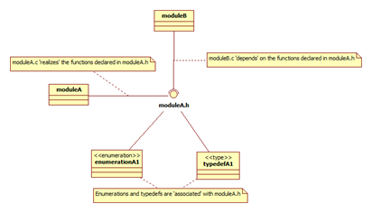

# 2 Use Cases

The following sections capture the high-level functionality of this feature.

## 2.1 Start-up

From the Client Application having loaded the Library, it will be configured with a set of default configuration.

_Default settings for content management flags is &#39;sanitise&#39;._

_Default setting for watermark is &#39;Glasswall Approved&#39;._

## 2.2 Setting Configuration Items

From the Client Application all configuration items in all cameras can be updated in one call to the API

From the Client Application an individual configuration item can be updated through the API.

From the Client Application updating a configuration item in one camera, does not affect the value of a configuration item of the same name in a different camera.

From the Client Application, attempting to configure a content item that does not exist will result is an error status and message being reported.

_Explanatory error messages are retrievable through the API._

From the Client Application attempting to update a configuration item with a non-valid value will result in an error status and message being reported.

From the Client Application any changes in the configuration will be used in all subsequent calls through the API.

## 2.3 Reading Current Configuration

From the Client Application, all configuration can be retrieved from the Library with one call to the API.

_The Configuration will be returned in an xml string that is in the same format as used in the configuration operation._

From the Client Application, retrieving the configuration from the Library will not require any memory management.

## 2.4 Clearing Configuration Updates

From the Client Application, the Configuration can be returned to the default values set at start-up with one call to the API.

# 3 Components

This section provides an architectural description of the solution.

## 3.1 Overview

The principle components involved in the configuration of the Glasswall library are shown in the diagram below. The scoping operator :: is used to indicate the nesting of components in order to provide some level of context only, no other semantic interpretation should be applied.

The component, glasswall.classic::glasswall, consists of the top layer of the library with modules that implement the client accessible interface of the library.

The component, glasswall.classic::utils, provides utility functionality to the interface layer and the cameras.

The component, application::pdf, provides the PDF camera functionality. This camera is responsible for the processing of PDF documents.

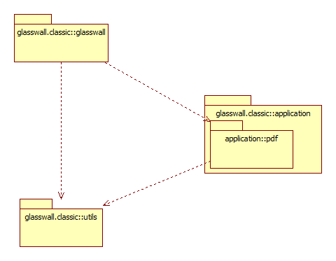

## 3.2 Glasswall Top Level

The library&#39;s configuration is managed through the API, in glasswall.classic::glasswall. The dll.dwfile module provides the API functionality, delegating responsibility of interfacing with the configuration repository to the gwallconfig module.

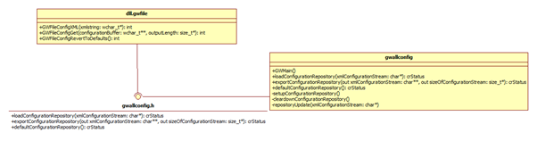

## 3.3 Utils

### 3.3.1 Configuration Repository Module

The configuration repository is the data storage container for Glasswall dynamic configuration. The module forms part of the glasswall.classic::utils component. The module provides two interfaces, one supporting the management aspects of the module, the other providing functionality to client modules. This split is shown in the diagram below.

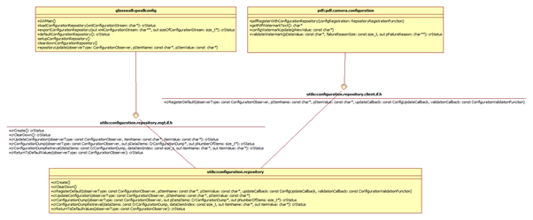

The data structure used by the configuration.repository module to store the configuration and associated observers is shown in the diagram below.

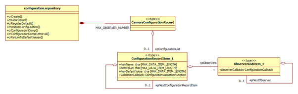

### 3.3.2 Configuration Loader Module

The configuration repository is updated from the client application using the configuration.loader module. This module is responsible for decoding the supplied XML string and updating the repository.

![]img/dynamicconfiguration6.png)

### 3.3.3 Configuration Exporter Module

To support the export of configuration to the client application the gwallconfig module makes use of the configuration.export module. The configuration.export module has responsibility for formatting the contents of the configuration repository into the required XML format.

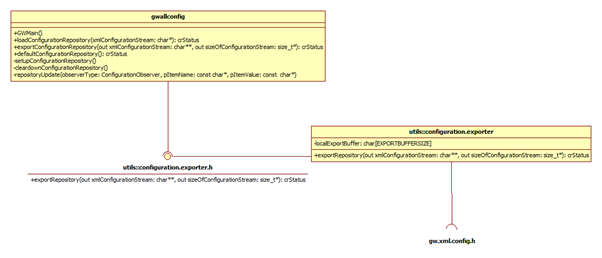

### 3.3.4 GW XML Config Module

The Configuration Loader and Configuration Exporter modules have responsibility associated with the receiving and publishing of Glasswall configuration in XML format. These modules use the GW XML Config module to access XML functionality. The GW XML Config module is a wrapper around the MXML third-party library.

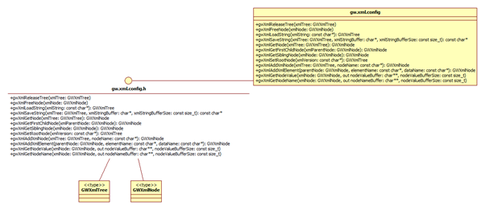

## 3.4 Camera Configuration

As shown in section 3.3 above the cameras have a dependency on the configuration.repository.client.if.h interface. Through this interface they register their configuration with the configuration repository. The camera&#39;s configuration module, in this example pdf.camera.configuration, is responsible for providing a function used by gwallconfig to instigate the registration of the camera&#39;s configuration with the repository. In the diagram below only the functions associated with the PDF Watermark configuration have been included as examples.

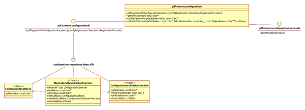

As part of the registration process the camera&#39;s configuration module registers the data item name and the default data item value. Along with these configuration items the configuration module also provides an update callback function and a validation callback function.

The data item&#39;s validation callback function is called when an attempt is made to updated the value of the data item to ensure that the new value is valid. The

The data item&#39;s update callback function is called by the configuration repository in the event of the data item&#39;s value being changed. The callback is then responsible for ensuring that the updated value is made available to the camera.

Other modules within the PDF camera access the PDF Camera Configuration through the pdf.camera.configuration.access.h interface.

# 4 Key Scenarios

## 4.1 Start-up

The call from the System object in the sequence diagram below is implemented using platform specific techniques, encapsulated within GWMain. All sequencing from GWMain is common between platforms. In common with earlier examples, only the PDF Watermark configuration item is included for simplicity. In the event of addition configuration items being used by a camera then multiple calls to crRegisterDefault would be made by the camera.

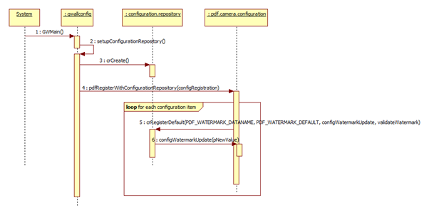

The addition of further cameras to the configuration system would involve the gwallconfig module&#39;s setupConfigurationRepository function being extended to include the additional cameras&#39; &#39;RegisterWithConfigurationRepository&#39; functions.

## 4.2 Configuration Item Update

The GWFileConfigXML API function provide the client application with the ability to modify the Glasswall configuration. It is not necessary to submit a complete XML configuration string to the function, only those configuration items which require updating need be included.

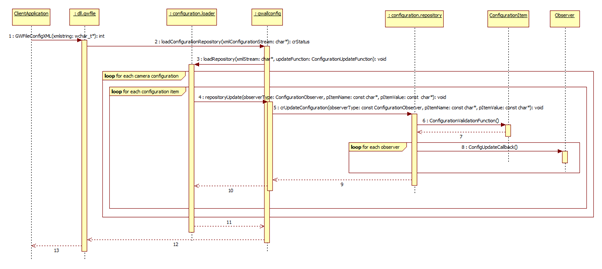

When the XML configuration string (see definition in References section) is received by the gwallconfig module it uses the configuration.loader to parse the string and update the repository using the specified update function.

When a configuration item is passed to the configuration repository for update the new value if validated using the function provided at start-up, if successful any observers of that configuration item are informed using the callback defined when the observer was registered.

## 4.3 Configuration Export

The export of configuration from the repository requires storage to be made available to the client application. To avoid the client application having responsibility for correctly releasing resources the existing global buffer facility (provided by the gwalllib module) is used to provide managed resources that can safely be provided to the client application.

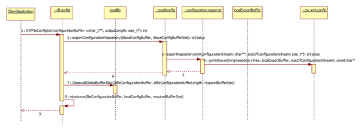

Since the Global Buffer Allocation requires a size to be allocated, a fixed size buffer (localExportBuffer in the above sequence) is used by the configuration.exporter module to store the initial XML string. The location of localExportBuffer is then returned to dll.gwfile and used as the source string when sizing and populating the globally allocated buffer.