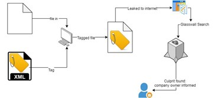

### Security Tagging

Glasswall FileTrust can inject data into files to provide security tagging and a document traceability mechanism. Security Tagging involves tagging a document by inserting meta-data into hidden locations of a document which the user specifies as strings in XML format. The hidden locations where the tag data can be injected to vary by filetype. Furthermore, the user has complete flexibility with what data can be security tagged to the file.

Once the tags have been injected throughout the file, a tagged version of the original document is outputted which is un-traceable to the average user.

### Tag Retrieval

From a document trace-ability standpoint, all data tagged by Glasswall can be retrieved and when retrieved are provided in the same format it has been tagged in which is XML.

_Below is an example use-case of Security Tagging._

## Supported Filetypes:

### Office Filetypes:

- XLSX
- PPTX
- DOCX
- XLS
- PPT
- DOC

### Image Filetypes:

- JPEG
- TIFF
- GIF
- JPEG
- PNG