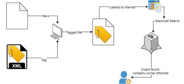

### Security Tagging

Glasswall FileTrust can inject data into files to provide security tagging and a document traceability mechanism. Security Tagging involves tagging a document by inserting meta-data into hidden locations of a document which the user specifies as strings in XML format. The hidden locations where the tag data can be injected to vary by filetype. Furthermore, the user has complete flexibility with what data can be security tagged to the file.

Once the tags have been injected throughout the file, a tagged version of the original document is outputted which is un-traceable to the average user.

### Specifying Tags
As shown above, security tags are defined in the tags file.

The tags you enter depend on your requirements. For example, you could add tags to track items such as the date/time the file was created or modified, details of the user who created or modified the file, the machine on which the object was created (for example, IP Address / MAC Address / hostname), etc.

The format and syntax for the tags file is as shown in the example below.
```
<?xml version="1.0"?>
<digitalsignature>
    <s1>File Created: User: user1@example.com, IP: 192.168.0.2, Time/Date: 10:03am / 02 April 2020</s1>
    <s2>File Modified: User: user2@example.com, IP: 192.168.0.6, Time/Date: 14:33pm / 02 April 2020</s2>
    <s3>File Modified: User: user1@example.com, IP: 192.168.0.2, Time/Date: 15:10pm / 02 April 2020</s3>
</digitalsignature>
```
The specified content is added to the tagged file.

### Tag Retrieval

From a document traceability standpoint, all data tagged by Glasswall can be retrieved. The tagged data is extracted from the tagged file, then an XML file is outputted containing the tag data.

In our example below, the following tagged data is included in the file:

```
<digitalsignature>
<s1>File Created: User: user1@example.com, IP: 192.168.0.2, Time/Date: 10:03am / 02 April 2020</s1>
<s2>File Modified: User: user2@example.com, IP: 192.168.0.6, Time/Date: 14:33pm / 02 April 2020</s2>
<s3>File Modified: User: user1@example.com, IP: 192.168.0.2, Time/Date: 15:10pm / 02 April 2020</s3>
</digitalsignature>
```



## Supported Filetypes:

### Office Filetypes:

- XLSX
- PPTX
- DOCX
- XLS
- PPT
- DOC

### Image Filetypes:

- JPEG
- TIFF
- GIF
- JPEG
- PNG