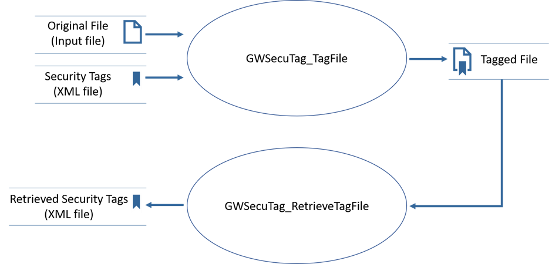

The Security Tagging wrappers allow you to call Glasswall Editor Security Tagging APIs from your chosen language. Wrappers are provided for Python, C#, JavaScript and Java.

These wrappers are provided in addition to the wrappers provided for core functionality. See [**Core Wrappers**](https://docs.glasswallsolutions.com/sdk/editor/Content/Wrappers/Core%20Wrappers.htm).

Each wrapper consists of:

- The wrapper itself: a bridge between the Glasswall Editor and the desired language;

- A series of supporting files (language dependent).

## General Requirements

The following general requirements must be met to use the wrappers and their test apps:

- The Glasswall Core 2 libraries and their dependencies

  - glasswall\_core2.dll

  - \*\_camera.dll

  - QT5Core.dll

  - Qt5gui.dll

  - Qt5Network.dll

  - Qt5Xml.dll

  - Qt5XmlPatterns.dll

  - Quazip.dll

- A designated folder containing files to be tagged or untagged

- A designated folder to hold the processed files

- An XML file containing the data to tag the files with

- The wrapper itself.

## Test Application Overview

Each wrapper is provided with a test application. This application is designed to call each of the Glasswall Editor Security Tagging APIs from the chosen language.

The process is described in this Data Flow Diagram:

|   |
| --- |