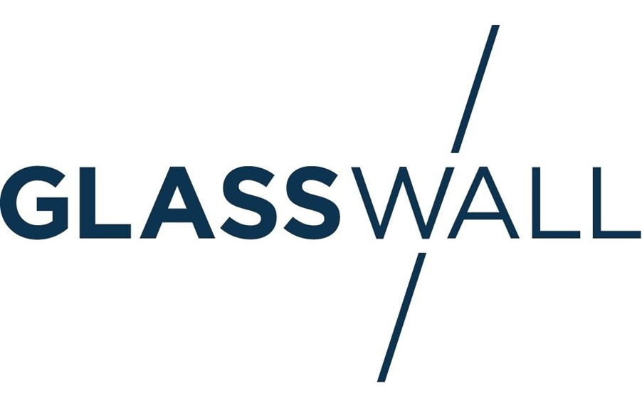

<div style={{textAlign: 'center'}}>

# Glasswall API Language Wrapper Documentation
# C#

&copy; 2020 Glasswall Solutions Ltd ALL RIGHTS RESERVED<br />
ALL RIGHTS RESERVED

Information contained herein is the property of Glasswall Limited and is proprietary and confidential.

Martin O'Brien

Glasswall Solutions Ltd.

[support@glasswallsolutions.com](mailto:support%40glasswallsolutions.com)
</div>


_Creation Date – 14 October 2020_

_Version – 1_


## Purpose

The purpose of the wrappers is to expose the Core 2 SDK functionality through Python, C#, JavaScript and Java.

Each wrapper consists of:

- The wrapper itself: a bridge between the Core 2 SDK and the desired language.
- A series of supporting files (language dependent).

## General Requirements

The following general requirements must be met to use the wrappers and their test applications:

- The Glasswall Core 2 libraries and their dependencies
  - glasswall\_core2.dll
  - \*\_camera.dll
- A designated folder containing files to be input into Core 2
- A designated folder to hold the output from Core 2
- A policy file to modify the default Core 2 file processing behaviour
- The wrapper itself.

## Test Application Overview

Each wrapper is provided with a test application. This application is designed to call each of the Core 2 APIs from the chosen language and generate a log file of the results.
 The execution steps are:

- All supporting files, folders and dependencies are checked
- The contents of the output directory are erased in preparation for file processing
- For each file in the input directory:
  - A new folder is created in the output directory and is named for the file currently being processed
  - A series of 23 tests are performed, as detailed in the Wrapper Test Calls document
  - The files generated by Glasswall are saved in the specified output directory
  - A log file detailing the result of each test is generated and saved as local\_process\_log.txt
- When all files have been processed, a final log file named process\_log.txt is saved in the root of the output directory.

C# Wrapper

### Environment

- Ensure the DLL glasswall.core2.csharp.wrapper is added as a reference to your environment.
- Ensure that the Core 2 Libraries and all required folders are accessible to the wrapper.

### Example Code

The following code uses the C# wrapper to process a file and place the managed file in a buffer. A policy file is specified, and an analysis report is generated. Note that the memory buffer is non-persistent and will have to be processed, analysed, or stored, before the script finishes. The policies file, config\_sanitise.xmlwill be placed in the specified directory.

```csharp
using glasswall.core2.wrapper;
using system;

class Program
    {
        static void Main(string[] args)
        {
            IntPtr buffer = new IntPtr();
            UIntPtr bufferLength = new UIntPtr();
 
            // create Glasswall object. 
            var gw = new Glasswall("e:\\Core2_dlls");
 
            // open session
            var sessionId = gw.OpenSession();
            
            // register inputfile 
            var returnStatus = gw.RegisterInputFile(sessionId, "e:\\Input\\A.xlsx");
 
            // register outputmemory: the processed data is non-persistent
            returnStatus = gw.RegisterOutputMemory(sessionId, out buffer, ref bufferLength);
 
            // register policies file
            returnStatus = gw.RegisterPoliciesFile(sessionId, "e:\\Config\\config_sanatise.xml", 0);
 
            // register analysis file
            returnStatus = gw.RegisterAnalysisFile(sessionId, "e:\\Output\\Analysis.xml", 0);
 
            // run the session
            returnStatus = gw.RunSession(sessionId);
 
            // close the session
            returnStatus = gw.CloseSession(sessionId);
        }
    }


```