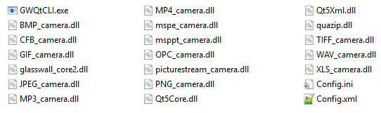

Step by Step Setup

1. Copy all library files into one folder.

2. Copy the CLI to the same folder.

3. Copy the sample config files to the same folder (the contents should now look like the image above)

4. Open the terminal.

5. Use pushd to set the present working directory to the folder containing all the above files.

6. **In Linux only**  the following is required for security tagging functions to work; In the terminal window enter: _export LD\_LIBRARY\_PATH=&quot;Core2 library location&quot;_.

7. Run Glasswall using the input/output or config file options described below.

8. Once this is complete you can use the results to check for any unwanted content, the xml files will contain information about each file and any issues found within it if it was non conforming.