## Help

Each of the below inputs gives you the following output.

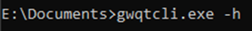 /  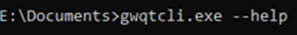 /  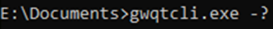

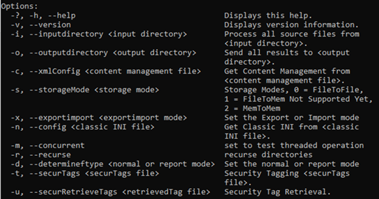

## Using Input and Output

Option 1:

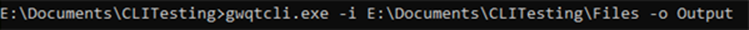

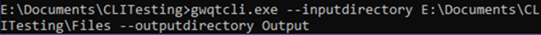

Using this option would process the files in the Files folder and create an Output folder inside the CLI Testing folder containing the files created by Glasswall.

Option 2:

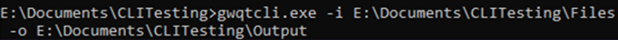

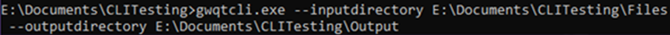

Using this option would process the files in the Files folder and put the processed files in the already existing Output folder or create the output folder in the specified location if it doesn&#39;t already exist.

## Storage Mode

Storage Modes:

Default or 1: File to File

2: File to Memory (not currently implemented and runs as 1)

3: Memory to Memory

 /  

Either of the above options will set the storage mode to your chosen setting, this parameter can be used along with the input and output parameters and the processed content will be put into the output folder specified.

## Import/Export

 /  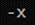

Either of the above options will set the import/export parameter to your chosen setting. This parameter can be used along with the input and output parameters and the processed content will be put into the output folder specified.

The format of the export can be controlled using a setting in the content management XML config file, it can be set to SISL(default) or XML. See the [**Config Files**](#config-files) example below.

## Config Files

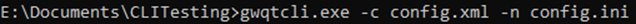

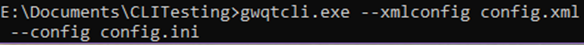

**XML Config File**

The XML config file is used to decide how content is managed within each file type. The default setting for each content type is sanitise which means the files will have this content removed or passed down to be processed by sub cameras during the process, if any content type or file type is missing from this document they will be sanitised. The other options are allow and disallow, if you allow content this means it will not be removed from the file. If you disallow content the whole file will be rejected and classed as non-conforming. Below is a sample config.xml file. The highlighted section changes the export format to XML.
```
<?xml version="1.0" encoding="utf-8"?>
<config>

<pdfConfig>
<watermark>Glasswall Approved</watermark>
<metadata>sanitise</metadata>
<acroform>sanitise</acroform>
<javascript>sanitise</javascript>
<external_hyperlinks>sanitise</external_hyperlinks>
<actions_all>sanitise</actions_all>
<embedded_files>sanitise</embedded_files>
<non_conforming_images>disallow</non_conforming_images>
</pdfConfig>

<wordConfig>
<embedded_files>sanitise</embedded_files>
<metadata>sanitise</metadata>
<macros>sanitise</macros>
<external_hyperlinks>sanitise</external_hyperlinks>
</wordConfig>

<pptConfig>
<embedded_files>sanitise</embedded_files>
<metadata>sanitise</metadata>
<macros>sanitise</macros>
<external_hyperlinks>sanitise</external_hyperlinks>
</pptConfig>

<xlsConfig>
<embedded_files>sanitise</embedded_files>
<metadata>sanitise</metadata>
<macros>sanitise</macros>
<external_hyperlinks>sanitise</external_hyperlinks>
</xlsConfig>

<sysConfig>
<interchange_type>xml</interchange_type>
<interchange_pretty>true</interchange_pretty>
</sysConfig>

</config>
```

**INI Config File**

The INI config file can be an INI or TXT file, it contains most of the parameters in the terminal, you can set the report mode, storage mode, input location and output location. The only details that are processed by QTCLI are the highlighted lines in the example below. The remainder are there for backwards compatibility with Glasswall Classic CLI.
```
[GWConfig]

processMode = 8

reportMode = 0

fileStorageMode = 1

fileType = \*

inputLocation = E:\Documents\CLITesting\Files

useSubfolders = 1

outputLocation = output

createOutputFolders = 1

nonConformingDirName = NonConforming

managedDirName = Managed

writeOutput = 1

logFileSize = 0

logFileProcessTime = 1
```
## Multithreading

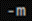 /  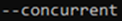

The above parameters will tell the application to run in multithreaded mode, this involves processing files concurrently. This can reduce the time it takes to process a set of files because multiple files can be processed at the same time up to the ability of your computer to handle.

## Recurse

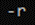 /  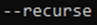

The above parameters will tell the application to process all files within the subfolders of the provided input directory. For example if you have 5 subfolders containing files within the folder Test they would all be processed through the application.

## Security Tags and Retrieval

Full Tagging Example:  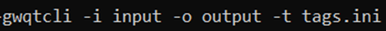

Full Tag Retrieval Example:  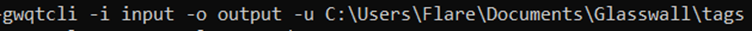

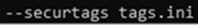 /  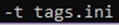

The above parameters will insert the security tags provided in the tags.ini file. See example below.

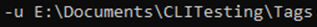

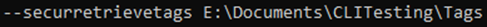

The above parameters will retrieve the security tags from the files it is processing and save the output in the folder provided. Below is an example of the file required for inserting tags and the output of retrieved tags.
```
<digitalsignature>
<s1>20191012123106</s1>
<s2>112.31.04.102</s2>
<s3>9C-35-5B-5F-4C-D7</s3>
<s4>gw.localhost</s4>
<s5>20191012083106</s5>
<s6>20191012092106</s6>
<s7>20191015123106</s7>
<s8>Fred Smith</s8>
<s9>Fred Smith</s9>
<s10>Tina Gray</s10>
<s11>RegisterOutputMem Mem TODO</s11>
</digitalsignature>
```

## Wordsearch

Full Example:  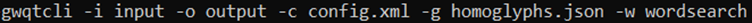

  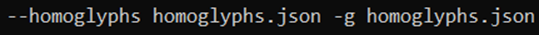

The above parameters will tell the application to redact the words/phrases specified in the provided config file from all files in the specified input folder. Below are the wordsearch policies provided in the config.xml file that dictate the words/phrases to be replaced and what they will be replaced with.
```
<textSearchConfig libVersion="core2">
<textList>

<textItem>

<text>Generic</text>

<textSetting replacementChar="*">redact</textSetting>

</textItem>

<textItem>

<text>testing</text>

<textSetting replacementChar="#">redact</textSetting>

</textItem>

<textItem>

<text>WAVE</text>

<textSetting>allow</textSetting>

</textItem>

</textList>

</textSearchConfig>
```

## Archive Manager

Full Example:  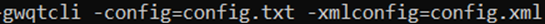

The above parameters will tell the application to call the config files that contain the archive policies below along with the input and output locations.
```
<archiveConfig libVersion="classic" defaultCompression="zip">
        <bmp>process</bmp>
        <doc>process</doc>
        <docx>discard</docx>
        <pdf>no_action</pdf>
        <xlsx>no_action</xlsx>
        <emf>process</emf>
        <gif>process</gif>
        <jpeg>process</jpeg>
        <wav>process</wav>
        <o>process</o>
        <elf>discard</elf>
        <pe>process</pe>
        <mp4>process</mp4>
        <mpg>process</mpg>
        <png>process</png>
        <ppt>process</ppt>
        <pptx>process</pptx>
        <tiff>process</tiff>
        <wmf>process</wmf>
        <xls>process</xls>
        <mp3>no_action</mp3>
        <obj>process</obj>
        </archiveConfig>
    ```