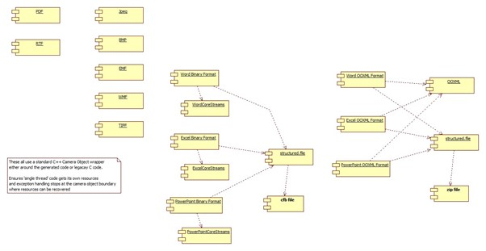
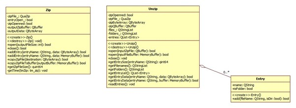
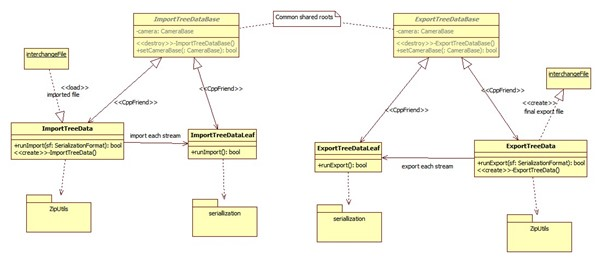
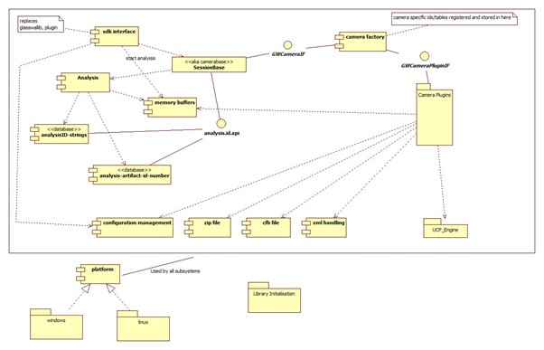
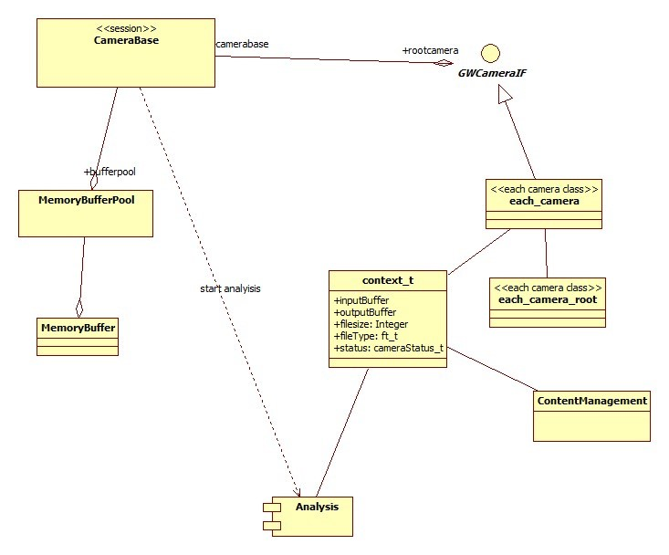
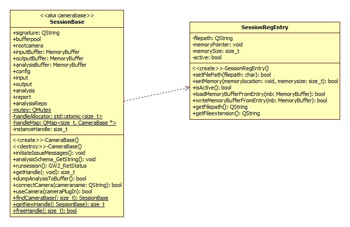
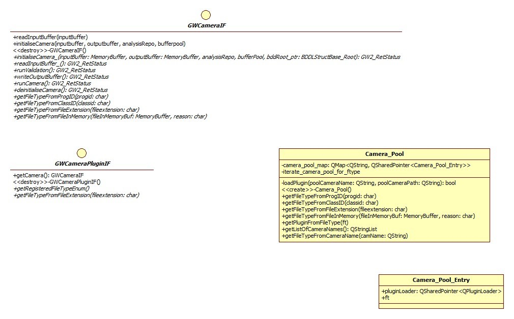

# Glasswall Solutions Ltd

# Planning and Implementation Guide

# Steven Warner

# 1 Camera Pool

# 2 Export/Import

## 2.1 Version 2 Package

### 2.1.1 Interface Object

Notes

entryname of form xxxx\yyyy\zzzz used to insert to specific stream or substream. (I believe underlying quazip/minizip supports this)

### 2.1.2 Import/Export procedure

Changes:

Change Import/Export to use leaves

Change Export/Import to start cameras independent of session manager

# 3 Cameras

## 3.1 Structured File Types

A common BDDL Based definition is defined to encapsulate the usual elements held in each level of a structured document (OPC and CFB being examples)

Each leaf in the tree holds a stream in the file.

Both OPC and CFB formats inherit the basic definition and connect to handwritten load/unload code that deals with the underlying format.

Initial Implementation:

For expediency, using generated structure/read/write output as framework seems a suitable starting point.

### 3.1.1 OPC

OPC\_StructuredFile :

StructuredContents : StructuredDirectory \*

(StructuredDirectory | StructuredStream) \*

See glasswall.classic\data.definitions.and.rules\MSOffice\bddl\StructuredStorage\ms-opc\ms-opc.bdd

Each stream can then be loaded with data from the streams in the zip file.

On write back, the usual checked flag for writing unset will mean skip the stream on regeneration of the zip file.

### 3.1.2 CFB

# 4 Camera interface

Ensure easy way to start a camera on a memorybuffer is part of the interface

#

# 5 Reason for New Core2

# 6 Structure of platform

# 7 Folder Layout

+--- **buildoutput**

+--- **cameras**

| \---camera.pool

| +---bmp

| +---bmp.support

| +---cfb

| +---documentsummaryinformationfile.support

| +---dsi

| +---elf

| +---elfdocument.support

| +---emf

| +---emf.support

| +---equationnative

| +---equationnative.support

| +---excelcorestreams.support

| +---macho

| +---macho.support

| +---mp3

| +---mp3.support

| +---mp4

| +---mp4.support

| +---mpeg

| +---mpeg.support

| +---msdoc

| +---mspe

| +---mspe.support

| +---msppt

| +---msxls

| +---officexml.support

| +---ooxml

| +---ooxml.support

| +---opc

| +---opc.support

| +---png

| +---png.support

| +---powerpointcorestreams.support

| +---printersettings

| +---printersettings.support

| +---rtf

| +---rtf.support

| +---tiff

| +---tiff.support

| +---wav

| +---wav.support

| +---wmf

| +---wmfbase.support

| \---wordcorestreams.support

+--- **core.support**

| +---analysis

| | +---analysis.id.api

| | +---AnalysisInfo

| | \---AnalysisRepository

| | +---RepositoryComponents

| | \---XML\_Reporting

| +---camera\_pool

| +---content.management

| +---gw.zip.support

| +---import.export

| +---lib

| | \---quazip

| | +---include

| | +---linux

| | \---win

| +---MemoryBuffer

| +---platform

| +---sdk.interface

| | \---api\_entrypoints

| +---session

| +---ThirdParty

| | \---SafeInt

| +---ucp\_engine

| +---ucp\_tree\_support

| | \---bddltreeimpl

| \---utils

| +---CustomExceptions

| \---mxml

+--- **core2**

| \---distribution

+--- **core2.dll**

\---qt\_core2\_dataviewerSession use (client view)

# 8 Test Tool GWQtCLI

# 9 CameraBase (aka session) 

#

# 10 Plugin use

# 11 &#39;filters&#39; concept

# 12 Plugin interface

# 13 Qt\_core2\_dataviewer

When you build the Core2 Project

# 14 Qt Usage