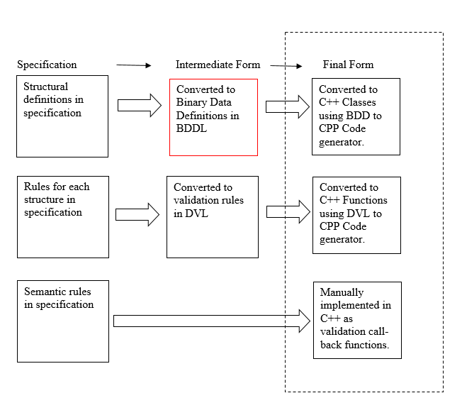
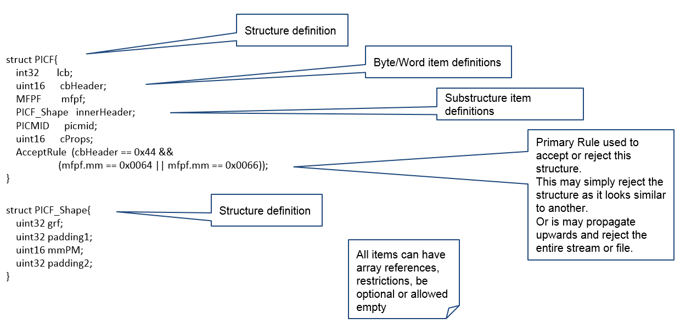
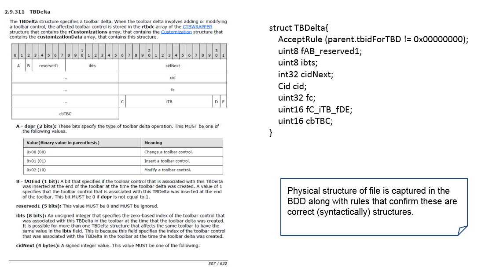
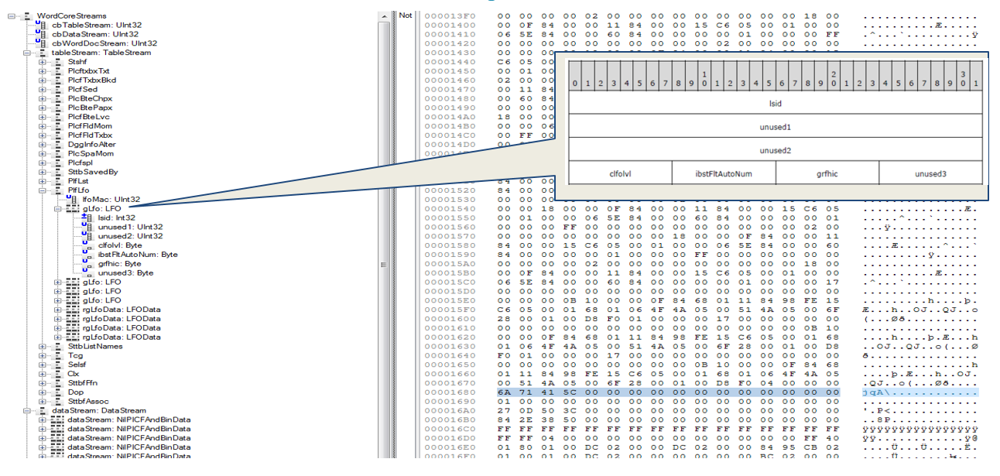

import useBaseUrl from '@docusaurus/useBaseUrl';

## Binary Data Definition Language (BDDL)

# Overview

BDDL is a Domain Specific Language (DSL) that defines the format of a binary (or string based) file format in terms of the sequence and layouts of the structures that it is comprised of i.e. BDDL defines the structures, how they may be used and their valid forms. The language was designed to be non-procedural, simple and human readable and can describe virtually any file format and has support for practically any data structure that can be met in a file.

To parse a file, a system needs to have knowledge about the internal structure 
of the file. There are several stages when generating a camera, the first
of which is defining the internal structure of the file in BDDL before
translating each definition to its final C++ form, with each structure
being converted to a Class in C++ via an internally developed code
generator. The diagram below shows the various stages involved in the 
code generation process and where BDDL fits in.

## Binary DOM Library and Miraplacid Viewer 

Miraplacid supplies a data viewer as well as a [Binary DOM library](binDomLib.pdf "binDomLib.pdf") that is used by Glasswall to test and validate the BDD definitions prior to generating C++ source files from them. 

Miraplacid Data Viewer is a tool for convenient binary file internals analysis based on BDDL definitions. It represents a binary file structure as a tree and display the hexadecimal content for the file in a hex viewer. Selected tree items or nodes highlight the corresponding binary data in the hex viewer.  The viewer also has rich search and navigation functionality as well as the ability to save selected chunks of data to a file.

Binary DOM is a software system designed for binary file content access and manipulation. The Binary DOM includes API (set of classes and interfaces for data loading, validation, manipulation and storing), and utility classes for parsing files and validation based on BDDL definitions. This gives the user the ability to develop tools and applications that can be used for various purposes including BDDL definition and document format validation.

# Binary Data Definition Language

The main building block of the binary data definition language is a document structure. Nested structures define an internal hierarchy of the document. Structures consist of items and rules. 

An item is a field in structure described by type which could be a primitive data type, a structure (which is simply the name of a defined structure) or an enumeration type. 

<u>BDDL Primitive Data Types</u>

•   uint8 or Byte - byte 
•   int8 or SByte - sbyte 
•   uint16 or UInt16 - ushort 
•   int16 or Int16 - short 
•   uint32 or UInt32 - uint 
•   int32 Int32 - int 
•   uint64 or UInt64 - ulong big endian 
•   int64 or Int64 - long big endian 
•   uint16be or UInt16BE - ushort big endian 
•   int16be or Int16BE - short big endian 
•   uint32be Uint32BE - uint big endian 
•   int32be or Int32BE - int big endian 
•   uint64be or UInt64BE - ulong big endian 
•   int64be or Int64BE - long big endian 
•   char or Char - 8-bit character (ANSI) 
•   wchar or UChar - 16-bit character (Unicode) 
•   float or Float - single 
•   double or Double - double

A rule is a condition that can be applied to a structure or a field. The rule is an expression which will be checked against this structure or field during parsing or validation, if the result of execution is false, structure or field will not be accepted.

<u>Main BDDL Rules</u>

<TABLE>
    <TR><TH>Rule</TH><TH>Description</TH></TR>
    <TR>
        <TD>optional</TD>
        <TD>When applied, if the current data item is omitted in a document that would not be an error.</TD>
    </TR>
    <TR>
        <TD>implicit</TD>
        <TD>All items of a type with "implicit" flag will be expanded and inserted into parent structure directly.</TD>
    </TR>
    <TR>
        <TD>allowempty</TD>
        <TD>If type or array is marked as “allowempty” and it is empty in the document, an error will not be thrown.</TD>
    </TR>
    <TR>
        <TD>restrictions</TD>
        <TD>Defines a special expression rule (in curly braces) which will be checked against the element. If the result of the rule execution is false - error will be reported.</TD>
    </TR>
    <TR>
        <TD>AcceptRule</TD>
        <TD>A pseudo-item containing expression which will be checked against this structure during parsing or validation. If the result of execution is false, structure will not be accepted.</TD>
    </TR>
</TABLE>

The language also provides various other attributes that aid in the definition of complex structures. More detailed information can be found in the [Binary Dom Library](BinaryViewer.chm "BinaryViewer.chm") documentation.

## Example 1
The diagram below shows an example of a binary data definition in BDDL of two structures from the Microsoft Word Binary MS-DOC specification.

## Example 2
The diagram below contains an example of a binary data definition in BDDL of a structure along-side the definition in Microsoft Word Binary MS-DOC specification.

# Binary Data Definition (BDD) - Verification

As described in previous sections, there are several stages to generating the structural definitions for the Glasswall parsers, the first of which is translating the file formats protocols defined in their official specification into BDDL structure definitions, before translating the BDD definitions into C++ code. 

Prior to converting the BDD files C++ there are several strategies and tests used for verifying that the structural definitions. This particularly includes the use of the Miraplacid Viewer and Binary DOM Library in conjunction with internally developed tools.

<u>Verification using the Miraplacid Data Viewer</u>

The Miraplacid viewer can load a file and represent the file and all the internal structure as a tree based on a specified .bdd file i.e. parses a file based on a BDD definition.

This allows a user to load a binary data file and parse it against the corresponding BDD definition, and visually verify that the file was parsed correctly and was therefore defined correctly.

## Example

The image below serves as an example of a MS-Word file loaded into the Miraplacid viewer and parsed against the binary data definitions developed by Glasswall.

<u>Verification using the Miraplacid DOM library</u>

Miraplacid Binary DOM includes an API (set of classes and interfaces for data loading, validation, manipulation and storing), and utility classes for parsing files and validating them using the binary data definition created in BDDL.

Glasswall has developed a tool called [Bin Directory Reader](../../7-tools/7_9-testing/7_9_1-BinDirectoryReader) using the Miraplacid Binary DOM SDK. The tool iterates over a directory of files, parsing and validating each file against a single or multiple BDD definitions, reporting the result of every processed file. This enables bulk verification of BDD structure definitions against a large set of files.

The guide and SDK documentation for Miraplacid Binary DOM library can be found in the document [Binary Viewer](BinaryViewer.chm "BinaryViewer.chm").

# BDDL Developers hints and tips

Glasswall defined hints and tips for BDDL developers can be found in document [BDDL Hints and Tips](../../3-guides/3_3-BddlhintsAndTips "BddlHintsAndTips.pdf")

# BDDL Developer Guidelines and Additions

Glasswall defined BDDL development guidelines and additions can be found in document [BDDL Developer Guidelines](../../3-guides/3_2-BddlDeveloperGuidelines "BddlDeveloperGuidelines.pdf").

# Related Links 

- [Binary DOM documentation](BinaryViewer.chm "BinaryViewer.chm")
- @ref BinDirectoryReader
- @ref dvl
- Glasswall Code Generators
    - @ref BddToCppConverter

