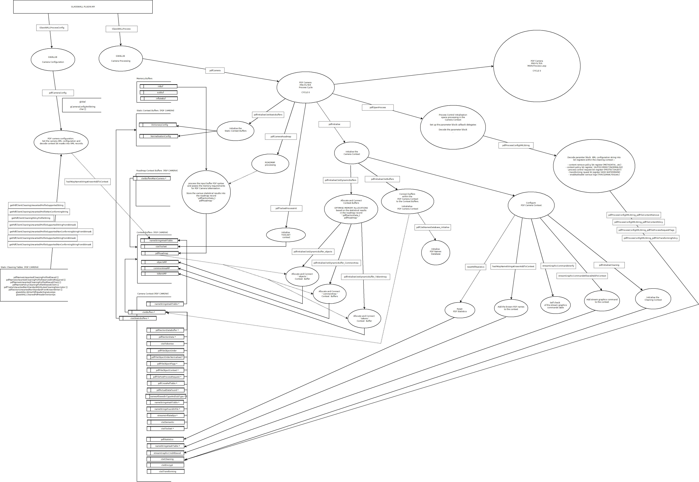

# Overview # 

The diagram below provides an overview of the PDF camera architecture.

# Requirement Specification #

View the [PDF Module Software Requirement Specification](<PDF Module - Software Requirement Specification.pdf> "PDF Module - Software Requirement Specification").

# Design and Architecture #

View the [PDF Module Architecture Design Document](<PDF Module - Architecture Design Document.pdf> "PDF Module - Architecture Design Document").

# PDF Camera - data elements

To see the PDF camera data elements, view the document [PDF Camera: data elements of the PDF Camera](data_elements_of_the_pdf_camera.md).

# Related Documents and Specifications #

- [PDF Introduction](PDF-Intro.pdf "PDF Introduction")
- [PDF Succinctly](PDF_Succinctly.pdf "PDF_Succinctly.pdf")
- [ISO_32000-1-2008(E)-Character_PDF_document](ISO_32000-1-2008E-Character_PDF_document.pdf "ISO_32000-1-2008E-Character_PDF_document.pdf")
- Filters
	- [DCT Filter](5116.DCT_Filter.pdf "5116.DCT_Filter.pdf")
	- [JBIG2 Filter](JBIG2.pdf "JBIG2.pdf")
	- [JPEG2000 Filter](JPEG2000CompressionFilter.pdf "JPEG2000CompressionFilter.pdf").
    Refer to @ref GlasswallDllCameraJPEG for further information on JPEG2000.   

# Tools #

PDFXplorer ("\\STORAGE-SERVER\Development Drive\Professional Development\Tools and Methods\Development Tools\PDFExplorer")

