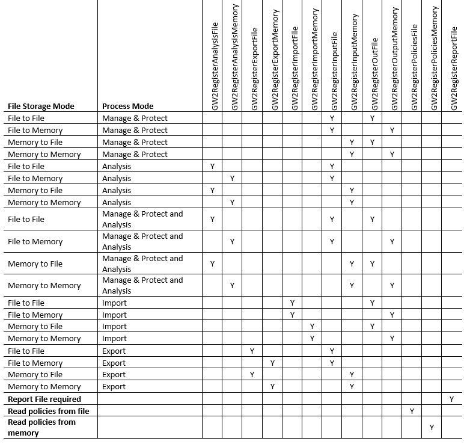

 
## **1 GLOSSARY**

|Term|Description
|---|---
| Session   | A session encapsulates the processing of a single file, specified either as a file path or a pointer to a memory image of the file. The session is given information regarding the required output of the session, the policies to be applied, and any other actions required.
|  Base name | The base name is the component left after all leading directory components have been removed from a file path. The base name can refer to a directory or file.

## **2 INTRODUCTION**

### 2.1 Objective
The objective of this document is to document the Application
Programming Interface (API) for the Glasswall Editor Dynamic Link
Library and Linux Shared Object.

### 2.2 Nomenclature

A monospaced font is used for any source code related information. This is
to distinguish it from normal text, and to obviate problems in other
fonts for reading names such as "lInfoFlag1" which is actually

    lInfoFlag1

(lowercase L and uppercase i look the same in quite a few fonts).

Depending on context, the word *bracket* is used to indicate any of the
paired delimiters `()`, `{}`, `[]`, although `()`  are sometimes referred to as parentheses, and `{}` are sometimes referred to as braces.

Code examples are shown using a monospaced font. Sometimes short examples are included in the text
in a monospaced font.

### 2.3 Glasswall Technology
Glasswall provides deep-file inspection, remediation, sanitisation and
reporting. The Glasswall API functions give third-party users the
ability to fine-tune an interface to the Glasswall functionality.

### 2.4 Types
The API makes available two enumerations for use by clients as argument
types to certain API functions. Include the header file
"`glasswall.core2.api.h`" in your source file and use the enumerators when
calling the API functions.

#### 2.4.1 Policy_format

The enumeration `Policy_format` is used to specify the format of the
policies file. The following enumerator is available:

    PF_XML

#### 2.4.2 Analysis_format

The enumeration `Analysis_format` is used to specify the format of the
analysis file. The following enumerator is available:

    AF_XML

#### `ft_t`

The enumeration `ft_t` is used to indicate the file type (file format) of
a file. Include header file "`filetype.h`" in your source code files to
use them.

This is marked for change to "Ft_t" to conform to the coding guidelines.

#### 2.4.4 Session

`Session` is a type that represents a file and the mechanisms used to
process that file. It is used by all Glasswall file processing API
functions.

This is marked for change to "SessionHandle".

### 2.5 Return Types

Most of the functions in the Glasswall API return a value that indicates success or failure. The values and their meaning are listed below.

  |Value|Meaning
  |---|---
  |-2|End of file was detected unexpectedly.
  |-1|General failure; Glasswall failed to process the file
  |0|General success; the file was processed successfully.
  |1|The file was processed successfully and cleaning was performed.

Each of the functions described in §3 assumes that one of these values is returned unless stated otherwise in the detailed description.

## **3. THE A.P.I.**

### 3.1 A.P.I. Overview

The API is session based. **Session** is a type that represents a file
and the mechanisms used to process that file. You create a **Session**
object by calling **GW2OpenSession** which returns a session handle. You
pass the session handle to other API functions to register the inputs
and outputs, the forms of the inputs and outputs (memory or a file) and
which processing mode is required (Analysis, Manage & Protect, Import,
Export). You then process the file by calling function **GW2RunSession**
and close the session calling **GW2CloseSession**, after processing any
non-persistent storage, or saving non-persistent storage.

The encapsulation of the processing of each file in a **Session** object
allows multi-thread processing.

The [API Functions](#api-functions) section provides details of each function, and
examples for their use.

The examples provided conform to the C programming language, as defined by ISO 9899:1990.

### 3.2 A.P.I. Functions

#### 3.2.1 The GW2CloseSession Function

**Synopsis**

    #include "glasswall.core2.api.h"
    int GW2CloseSession(Session session);

**Description**

The **GW2CloseSession** function closes the session designated by
**session**. All resources allocated by the session will be destroyed.
Only data stored to persistent storage can be processed by the client
after a successful call to **GW2CloseSession**.

**Returns**

If successful, the **GW2CloseSession** function returns zero; otherwise,
it returns non-zero.

#### 3.2.2 The **GW2DetermineFileTypeFromFile** Function

**Synopsis**

    #include "glasswall.core2.api.h"
    Ft_t GW2DetermineFileTypeFromFile(const char *path);

**Description**

The **GW2DetermineFileTypeFromFile** function determines the file type
for the file whose name is the string pointed to by **path**.

**Returns**

If **GW2DetermineFileTypeFromFile** cannot discern the file type, it
returns the value of the enumeration constant **ft_unknown** from the
enumerated type **ft_t**; otherwise, it returns a value from the
enumerated type **ft_t** indicating the file type. A list of the
enumeration constants is in the C source header file **filetypes.h**.

**Example**

    #include "glasswall.core2.api.h"
    #include "filetypes.h"

    ft_t file_type =
    GW2DetermineFileTypeFromFile("c:\dir1\dir2\filename");
    char *type = NULL;
    switch (file_type) /* categorise them */
    {
        case ft_doc:
        case ft_docx:
        case ft_ppt:
        case ft_pptx:
        case ft_xls:
        case ft_xlsx:
            type = "Microsoft Office";
            break;

        case ft_png:
        case ft_jpg:
        case ft_gif:
        case ft_tiff:
            type = "Image file";
            break;

        case ft_pdf:
            type = "PDF";
            break;

        default:
            type = "Unrecognised file type";
            break;
    }
    printf("File type is: %s\n", type);

#### 3.2.3 The **GW2DetermineFileTypeFromMemory** Function

**Synopsis**

    #include "glasswall.core2.api.h"
    Ft_t GW2DetermineFileTypeFromFile(const char *inputFileBuffer, size_t inputLength);

**Description**

The **GW2DetermineFileTypeFromMemory** function determines the file type
of the file whose content is in the buffer pointed to by
**inputFileBuffer**.

**Returns**

If **GW2DetermineFileTypeFromMemory** cannot discern the file type, it
returns the value of the enumeration constant **ft_unknown** from the
enumerated type **ft_t**; otherwise, it returns a value from the
enumerated type **ft_t** indicating the file type. A list of the
enumeration constants is in the C source header file **filetypes.h**.

#### 3.2.4 The **GW2FileErrorMsg** Function

**Synopsis**

    #include "glasswall.core2.api.h"
    int GW2FileErrorMsg(Session session, char **errorMsgBuffer, size_t *errorMsgBufferLength);

**Description**

The **GW2FileErrorMsg** function retrieves the error message reported by
Glasswall. A pointer to the error message is placed in the object
pointed to by **errorMsgBuffer** and the size, in bytes, of the error
message is placed in the **size_t** object pointed to by
**errorMsgBufferLength.**

If there was more than one reason for the error, only one will be
reported by this function call. If details are required for the failure,
they will be present in the analysis report produced if either of the
functions **GW2RegisterAnalysisFile** or **GW2AnalysisRegisterMemory**
were called on the session. If not, the document can be processed by
Glasswall using either of those functions in another session to produce
a detailed analysis report.

#### 3.2.5 The **GW2FileSessionStatus** Function

**Synopsis**

    #include "glasswall.core2.api.h"
    int GW2FileSessionStatus(Session session,
        int *glasswallSessionStatus,
        char **statusMsgBuffer, size_t *statusBufferLength);

For session **session** the **GW2FileSessionStatus** function places in
the object pointed to by **glasswallSessionStatus** a pointer to a
string that describes, at a high level, the processing carried out on
the last document processed by Glasswall.

**Returns**

If **session** is invalid (0), or a value that has not been returned by
**GW2OpenSession**, it will return -1 and **glasswallSessionStatus**,
**statusMsgBuffer** and **statusBufferLength** will be undefined. If
**session** is valid, the function returns 0 and
**glasswallSessionStatus, statusMsgBuffer** and **statusBufferLength**
will be populated.

#### 3.2.6 The **GW2GetAllIdInfo** Function

**Synopsis**

    #include "glasswall.core2.api.h"
    int GW2GetAllIdInfo(Session session, size_t *bufferLength, char **outputBuffer);

**Description**

For session **session** the **GW2GetAllIdInfo** function places in the
object pointed to by **outputBuffer** a pointer to XML data populated
with Glasswall Issue ID descriptions and value ranges. The length, in
bytes, of the populated output buffer is placed in the **size_t** object
pointed to by **bufferLength**.

**Example**

    #include "glasswall.core2.api.h"

    char *outbuf = NULL;
    size_t buflen = 0;
    if (GW2OpenSession())
        /* error opening session */
    else
    {
        int status = GW2GetAllIdInfo(session, &buflen, &outbuf);
        /* if status is not 0, outbuf points to a buffer containing the XML file.
        * Either process the data pointed to, or copy the data and process it
        * after the session is closed
        */
        if (GW2CloseSession())
            /* error closing session */
    }

#### 3.2.7 The **GW2GetIdInfo** Function

**Synopsis**

    #include "glasswall.core2.api.h"
    int GW2GetIdInfo(Session session, size_t issueId, size_t *bufferLength, char **outputBuffer);

**Description**

For session **session**, **GW2GetIdInfo** places in the object pointed
to by **outputBuffer**, a pointer to a description of Glasswall Issue ID
**issueId**. The length of the description, in bytes, is placed in the
**size_t** object pointed to by **bufferLength**.

**Example**

    #include "glasswall.core2.api.h"

    char *outbuf = NULL;
    size_t buflen = 0;
    if (GW2OpenSession())
        /* error opening session */
    else
    {
        int status = GW2GetIdInfo(session, issueId, &buflen, &outbuf);
        /* if status is not 0, outbuf points to a buffer containing the XML file.
        * Either process the data pointed to, or copy the data and process it
        * after GW2CloseSession is called
        */
        if (GW2CloseSession())
            /* error closing session */
    }

#### 3.2.8 The **GW2GetPolicySettings** Function

**Synopsis**

    #include "glasswall.core2.api.h"
    int GW2GetPolicySettings(Session session,
                             char **policiesBuffer,
                             size_t *policiesLength,
                             Policy_format format
                            );

**Description**

The **GW2GetPolicySettings** function returns the policy settings used
for session **session**. A pointer to the information is placed in the
object pointed to by **policiesBuffer** and the size, in bytes, of the
data pointed to is placed in the **size_t** object pointed to by
**policiesLength**. The format of the data will be in the format
specified by **format**.

#### 3.2.9 The **GW2LibVersion** Function

**Synopsis**

    #include "glasswall.core2.api.h"
    const char *GW2LibVersion(void);

**Returns**

The **GW2LibVersion** function returns a pointer to a constant string
describing the current version of the Glasswall Core 2 library.

**Example**

    #include <stdio.h>
    #include "glasswall.core2.api.h"

    puts(GW2LibVersion());

#### 3.2.10 The **GW2OpenSession** Function

**Synopsis**

    #include "glasswall.core2.api.h"
    Session GW2OpenSession(void);

The **GW2OpenSession** function creates a new session.

**Returns**

If successful, the **GW2OpenSession** function returns a handle, a small
positive integer that designates the session. The handle is used as an
argument to other API functions to identify the session. If the call
fails, the handle will be zero.

**Example**

    #include "glasswall.core2.api.h"
    
    Session session = GW2OpenSession();
    if (!session)
        /* deal with error */
    else
        /* use session to refer to the session in other API function calls */
    
    /* later */
    if (GW2CloseSession(session))
        /* error closing session */

#### 3.2.11 The **GW2RegisterAnalysisFile** Function

**Synopsis**

    #include "glasswall.core2.api.h"
    int GW2RegisterAnalysisFile(Session session,
                                const char *analysisFilePath,
                                Analysis_format format
                               );

**Description**

The **GW2RegisterAnalysisFile** function stores in the file whose name
is pointed to by string **analysisFilePath** the analysis report
produced by a successful run of API function **runSession** that used
session **session**. Using this function activates the Analysis Process
Mode for the session.

**Example**

    #include "glasswall.core2.api.h"
    
    Session session = GW2OpenSession();
    if (!session)
        /* deal with error */
    else
        if (GW2RegisterAnalysisFile(session,
                                    "c:\\analysis_files\\analysis_file_023.xml",
                                    AF_XML)
                                   )
            /* deal with error */
        else
            /* analysis file registered */
    
    /* later */
    if (GW2CloseSession(session))
        /* error closing session */

#### 3.2.12 The **GW2RegisterAnalysisMemory** Function

**Synopsis**

    #include "glasswall.core2.api.h"
    int GW2RegisterAnalysisMemory(Session session,
                                  char **analysisFileBuffer,
                                  size_t analysisLength,
                                  Analysis_format format
                                 );

**Description**

The **GW2RegisterAnalysisMemory** function stores in the object pointed
to by **analysisFileBuffer** a pointer to the analysis report produced
by a successful run of API function **runSession** that used session
**session**. The size of the analysis report, in bytes, is placed in the
object pointed to by **analysisLength**. The format of the analysis
report will be in the format requested by **format**. Using this
function activates the Analysis Process Mode for the session.

**Example**

    #include "glasswall.core2.api.h"
    
    HANDLE session;
    char *analysisReport = NULL;
    session = GW2OpenSession();
    if (!session)
        /* deal with error */
    else
        if (GW2RegisterAnalysisMemory(session, &analysisReport, PF_XML))
        /* deal with error */
        else
        /* analysisReport points to the analysis report data */
    
    /* later */
    if (GW2CloseSession(session))
        /* error closing session */

#### 3.2.13 The **GW2RegisterExportFile** Function

**Synopsis**

    #include "glasswall.core2.api.h"
    int GW2RegisterExportFile(Session session, const char *exportFilePath);

**Description**

The **GW2RegisterExportFile** function registers the file whose name is
the string pointed to by **exportFilePath** with the session denoted by
**session.** The exported data will be placed in that file. Using this
function activates the Export Process Mode for the session.

#### 3.2.14 The **GW2RegisterExportMemory** Function

**Synopsis**

    #include "glasswall.core2.api.h"
    int GW2RegisterExportMemory(Session session,
                                char **exportFileBuffer,
                                size_t *exportFileBufferLength
                               );

**Description**

For session **session**, the **GW2RegisterExportMemory** function
registers where the exported content is to be placed, and where to place
the size in bytes of the exported content. A pointer to the exported
content will be placed in the object pointed to by **exportFileBuffer**
and the size in bytes of the exported data will be placed in the
**size_t** object pointed to by **exportFileBufferLength**. The exported
content will be deleted when the session is closed using
**GW2CloseSession**. Using this function activates the Export Process
Mode for the session.

#### 3.2.15 The **GW2RegisterImportFile** Function

**Synopsis**

    #include "glasswall.core2.api.h"
    int GW2RegisterImportFile(Session session, const char *importFilePath);

**Description**

The **GW2RegisterImportFile** function registers the file whose name is
pointed to by **importFilePath** as the file it should import. The file
must conform to the interchange file format. Using this function
activates the Import Process Mode for the session.

#### 3.2.16 The **GW2RegisterImportMemory** Function

**Synopsis**

    #include "glasswall.core2.api.h"
    int GW2RegisterImportMemory(Session session, char *importFileBuffer, size_t *importLength);

**Description**

The **GW2RegisterImportMemory** function registers with the session
denoted by **session** the file which is stored in the buffer pointed to
by **importFilePath** of size **inputLength** bytes as the file it
should import. The file must conform to the interchange file format.
Using this function activates the Import Process Mode for the session.

#### 3.2.17 The **GW2RegisterInputFile** Function

**Synopsis**

    #include "glasswall.core2.api.h"
    int GW2RegisterInputFile(Session session, const char *inputFilePath);

**Description**

The **GW2RegisterInputFile** function registers the file to be processed
in session **session**. The file name is the string pointed to by
**inputFilePath**.

**Example**

    #include "glasswall.core2.api.h"
    
    HANDLE session = GW2OpenSession();
    if (!session)
        /* deal with error */
    else
    {
        if (GW2RegisterInputFile(session, "filename.doc"))
            /* deal with error */
        else
            /* continue processing */
            ...
    }

    /* later */
    if (GW2CloseSession(session))
        /* error closing session */

#### 3.2.18 The **GW2RegisterInputMemory** Function

**Synopsis**

    #include "glasswall.core2.api.h"
    int GW2RegisterInputMemory(Session session, const char *inputFileBuffer, size_t inputLength);

**Description**

The **GW2RegisterInputMemory** function registers the file which is
stored in the buffer pointed to by **inputFileBuffer** of size
**inputLength** bytes, with the session denoted by **session.**

**Example**

    #include "glasswall.core2.api.h"
    . . .
    HANDLE session = GW2OpenSession();
    if (!session)
        /* deal with error */
    else
    {
        /* ... load file contents into buffer 'buf' and log the file size in 'size' ... */
        if (GW2RegisterInputMemory(session, buf, size))
            /* deal with error */
        else
            /* continue processing */
            ...
    }

    /* later */
    if (GW2CloseSession(session))
        /* error closing session */

#### 3.2.19 The **GW2RegisterOutputFile** Function

**Synopsis**

    #include "glasswall.core2.api.h"
    int GW2RegisterOutFile(Session session, const char *outputFilePath);

**Description**

For session **session** the **GW2RegisterOutFile** function registers
the file whose name is the string pointed to by **outputFileBuffer** as
the destination file for the managed file produced by Glasswall. The
[base name](#base_name) of the path must be different to the base name registered
using the **GW2RegisterInputFile** function. Using this function
activates the Manage & Protect Process Mode for the session.

NOTE: This should be called "GW2RegisterOutputFile" for symmetry with "GW2RegisterInputFile".

**Example**

    #include "glasswall.core2.api.h"
    
    HANDLE session = GW2OpenSession();
    if (!session)
        /* deal with error */
    else
    {
        if (GW2RegisterOutFile(session, "managed_file.docx"))
            /* deal with error */
        else
            /* continue processing */
            ...
    }

    /* later */
    if (GW2CloseSession(session))
    /* error closing session */

#### 3.2.20 The **GW2RegisterOutputMemory** Function

**Synopsis**

    #include "glasswall.core2.api.h"
    int GW2RegisterOutputMemory(Session session, char **outputBuffer, size_t *outputLength);

**Description**

For session **session**, the **GW2RegisterOutputMemory** function
registers where the managed content is to be placed, and where to place
the size in bytes of the managed content. A pointer to the managed file
content will be placed in the object pointed to by **outputBuffer** and
the size in bytes of the managed data will be placed in the **size_t**
object pointed to by **outputLength**. The managed file content will be
deleted when the session is closed using **GW2CloseSession**. Using this
function activates the Manage & Protect Process Mode for the session.

**Example**

    #include "glasswall.core2.api.h"

    HANDLE session = GW2OpenSession();
    char *managed_content = NULL;
    size_t size = 0;
    if (!session)
        /* deal with error */
    else
    {
        if (GW2RegisterOutputMemory(session, &managed_content, &size))
            /* deal with error */
        else
            /* continue processing */
            ...
    }
    /* later */
    if (GW2CloseSession(session))
        /* error closing session */
    else
        /* managed file content has been deleted */

#### 3.2.21 The **GW2RegisterPoliciesFile** Function

**Synopsis**

    #include "glasswall.core2.api.h"
    int GW2RegisterPoliciesFile(Session session, const char *filename, Policy_format format);

**Description**

The **GW2RegisterPoliciesFile** function requests that session
**session** uses the policies specified in the file whose name is the
string pointed to by **filename.** The format of the policies is in the
format specified by **format**. The policies will be applied to all
processing performed by Glasswall for that session.

If neither **GW2RegisterPoliciesFile** or **GW2RegisterPoliciesMemory**
is registered with a session, the default policies will be applied to
that session.

**Example**

    #include "glasswall.core2.api.h"

    HANDLE session = GW2OpenSession();
    if (!session)
        /* deal with error */
    else
        if (GW2RegisterPoliciesFile(session, "Office_Binary_Policies.xml",  PF_XML))
            /* deal with error */
        else
            /* the file has been successfully registered */
    
    . . .
    
    /* later */
    if (GW2CloseSession(session))
        /* error closing session */

#### 3.2.22 The **GW2RegisterPoliciesMemory** Function

**Synopsis**

    #include "glasswall.core2.api.h"
    int GW2RegisterPoliciesMemory(Session session,
                                  const char *policies,
                                  size_t policiesLength,
                                  Policy_format format
                                 );

**Description**

For session **session**, the **GW2RegisterPoliciesMemory** function
registers the policies to be used by Glasswall when processing files.
**policies** is a pointer to the policies data, **policiesLength**
specifies the size in bytes of the policies data, and **policiesFormat**
specifies the format of the policies data.

If neither **GW2RegisterPoliciesFile** or **GW2RegisterPoliciesMemory**
is registered with a session, the default policies will be applied to
that session.

**Example**

    #include "glasswall.core2.api.h"

    Session session = GW2OpenSession();
    char *policies = NULL;
    size_t size = 0;
    if (!session)
        /* deal with error */
    else
    {
        /* ... load 'policies' with a pointer to the policies content ... */
        if (GW2RegisterPoliciesMemory(session, policies, size, PF_XML))
            /* deal with error */
        else
            /* continue processing */
    }

    . . .

    /* later */
    if (GW2CloseSession(session))
        /* error closing session */

#### 3.2.23 The **GW2RegisterReportFile** Function

**Synopsis**

    #include "glasswall.core2.api.h"
    int GW2RegisterReportFile(Session session, const char *reportFilePathName);

**Description**

For session **session**, the **GW2RegisterReportFile** function
registers the name of the file where the engineering log file is to be
placed. The name is the string pointed to by **reportFilePathName**.

#### 3.2.24 The **GW2RunSession** Function

**Synopsis**

    #include "glasswall.core2.api.h"
    int GW2RunSession(Session session);

**Description**

The **GW2RunSession** function runs session **session**, using all the
previously registered artifacts.

**Example**

    #include "glasswall.core2.api.h"

    HANDLE session = GW2OpenSession();
    if (!session)
        /* deal with error */
    else
    {
        /* ... register other artifacts ... */
        if (GW2RunSession(session))
            /* error running the session */
    }

    /* later */
    if (GW2CloseSession(session))
        /* error closing session */

## **4 Editor A.P.I. Function Call Summary**

The table below lists all the Core 2 API registration functions. Each
row specifies a File Storage Mode and Process Mode. The API functions
to call to activate them for a session are indicated with 'Y'. The
report file and policies can be applied to any mode, and an analysis
report can be requested during Import and Export as well.

The API functions **GW2OpenSession**, **GW2RunSession**, and **GW2CloseSession** are not
shown because they are common to the use of all sessions.

## 5 Summary of A.P.I. Functions

    int GW2CloseSession(Session session);
    ft_t GW2DetermineFileTypeFromFile(const char *path);
    ft_t GW2DetermineFileTypeFromMemory(const char *inputFileBuffer, size_t inputLength);
    int GW2FileErrorMsg(Session session, char **errorMsgBuffer, size_t *errorMsgBufferLength);
    int GW2FileSessionStatus(Session session, int *glasswallSessionStatus, char **statusMsgBuffer, size_t *statusbufferLength);
    int GW2GetAllIdInfo(Session session, size_t *bufferLength, char **outputBuffer);
    int GW2GetIdInfo(Session session, size_t issueId, size_t *bufferLength, char **outputBuffer);
    int GW2GetPolicySettings(Session session, char **policiesBuffer, size_t *policiesLength, Policy_format format);
    const char *GW2LibVersion(void);
    Session GW2OpenSession(void);
    int GW2RegisterAnalysisFile(Session session, const char *analysisFilePathName, Analysis_format format);
    int GW2RegisterAnalysisMemory(Session session, char **analysisFileBuffer, size_t *analysisoutputLength, Analysis_format format);
    int GW2RegisterExportFile(Session session, const char *exportFilePath);
    int GW2RegisterExportMemory(Session session, char **exportFileBuffer, size_t *exportLength);
    int GW2RegisterImportFile(Session session, const char *importFilePath);
    int GW2RegisterImportMemory(Session session, char *importFileBuffer, size_t importLength);
    int GW2RegisterInputFile(Session session, const char *inputFilePath);
    int GW2RegisterInputMemory(Session session, const char *inputFileBuffer, size_t inputLength);
    int GW2RegisterOutFile(Session session, const char *outputFilePath);
    int GW2RegisterOutputMemory(Session session, char **outputBuffer, size_t *outputLength);
    int GW2RegisterPoliciesFile(Session session, const char *filename, Policy_format format);
    int GW2RegisterPoliciesMemory(Session session, char *policies, size_t policiesLength, Policy_format format);
    int GW2RegisterReportFile(Session session, const char *reportFilePathName);
    int GW2RunSession(Session session);
