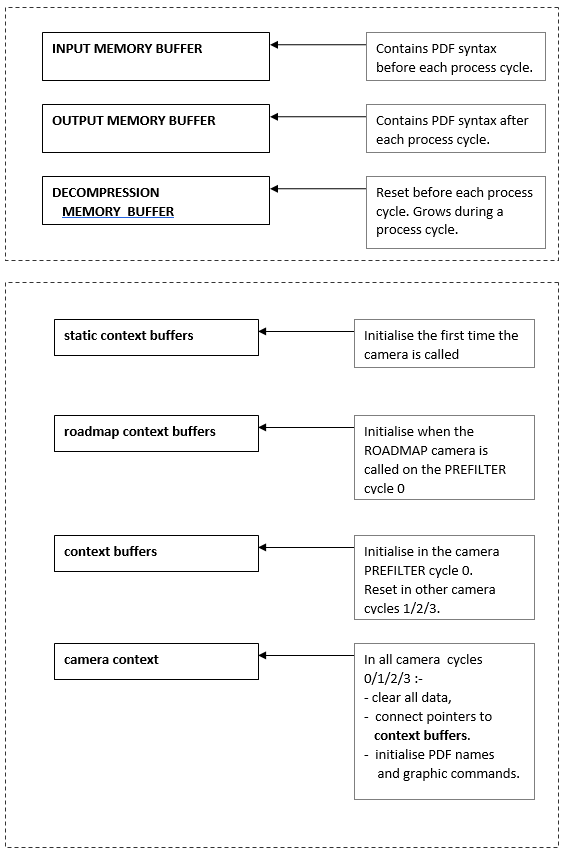
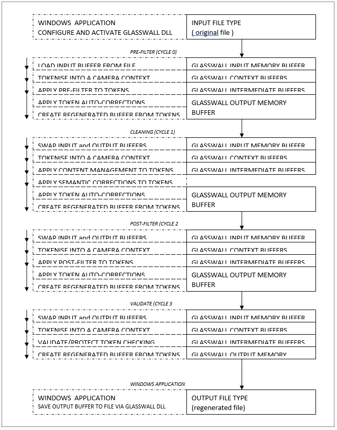
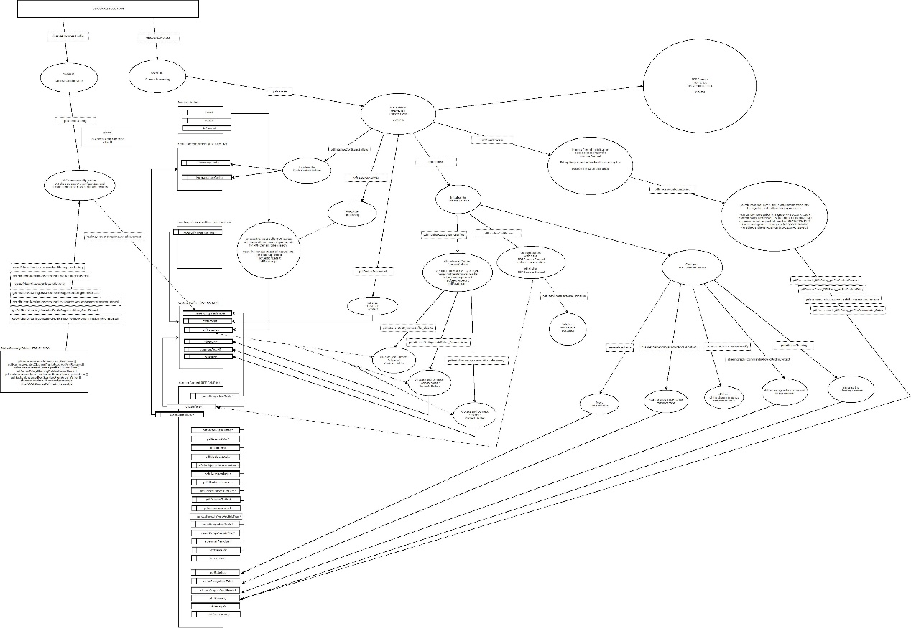
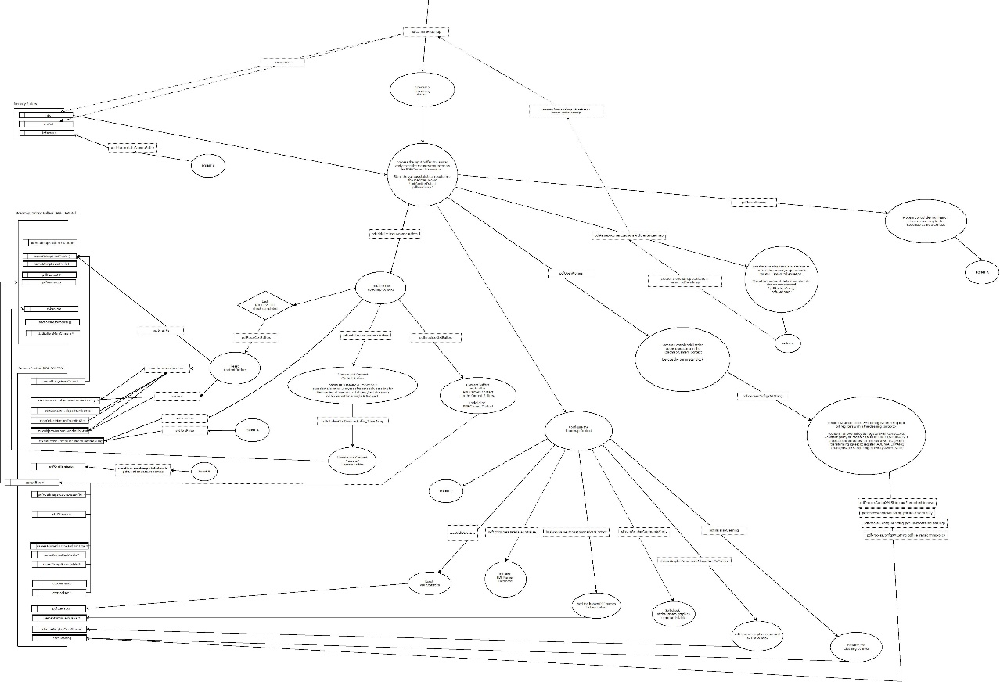
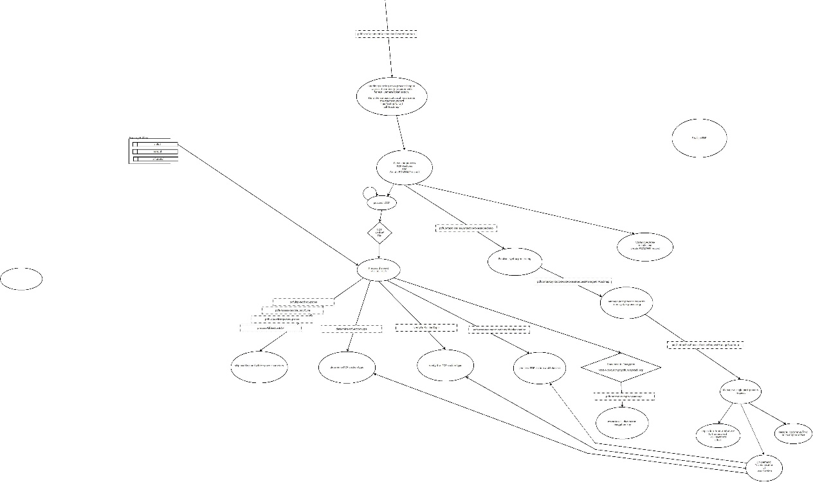

Introductory section describing the document would be nice. Numbering the sections would be useful.

## PDF Camera Data Model

## Data elements of the PDF Camera

-   INPUT MEMORY BUFFER: original document file (PDF syntax)
-   OUTPUT MEMORY BUFFER : original document file (PDF syntax)
-   DECOMPRESSION MEMORY BUFFER : for decompressed strings and cleaning /
    auto-corrections.

| | |
|---|---|---
| static context buffers | | pdf_buffer_static_context_t
| roadmap context buffers | | pdf_roadmap_buffer_context_t
| context buffers | | pdf_buffer_context_t
| | toolset context | pdf_context_toolset_t
| | toolset statistics | context pdf_context_statistics_t
| camera context | | pdf_context_t
| | tokenisation context | pdf_context_tokenisation_t
| | semantic context | pdf_context_semantic_t
| | cleaning context | pdf_context_cleaning_t
| | encryption context | pdf_context_encrypt_t
| | toolset context pointer | pdf_context_toolset_t \*
| | transforming context | pdf_context_transforming_t

## Definitions of the Data elements 

### INPUT MEMORY BUFFER: original document file (PDF syntax)

The *input memory buffer* is loaded with PDF document syntax by the Glasswall
Software Framework before processing is initiated.

At the start of process cycles one (CLEANING) and three (VALIDATE) the *input
memory buffer* is emptied.

Note the **output buffer** from a previous process cycle (i.e., now loaded with PDF
syntax) becomes the new **input buffer** for process cycles one,
two(POST-FILTER) and three.

The *input memory buffer* is the **output buffer** from PDF process cycle three
(VALIDATE).

### OUTPUT MEMORY BUFFER: original document file (PDF syntax)

The *output memory buffer* is loaded with PDF document syntax at the end of PDF
process cycles zero (PRE-FILTER) and two (POST-FILTER)

The output buffer at the end of the mentioned process cycles contains PDF syntax
which is correct in as far as Glasswall cleaning and validation has been applied
in the current and previous process cycles.

The *output memory buffer* is the **input buffer** to PDF process cycle three
(VALIDATE).

### DECOMPRESSION MEMORY BUFFER: for decompressed strings and cleaning / auto-corrections.

The *decompression memory buffer* is used by the PDF decompression functions ,
cleaning mechanisms and the PDF auto-corrections system.

The *decompression memory buffer* is emptied at the start of each PDF process
cycle.

The *decompression memory buffer* grows during each PDF process cycle.

A snapshot of the *decompression memory buffer* is taken before processing
decompression for content streams.

The snapshot of the *decompression memory buffer* is applied to restore the
*decompression memory buffer* after processing an individual or an array of
content streams.

The snapshot restore mechanism is an optimisation which is particularly
effective at reducing the memory requirement for processing larger (i.e.,\> 5MB)
PDF files

### static context buffers (pdf_buffer_static_context_t) 

The *static context buffers* context encapsulates fast access data lookup for
various flags and other settings which may be indexed by the various software
enumerations which identify PDF dictionary types and keys.

Fast lookup data fields include the string descriptions of dictionary types, PDF
content management settings and the PDF normalisation configuration.

Note that the versioning of PDF keys and dictionaries is part of the PDF
normalisation configuration.

The *static context buffers* are initialised from internal static tables the
first time the PDF camera is called.

Some of the *static context buffers* are indexed using either a single index
which may be a PDF Dictionary enumeration or a PDF Name enumeration.

Other *static context buffers* require a PDF Dictionary and PDF Name enumeration
pair to access the fast look up value.

The use of the *static context buffers* is currently from PDF dictionary content
management which is achieved through various cleaning and content management PDF
token tree-walks. The PDF toolset provides several layers of “C” style classes
which access the *static context buffers* via helper software functions.

### roadmap context buffers (pdf_roadmap_buffer_context_t)

The *roadmap context buffers* context contains a minimal set of global buffers
which are required for creating a roadmap of the PDF document. A PDF document
roadmap processes a PDF document into PDF tokens, which are then discarded, in
order to create a roadmap statistical record for a document.

The roadmap statistical record provides an input to the resource allocation
functions which will allocate an optimal set of context buffers to minimise the
use of memory before for full tokenisation of document content.

The *roadmap context buffers* are initialised in process cycle 0 (PREFILTER) by
the PDF Roadmap sub-camera.

### context buffers (pdf_buffer_context_t)

The *context buffers* context contains a complete set of global buffers which
are required in order to create a tokenised representation of a PDF document.
The PDF document roadmap record configures the size of the *context buffers*
which are allocated to sizes which are optimised for the current process PDF
document file. This also considers the requirement for additional PDF syntax
which may be inserted into a PDF file for transforming purposes such as adding a
PDF watermark.

The *context buffers* are initialised in process cycle 0 (PREFILTER) by PDF
camera initialisation which is called after processing the PDF roadmap camera
and before tokenising PDF document content on the pre-filter cycle.

### camera context (pdf_context_t)

The *PDF camera context*  is a context which is passed throughout the PDF camera
software function in order to allow PDF Camera helper functions to access any of
the data elements provided by the PDF Camera.

The PDF Camera context is cleared at the start of each of the process cycles (i.e., cycle 0 (PREFILTER) 1(CLEANING) 2(POSTFILTER) 3(VALIDATE)) and then various
data elements hooked into the PDF Camera context. Generally, these will be the
global buffers from the *buffers context*.

The PDF Camera context is also used by the PDF Camera roadmap sub-camera which
clears the PDF Camera context in cycle 0(PREFILTER) .

In this case then the *roadmap context buffers* are hooked into the PDF Camera
context used by the roadmap sub-camera which is a separate PDF camera content
independent of the main PDF Camera context.

## Data elements of the PDF Camera (DETAIL):

### static context buffers (pdf_buffer_static_context_t) 
|||
|---|---|---
|dictionary management policy |[dictionary]| (disallow, allow, remove)
|allowed dictionary types |[name]| (dictionary)
|allowed dictionary key types |[name]| (dictionary)
|allowed dictionary sub types |[dictionary]| |[name]| (dictionary)
|allowed dictionary key sub types |[dictionary]| |[name]| (name)
|allowed dictionary keys |[dictionary]| (true/false)
|allowed dictionary keys |[dictionary]| |[name]| (true/false)
|supported dictionary type |[name]| (dictionary)
|supported dictionary sub type |[dictionary]| |[name]| (dictionary)
|supported dictionary characteristics |[dictionary]| (characteristics)
|dictionary type strings |[dictionary]| (char \*)
|dictionary min. version (NORMALISE) |[dictionary]| (INT_16)
|dictionary key config. (NORMALISE) |[dictionary]| |[name]| (mandatory, optional, unspec.)
|dictionary key min. version (NORMALISE) |[dictionary]| |[name]| (INT_16)
|dictionary key manage policy (NORMALISE) |[dictionary]| |[name]| (disallow, |allow, remove)
|dictionary virtual |[dictionary]| (true/false)
|dictionary non standard |[dictionary]| (true/false)

### roadmap context buffers (pdf_roadmap_buffer_context_t)
||||
|---|---|---|
| roadmap section data| pdfRoadmapSectionDataBuffer_t | |
| names allowed for type and subtype | [unit8_t] | (true/false) 
| names hash table (i.e., DATABASE) | [stringHashTable_t] 
| names found in file flags | [unit8_t] | (true/false)
| names database | pdfNamesDB_t | 
| token array MP[ pdfBasicObjectToken_t] |
| sections post process requests queue | [pdfPostProcessRequest_t] | (size = 100)
| pointer to the context buffers | pdf_buffer_context_t *

### context buffers (pdf_buffer_context_t)
| | |
|---|---|---
| roadmap record | pdfSectionData_t
| section data buffers | pdfSectionDataBuffer_t
| objects cross reference table | DB [crossRefStruct_t]
| objects data offsets found | DB [dataFoundStruct_t]
| objects order | DB [unit32_t]
| objects order (normalised) | DB [unit32_t]
| objects regeneration flags | DB [unit8_t]
| objects type/subtype found | DB [pdfFileObjectContext_t]
| names allowed for type and subtype | [unit8_t] | (true/false)
| names hash table | [stringHashTable_t]
| names found in file flags | [unit8_t] | (true/false)
| inflated streams IPS array | [inPlaceString]
| objects array | MP[pdfIndirectObjectTokenList_t]
| object handle dereference counters | DB [unit32_t]
| object reference descriptors | DB [pdfObjectReferenceToken_t]
| object reference linked lists | DB [pdfBasicObjectTokenPtr]
| post process requests queue | DB [pdfPostProcessRequest_t]
| token array | MP[pdfBasicObjectToken_t]
| token array for content stream tokens | MP[pdfBasicObjectToken_t]
| stream token lists | [inPlaceTokenList_t]
| font file stream object references | [pdfBasicObjectTokenPtr]
| page objects visited by semantics | DB [unit32_t]
| toolset tree node ID stack | [unit16_t]
| toolset tree node context stack | [pdfBasicObjectTokenPtr]
| toolset Tree node dictionary type stack | [pdfBasicObjectTokenPtr]
| toolset Tree node dictionary type list | [pdf_toolset_linked_list_t]
| common Area for array allocations | MP[uint8_t]
| camera parameter block copy | pdfParamBlk_t
| toolset context | pdf_context_toolset_t
| toolset statistics context | pdf_context_statistics_t

*KEY*
- DB = Dynamic Buffer
- MP = Memory Pool

*NB:* Dynamic buffers are allocated from the common area memory pool

### camera context (pdf_context_t)
| | |
|---|---|---
| process file information | pdfProcessFileInfo_t
| process state | pdfProcessState_t
| process state log | pdfProcessStateLog_t
| process cleaning flags | eGWCleaningFlags
| trace flags | eGWTraceFlags
| process cycle number (0..3) | uint8_t
| recursion level | uint32_t
| content management applied flag | eBoolean | (true/false)
| extract text process request flag | eBoolean | (true/false)
| input/output/inflate memory buffers | memoryBuffer *
| original document version detected | uint32_t
| object number detected limits | uint32_t
| context buffers pdf_buffer_| context_t \*
| static context buffers | pdf_buffer_static_context_t \*
| section record | pdfSectionData_t
| section data buffers | pdfSectionDataBuffer_t \*
| current section | pdfSectionDataCurrent_t
| objects cross reference table | crossRefStruct_t \*
| objects data offsets found | dataFoundStruct_t \*
| objects order | unit32_t \*
| objects order (normalised) | unit32_t \*
| objects regeneration flags | unit8_t \*
| objects type/subtype found | pdfFileObjectContext_t \*
| post process requests queue | pdfPostProcessRequest_t \*
| statistics record | pdfStatistics_t
| various tokenisation registers |  | 
| names allowed for type and subtype | unit8_t \* | (true/false)
| names database | pdfNamesDB_t
| names hash table | stringHashTable_t \*
| names found in file | unit16_t
| stream graphics commands allowed | [unit8_t] | (true/false)
| stream graphics commands in file | [unit8_t] | (true/false)
| inflated streams IPS array | inPlaceString \*
| sublevel tables for a single object |  | 
| tokenisation context | pdf_context_tokenisation_t
| semantic context | pdf_context_semantic_t
| cleaning context | pdf_context_cleaning_t
| encryption context | pdf_context_encrypt_t
| toolset context | pdf_context_toolset_t \*
| transforming context | pdf_context_transforming_t

### tokenisation context (pdf_context_tokenisation_t)

| | |
|---|---|---
| stream in object collection flag | eBoolean | (true/false)
| stream collection ID (zero for first stream in collection)| uint32_t | (0..)
| disable decryption of literal strings | eBoolean | (true/false)
| force use of the crypt filter only NB: any other filters will not be applied | eBoolean | (true/false)
| is decompression from a post process request | eBoolean | (true/false)
| process original context without inline checking or decompression | eBoolean | (true/false)
| queue containing value tokens for  attribute “/FontFile/2/3” for all  processed objects | [pdfBasicObjectToken_t]
| size of queue attribute “/FontFile/2/3” | uint32_t
| track the offset from the start of the file for the last cross reference table | uint32_t[2]
| index into the above table either 0 or 1 | uint32_t | 
| document is “linearised” flag | eBoolean | (true/false)
| COMMON AREA for array allocations | MP[uint8_t]
| COMMON AREA object number max. | \* uint32_t
| COMMON AREA post process count max. | \* uint32_t
| token array current pool buffer | [pdfBasicObjectToken_t]
| maximum limit for the token array | uint32_t
| token array memory pool | MP[pdfBasicObjectToken_t]
| queue of sections for post processing | [pdfPostProcessSection_t]
| objects array | [pdfIndirectObjectTokenList_t]
| objects array memory pool | MP[pdfIndirectObjectTokenList_t]
| create document roadmap flag | eBoolean | (true/false)
| create document roadmap token flag | eBoolean | (true/false)
| Pdf data found for the current section | dataFoundStruct_t
| Current Stream in-place-token list | inPlaceTokenList_t

*KEY*
- DB = Dynamic Buffer
- MP = Memory Pool

*NB:* Dynamic buffers are allocated from the common area memory pool

### semantic context (pdf_context_semantic_t)

 | |
|---|---
| objects array | MP[pdfIndirectObjectTokenList_t]
| object handle dereference counters | DB [unit32_t]
| object reference descriptors | DB [pdfObjectReferenceToken_t]
| token array | MP[pdfBasicObjectToken_t]
| stream token lists | [inPlaceTokenList_t]
| object reference linked lists | DB [pdfBasicObjectTokenPtr]
| integrated trailer dictionary | pdfTrailerDictionaryIntegrated_t
| page objects visited by semantics | DB [unit32_t]
| pdf destination tree (semantics) | pdfNameTree_t
| pdf resources (semantics) | pdfResource_t
| pdf destination pages (semantics) | pdfDestinationPages_t
| pdf threads (semantics) | pdfThreads_t
| tree walk ID (semantics) | uint32_t
| content processing state | pdfContentProcessingState_t
| PDF Header token list | pdfBasicObjectToken_t
| Max. object number in objects array | uint32_t
| Max. object number in last cycle | uint32_t
| Size of the object references queue | uint32_t
| Number of tokens in the token array | uint32_t
| Root object number (i.e.,Catalog) | uint32_t
| ‘IN USE’ cross ref. entries found | uint32_t
| ‘FREE’ cross ref. entries found | uint32_t
| cross ref. updates count | uint32_t
| byte offset of the last cross ref. table | uint32_t
| trailer dictionary in-place-token-list | inPlaceTokenList_t
| virtual object | pdfIndirectObjectTokenList_t
| object profile | pdfObjectProfile_t
| semantic processing state | pdfProcessStateLogSemantic_t
| pointer to the MAIN PDF context | pdf_context_t \*
| semantic loop check counter | long
| semantic trace area|  char \*
| semantic post script stack | psStack_t
| test extracted size u| int32_t
| content stream extracted buffer | memory buffer \*

*KEY*
- DB = Dynamic Buffer
- MP = Memory Pool

*NB:* Dynamic buffers are allocated from the common area memory pool

### cleaning context (pdf_context_cleaning_t)

 ||
|---|---
| cleaning profile table (type/subtype) | pdfCleaningProfile_t [ 20 ]
| cleaning profile bitmask | ePdfContentManagementBitmask
| cleaning profile detected bitmask | ePdfContentManagementBitmask
| cleaning profile applied bitmask | ePdfContentManagementBitmask
| document content policy bitmask | ePdfContentPolicyBitmask
| token cleaning control bitmask | eGWCleaningControlFlags
| token cleaning trailing in-place-string | inPlaceString
| token tree key back links allowed list | ePdfName \*
| normalisation version | uint16_t
| normalisation version count | uint8_t

### encryption context (pdf_context_encrypt_t)
| |
|---|---
| document is encrypted flag | eBoolean | (true/false)
| encryption is enabled | eBoolean | (true/false)
| encryption control | eControlEncrypt_t
| encryption status | eStatusEncrypt_t
| encryption algorithm parameters | pdfInflationAlgorithmParms_Crypt_t
| encryption parameter ID one | inPlaceString
| encryption parameter ID two | inPlaceString
| encryption parameter ID one array | uint8_t [32]
| encryption parameter ID two array | uint8_t [32]
| encryption key buffer | uint8_t [128]
| encryption dictionary object number | uint32_t

## PDF camera main process loop (key elements)

The PDF camera main process loop encapsulates functionality as follows:

PDF camera main process loop (key elements)

-   Open process
-   Initialise process
    -   Static buffers
    -   Dynamic buffers
    -   Context
-   Syntactic processing to tokenise sections
    -   Header
    -   Body
        -   Objects
        -   Cross-reference tables
        -   Trailers
        -   Comments
        -   Non-standard sections
-   Post syntactic processing
    -   Tagging / manage content
    -   PDF tool-set applications
        -   ANALYSE (statistics)
-   Semantic processing to check file conformance and apply transformations
-   Post semantic processing
-   Assemble tokens to the PDF regeneration buffer
-   Close process

PDF camera context

-   Static buffers

-   Dynamic buffers

-   Context

    -   Process

    -   Tokenisation

    -   Compression

    -   Cleaning

    -   Encrypt

    -   PDF Tool-set

    -   Semantic

The PDF camera make use of STATIC (i.e., application life-cycle) and DYNAMIC (ie
process file life cycle) software buffers and a process software context which
has links into the STATIC /DYNAMIC buffers.

Note that common dynamic buffers are allocated as blocks of memory from the
common area memory pool.

##  Architectural Principles of the PDF Camera

The key to the PDF camera architecture is to understand the break-down of camera
functionality into manageable areas (i.e SYNTAX_TOKENISATION / SEMANTICS /
CLEANING / DECOMPRESSION / REGENERATION / REPORTING), and with four camera
process cycles each with distinct functionality:

-   PRE-FILTER (0): correct file content and standardize

-   CLEANING (1): apply CONTENT MANAGEMENT policies (ALLOW, REMOVE, DISALLOW)

    and semantic cleaning

-   POST-FILTER (2): correct file content and standardize after cycle (1)

-   VALIDATE (3): apply VALIDATE/PROTECT policies

The above architecture has been shown to be highly effective with its use of
multiple process cycles for a PDF camera as follows:

-   PDF camera cycle model (4 cycles) which activates distinct camera
    functionality according to the process cycle:

-   CYCLE 0 – PRE-FILTER: application of a software “stencil” to include
    syntactic elements which may be linked together with a minimum of
    processing, involving only token walks and few calls to decompression
    functions, except when this is necessary to obtain syntactic objects for the
    required token tree walk. Any file type objects which are not within the
    token tree walk for the file type will be excluded from the file buffer.
    This cycle also makes any corrections to the contents of syntactic objects
    and regenerates a file memory buffer formatted with PDF syntax.

    -   CYCLE 1 – CLEANING: apply CONTENT MANAGEMENT policies (ALLOW, REMOVE,
        DISALLOW) to file content for a the PDF camera.. Apply semantic
        corrections to file type tokens and syntactic content which is
        decompressed on demand by semantic processing in a camera.

    -   CYCLE 2 – POST-FILTER: application of a software stencil for the PDF
        camera to include all file type objects which are found in the token
        tree walk starting at the root of a file type token tree walk. This
        cycle ensures that any un-wanted file-type content from the cleaning
        cycle is not included in the regenerated file buffer for the camera.

    -   CYCLE 3 – PROTECT: apply PROTECT policies to file content. Ensures that
        syntactic content like font faces may be opened and are formed
        correctly. Perform the various semantic walks to analyze the document
        and ensure that it is formed correctly for the current camera file type.

The PDF camera is realized through multiple scans (i.e. process cycles) with
swapping of the output buffer of each stage to be the input buffer of the next
stage in order to achieve modularization of camera functionality.

This approach of multiple scans of processed file content applies the software
concept of a software pipe-line with a filter stage at each node.

The filter stage at each node on the software pipe encapsulates particular
functionality which may not be easily applied simultaneously at all pipe-line
nodes.

The file level diagrammatic file type data flow view for the PDF Camera software
is shown below:  

The diagram needs to be rendered correctly. It like this in the original document.

##  PDF Document Object Model and Data Flow Diagrams

This following sub-sections provide diagrammatic views of the PDF camera
Document Object Model and a software data flow perspective for each of the
process cycles (0/1/2/3) for the PDF camera.

The diagrammatic views describe the flow of data from an original file type into
memory buffers and then into data elements, which encapsulate software tokens,
and the assembly of these data elements and software tokens into a regenerated
output buffer in order to provide the core Glasswall functions of *Analyse*,
*Manage* and *Protect* by the end of process cycle three (i.e. the VALIDATE
process cycle).

The data elements for the PDF camera document object model are:

-   INPUT MEMORY BUFFER: original document file (PDF syntax)
-   OUTPUT MEMORY BUFFER : original document file (PDF syntax)
-   DECOMPRESSION MEMORY BUFFER : for decompressed strings and cleaning /
    auto-corrections.

| | |
|---|---|---
|static context buffers  | | pdf_buffer_static_context_t
|roadmap context buffers | | pdf_roadmap_buffer_context_t
| context buffers        | | pdf_buffer_context_t
| | toolset context | pdf_context_toolset_t
| | toolset statistics context | pdf_context_statistics_t
| camera context | | pdf_context_t
| | tokenisation context | pdf_context_tokenisation_t
| | semantic context | pdf_context_semantic_t
| | cleaning context | pdf_context_cleaning_t
| | encryption context | pdf_context_encrypt_t
| | toolset context pointer | pdf_context_toolset_t \*
| | transforming context | pdf_context_transforming_t

The diagrams in the following sections illustrate through top and mid levels
software interfaces how the PDF camera initialises its data element in each of
the four process cycles (0/1/2/3) and then how these data elements are created
and used within each of the PDF camera process cycles.

### Software Interface 

Also known as the software function interface for the PDF camera document object
model.

The section lists the top and mid level software interface to achieve PDF camera processing:

| | | |
|---|---|---|
|A.1 |*GlassWALLProcessConfig* |Configure Glasswall processing|
|A.2 |*GlassWALLProcess* | Activate Glasswall processing      |
|B.1 |*pdfCameraConfig*  | PDF camera configuration. Set the camera XML configuration and decode context bit masks into XML records.|
|B.2 | *pdfCamera* | PDF camera processing entry point |
|B.2.1 |*pdfToolsetProcessInit* |Toolset initialisation|
|B.2.2 |*pdfCameraRoadmap*| Camera roadmap entry point|
|B.2.3 |*pdfInitialise*| Camera initialisation|
|B.2.4 |*pdfInitialiseCtxtStaticBuffers*| Static Context buffers initialisation|
|B.2.5 |*pdfOpenProcess* |Open camera processing|
|B.2.6 |*pdfParseDocumentSections* |Parse document sections (e.g. header, object, cross ref. table, trailer ..)|
|B.2.7 |*pdfContextFinaliseSyntacticProcess* |Finalise syntactic processing|
|B.2.8 |*checkPdfFileStructure* Check document file structure|
|B.2.9 |*pdfCheckCrossReferenceTableAndTrailer* | Validate cross reference tables offsets against PDF object offsets.|
|B.2.10 |*pdfContextPostSyntacticProcess* |Post syntactic processing to process any toolset applications: stencil token tree content management; syntactic and semantic cleaning; object references validation|
|B.2.11 |*pdfCameraCheckTokenArrayLinkageIntegrity* |Token array link integrity self Check|
|B.2.12 |*processCleaningRequestApplyStencilFilterContentManagementToTrailer*|Apply stencil content management to the trailer dictionary in PREFILTER cycle|
|B.2.13| *processCleaningRequestToRemoveDocumentEncryption*| Remove document encryption on the PREFILTER cycle (i.e., if required)|
|B.2.14 |*processCleaningRequestApplyStencilFilterContentManagementToTrailer*|Apply stencil content management to the trailer dictionary in POSTFILTER cycle|
|B.2.15 |*pdfValidateRootObjectTokenList*| Semantic validation of document tokens|
|B.2.16 |*pdfContextPostSemanticProcess* |Semantic validation post processing steps through normalised objects and forces checked and valid for tokens which do not already have this status.|
|B.2.16 |*pdfProcessOutput* |Assemble tokens in the regeneration buffer applying cleaning requests to keep, remove and standardise regenerated tokens.|
|B.2.17 |*pdfCloseProcess*| Close camera processing: resets the copy of the camera parameter block and the PDF names database.|

### PDF Camera Dataflow - PREFILTER CYCLE 0 - INITIALISATION Dia(gram)

Unreadable image.

### PDF Camera Dataflow - PREFILTER CYCLE 0 - ROADMAP INITIALISATION Dia(gram)

Unreadable image.

### PDF Camera Dataflow - PREFILTER CYCLE 0 - ROADMAP MAIN PROCESS LOOP Dia(gram)

Unreadable image.

