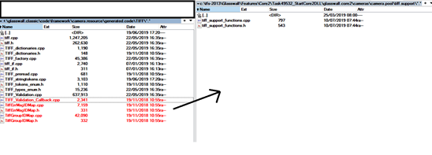
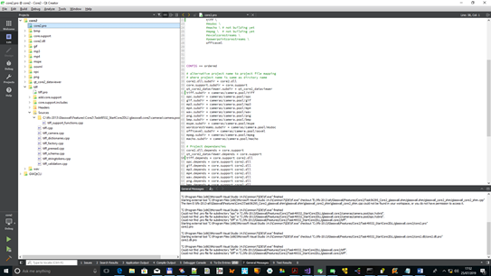
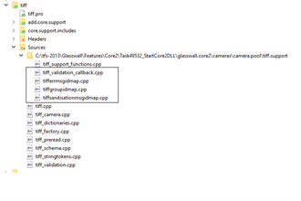
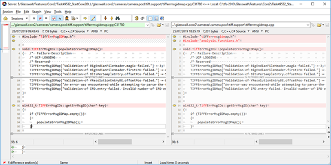
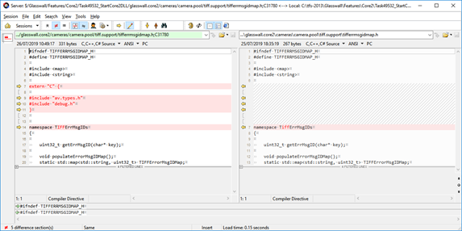
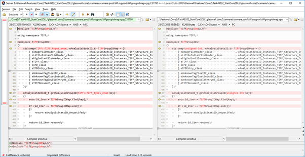
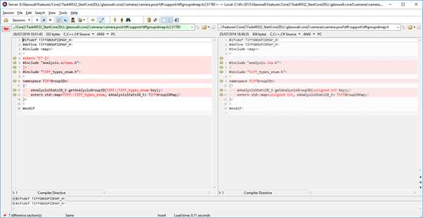
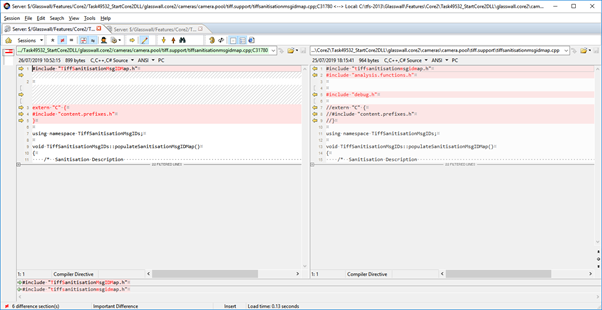
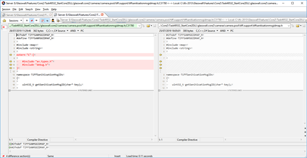
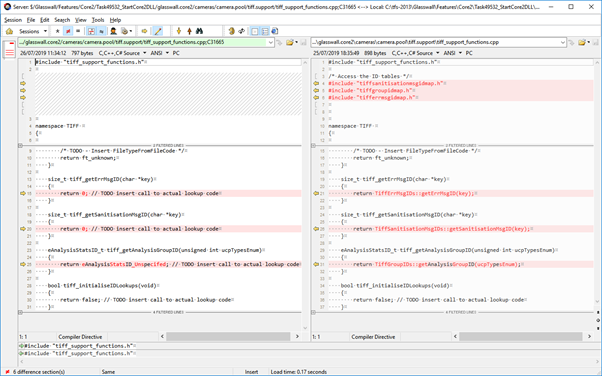

### **AUTHOR**
Steven Warner

### Core2 cameras - Creating and Development Rules

How to build and maintain Core2 style cameras


## Building a Core2 Camera

### Check BDD

Confirm &#39;[Naming conventions](#naming-conventions)&#39; in &#39;Policies&#39; section adhered to

First check is that Miraplacid data viewer works with the BDD and you have run a decent number of test files through BDDLDirectoryReader to confirm the BDD is sound when parsing documents

### Prepare batchfiles

Create a setup\_(cameraname).bat in ..\glasswall.classic\data.definitions.and.rules\BDD\_DVL\_to\_code\_scripts if it does not yet exist

See [sample](#setup-batch-sample-mp3) for expected form

### Generation

New Generator script - generate\_code\_core2.bat

_Usage generate\_code\_core2.bat &quot;tfs\_path&quot; &quot;cameraname&quot; &quot;toolversion&quot; [&quot;optional code params&quot;]_

_where &quot;tfs\_path&quot; is the path to your workspace e.g. c:\tfs2013_

_where &quot;cameraname&quot; is one of the camera types e.g. emf,wmf,msdoc,msppt,msxls,printersetting,rtf,equationnative etc_

_where &quot;toolversion&quot; is bdd-to-cpp tool and C# dvl\_checker tool located in_

_&#39;ucp&#39; - default &quot;\\STORAGE-SERVER\Development Drive\Development Tools\UCP\_ToolChain&quot; directory_

_&#39;ucp\_pending&#39; - &quot;\\STORAGE-SERVER\Development Drive\Development Tools\UCP\_ToolChain\Pending&quot; directory_

_&#39;ucp\_previous&#39; - &quot;\\STORAGE-SERVER\Development Drive\Development Tools\UCP\_ToolChain\Previous&quot; directory_

_&#39;ucp\_local&#39; - &quot;c:\UCP\_ToolChain.Local&quot; directory, for recently rebuild tool output. Usually for development._

It takes the same parameters as generate\_code.bat but always inserts &#39;—core2&#39; option so that BDDs should still be able to be built in Classic for maintenance.

The output goes to a different temporary directory:

It creates a &quot;temporary\_generate\_output.core2&quot; directory

For each camera two directories are produced e.g.

_mp3_

_mp3.support_

The intent is to keep the root directory (mp3 in this case) for generated output that will be tried to be kept unaltered when copied across to the project.

The support directory, contains code that is partially populated ready for more hand inserted sections. (will try and place markers to help clarify)

If a generated camera is going to be heavily altered for interim work (such as reusing a classic camera) then a cameraname.hybrid directory should be created to mix the generated and hand built parts. Eg

_mp3.hybrid_

### Validation Callback and Issue ID / Sanity ID / Group ID

#### Sample of porting: Tiff

Call back code needs to be wrapped in an object to ensure no global static data is used.

The ID mapping functions from Classic are usable and just need linking to the standard Core2 Camera interface.

The source code for Issue (aka Err) ID / Sanity ID / Group ID needs to be copied from classic generated area to the core2 \&lt;cameraname\&gt;.support directory
# 1

For completeness, a Sanitise map was created for Tiff to show the sequence of construction.

All filenames changed to all lowercase to help removed complaints from Linux when filename case differs.




Add existing files menu

Add the new files

 

 [1](#sdfootnote1anc) \&lt;cameraname\&gt;.support directory is usually expected to need careful merging with updated support template code when you regenerate the camera from BDD

New files then part of project:



Next step is to make a few changes to the code to remove &#39;C&#39; and old classic headers, then connect the functions to \&lt;camera\&gt;\_support\_functions.cpp

ErrMsg ID changes





GroupMsg ID changes





SanitisationMsg ID changes





Support Functions Changes



### Adding New Camera to Core2 Project

Project (PRO files)

There are several PRO (project) files that control the construction of the code:

Adding new cameras.

…\glasswall.core2\core2.pro

```c++
TEMPLATE = subdirs

#project name to project file mapping where name and directory are different
ooxml.file = cameras/camera.pool/ooxml/officexml.pro
bmp.file = cameras/camera.pool/bmp/BMP.pro
…

#Active subproject list : comment these out to remove from current build
SUBDIRS	 = core.support \
           core2.dll \
           qt_core2_dataviewer \
           opc \
           mp3 \
           mp4 \
           wav \
…


CONFIG += ordered

# alternative project name to project file mapping
# where project name is same as dirctory name
core2.dll.subdir = core2.dll
core.support.subdir = core.support
qt_core2_dataviewer.subdir = qt_core2_dataviewer
tiff.subdir = cameras/camera.pool/tiff
opc.subdir = cameras/camera.pool/opc
mp3.subdir = cameras/camera.pool/mp3
…


# Project dependancies
core2.dll.depends = core.support
qt_core2_dataviewer.depends = core.support
tiff.depends = core.support core2.dll
opc.depends = core.support core2.dll
mp3.depends = core.support core2.dll

```


## Pitfalls

Code generator has removed and tidied a lot of boiler-plate code in the generated output. So expect subtle differences from Classic output

Also some methods of grabbing data have changed to more compact forms.

It&#39;s still a work in progress, so some new bugs have been introduced while trying to improve its reinterpretation of BDDL expressions.

## Policies

### Naming conventions

#### Include files

Intent where possible the generated files will stick to lowercase for filenames to avoid Linux complaints about different files when case is changed.

#### Root file names/directories

You must make sure there is a simple and consist naming of the key directory and root objects

##### BDD Sample MP3

Main BDD same name as the camera and in same named directory.

…\glasswall.classic\data.definitions.and.rules\AUDIO\bddl\ **MP3** \ **mp3**.bdd

BDD contains a Document object for Miraplacid to open the file :
```
[extension="mp3", mime_type="glasswall/mp3", ft_t="ft_mp3"]
document MP3Root {
    MP3 mp3;
}

```

But this is not used as kick off point for the Code Generator, instead it will use a root class as specified in the camera batch file – but for convention that should also be the same name.

```
struct MP3 {
    ID3V2Tag id3v2Tag optional;
    Frame [*] frames;
    ID3V1Tag id3v1Tag optional;
	APETag apeTag optional;
}

```

##### DVL Sample MP3

c:\tfs-2013\Glasswall\Features\Core2\Task49532\_StartCore2DLL\glasswall.classic\data.definitions.and.rules\AUDIO\validation\MP3\mp3.dvl

```
validation MP3 {
id3v2Tag := NO_REQUIREMENT;
}

```

##### Setup Batch Sample MP3

c:\tfs-2013\Glasswall\Features\Core2\Task49532\_StartCore2DLL\glasswall.classic\data.definitions.and.rules\BDD\_DVL\_to\_code\_scripts\setup\_mp3.bat

```
pushd ..
set CD_PARENT=%CD%
popd

set "PATH_TO_BDD=%CD_PARENT%\Audio\bddl\MP3\mp3.bdd"
set "PATH_TO_DVL=%CD_PARENT%\Audio\validation\MP3"
set "BDD_ROOT=MP3"

set "CODEOPTIONS= --enable_dataheap --core2"
set "DVLOPTIONS= --core2"

```

[i](#sdendnote1anc) Note BDDs are still in glasswall.classic directory … probably should be moved up level at some point