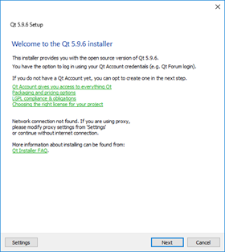
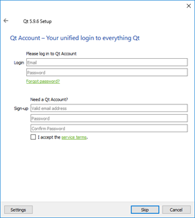
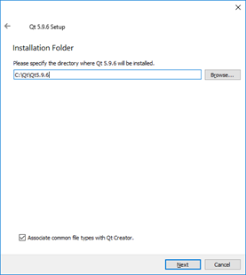
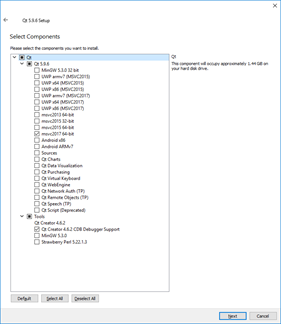
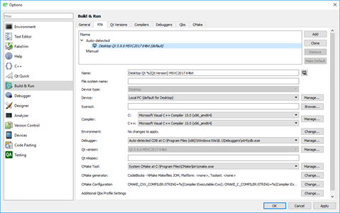
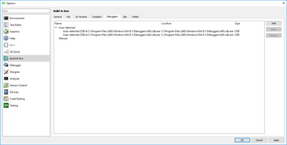
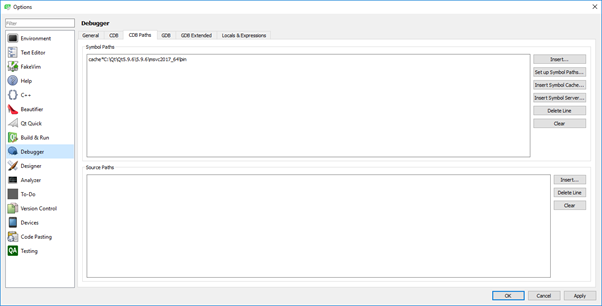
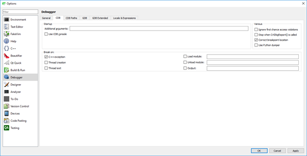

# Using QT

## Installation

### Installing QT Framework and Dev Environment (on Windows)

Run the &#39;\\STORAGE-SERVER\Development Drive\Development Tools\QT Framework\Offline Installers\Windows Host\qt-opensource-windows-x86-5.9.6.exe&#39; offline installer.

Skip this screen (1) ..

And this one (2) and the following welcome screen (3),

Suggest you leave the default installation path and the file-association &#39;ticked&#39; on this screen (4)

On screen (5), QT Creator with CDB Debugger is already selected.

Choose MSVC 2017 64 bit as the platform target.

Accept license agreement on next screen (6)

Accept Start Menu Shortcuts setting on next screen (7)

Then click &#39;Install&#39; on next screen (8)

Installation will take some time (300mb+ install)

### Installing Windows Debug Support

This install of QT Creator is primarily built to use CDB debug (WinDbg) to debug on Windows.

WinDbg comes as part of Windows Driver Kit

Install it by running ….

[\\STORAGE-SERVER\Development Drive\Development Tools\WindowsDriverKit\wdksetup.exe](/%5C%5CSTORAGE-SERVER%5CDevelopment%20Drive%5CDevelopment%20Tools%5CWindowsDriverKit%5Cwdksetup.exe)

Select c:\Program Files (x86)\Windows Kits\ as the install location ion screen (1)

On screen (2) switch off Kits Privacy

Skip screen (3) that just reminds that the kit has no build or compile tools

On screen (4) installation occurs – fairly quick.

And your done 

### Installing Visual Studio Support

You can get support for bulding Qt Pro projects in Visual Studio

Goto z:\QT Framework\Visual Studio Add-In\Visual Studio Add-in 2.2.1 for Qt5 MSVC 2017

Run &#39;qt-vsaddin-msvc2017-2.2.1\_48f558a.vsix&#39;

It will install the Qt Support Tools into Visual Studio for MSVC 2017

## Setup

### Configure Debug

#### Hook CDB debug

QT Creator may not spot the debugger path immediately

Goto Tools\Options\Build&amp;Run\Kits and check you have this setup

Goto Tools\Options\Build&amp;Run\Debuggers and check you have this setup

#### Symbols (full symbol support TBD)

##

## z:\QT Framework\Offline Installers\Windows Host\qt-opensource-windows-x86-pdb-files-desktop-5.9.6.7z

Contains the PDB files for the 5.9.6 version of Qt

These need to be copied to

c:\Qt\Qt5.9.6\5.9.6\msvc2017\_64\bin\

Add the cache path as above

Suggestion been made that switching off Python Dumper can help debugging.

# Debugging in Visual Studio

When all else fails: Try debugging in Visual Studio

This is a workaround.

After building in Qt

Copy QtCli in to Core Buildoutput

Open Visual Studio

Open File/Project and select QtCli

This will open a solution – goto the properties and copy the arguments for QtCLI from the Run window in QtCreator that you wish to run.

Find file in QtCreator where you want the breakpoint and grab the full path to it and open that file in Visual Studio

Now you can place a breakpoint in the file window in VS and run in debug mode on VS
