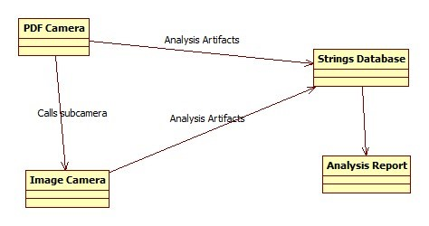
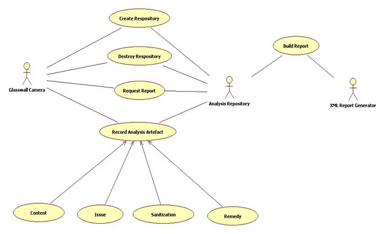
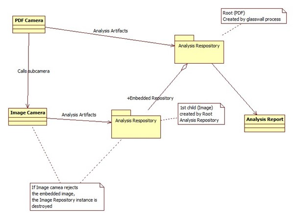
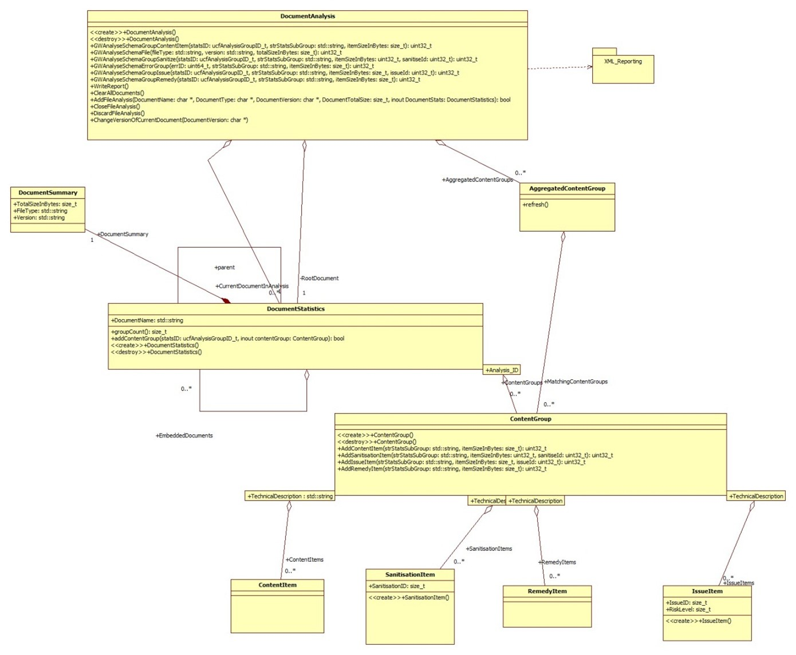
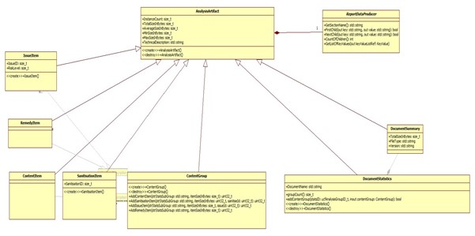
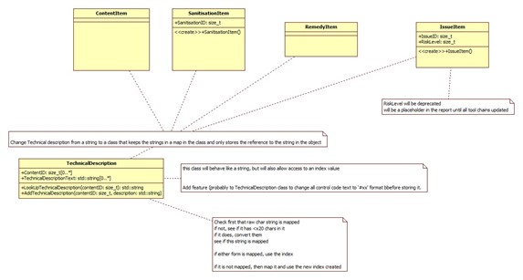
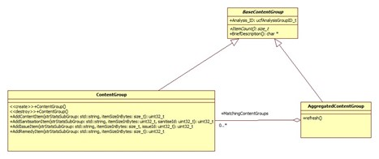
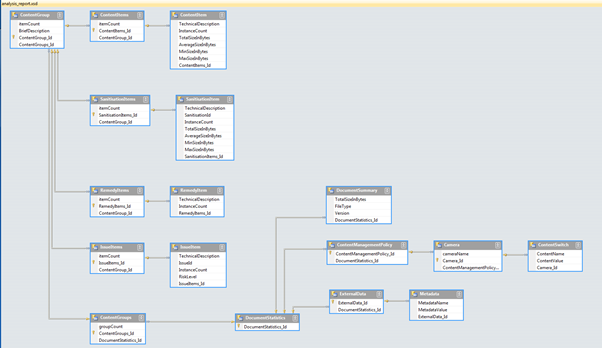
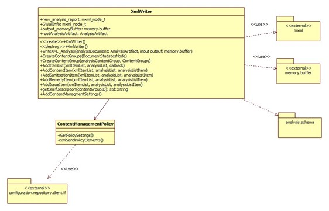

## **Document History**

Table 1: Document Change History

| _ **Issue Date** _ | _ **Issue Number** _ | _ **Author** _ | _ **Description** _ |
| --- | --- | --- | --- |
| **14-3-2016** | 0.1 | SWarner | First Basic Draft |
| **20-4-2016** | 0.2 | SWarner | Further amendments from prototyping |
| **25-5-2016** | 0.3 | SWarner | Review edits to text and diagrams |

# 1 Introduction

## 1.1 Scope
 This document is intended to describe in detail the design and function of a new analysis report repository. It will also describe how it will be constructed and tested.

Note: That lot of documentation is going in the UML model, which will be generating additional material for this document in due course

## 1.2 Key requirements

### 1.2.1 
We require a replacement Analysis system that is clean and documented in a consistent way that can be used in a known manner anywhere in the glasswall core.
 
### 1.2.2 
It should contain a single repository of all report information generated during a file pass.

### 1.2.3 
It should produce a hierarchical XML report from the repository at the end of the file pass.

### 1.2.4 
It should have a clean simple API that is fully described in associated documentation.

### 1.2.5 
All camera&#39;s requirements and quirks will need to be supported or those cameras will need to be changed to use a more simplified approach.

### 1.2.6 
All cameras will need to use this new API.

### 1.2.7
The File Instances, Analysis IDs and [Issue IDs | Remedy IDs | Sanitisation IDs] should be the keys for building the hierarchy of the Repository and subsequently the report. String indexing should no longer be used.

### 1.2.8 
Plan for (and perhaps implement) support for international language changes by moving Issue / Remedy / Sanitation Strings into tables and use ID&#39;s to select them rather than duplicating the strings in the ID look up tables.

##

## 1.3 Reference Documents

Outline for this new repository was proposed by Paul Gerard in following documents

**AnalysisRepositorySummary.docx** _[http://sharepoint-2013/sites/DefaultCollection/Glasswall/Glasswall%20Cameras/Analysis%20Repository/Documents/AnalysisRepositorySummary.docx]_

**Integration Team Roadmap 2015Q1.docx** _[http://sharepoint-2013/sites/DefaultCollection/Glasswall/Glasswall%20Cameras/Analysis%20Repository/Documents/Integration%20Team%20Roadmap%202015Q1.docx]_

Paul&#39;s original proposal suggested stages that involved maintaining an interface to the original Strings Database, while his later notes in the Roadmap discussed a API level replacement at the **ucf.analysis.if.h** level, with a new repository for the data that outputs its final form in XML.

This is the route I am planning.

# 2 Features of Existing System

## 2.1 Existing Functional Features

(From IntegrationTeamRoadmap2015Q1) &quot;_The Glasswall library provides functionality to enable client applications to request an XML report that provides a detailed breakdown of a document&#39;s content. The report logs the number of instances of each content item type that is found within the document, along with a technical description and a number of associated size metrics. Similar information is captured for Remediation, Sanitisation and Issue items that are found in the document. This information can then be used in post-processing to gather information across file sets, or to provide explanation of why a document has been identified as non-conforming. The current report format adequately reports information for single documents and enables information to be extracted for that document.&quot;_

Any Embedded documents have their analysis aggregated with the host documents analysis.

## 2.2 Existing Internal Mechanism

Current Analysis is stored in a Strings Database that indexes results by hashes of the strings.

This can lead to indexing of similar problems from different cameras being grouped together instead of being kept in the cameras they belong.

Also, the [Analysis Artefacts](#all-repository-objects-inherit-from-analysis-artefact) are stored together in the Strings Database as all cameras are run. If a sub-camera is called, then its results are merged into the same database. If subsequently, the camera decides that the subcomponent of the file is non-conformant, removal of the file will leave the residual analysis in the Strings Database.

From &#39;Analysis Repository Proposal&#39;

&quot;_Each of the document cameras uses the Strings Database to store analysis information. As Content Items, Remedy Items, Sanitisation Items and Issue Items are identified during processing, each camera records the instances into the database. There is no mechanism to remove items from the database._

_The PDF camera has a configuration setting that enables non-conforming images to be removed from the PDF document. When this feature is enabled, the image camera will have submitted items to the Strings Database as part of its normal processing, including the Issue Item describing the non-conformance. When the image camera returns the failure status to the PDF camera, the PDF camera removes the image and resets the error message that is being returned, but is not able to remove the analysis items that have already been added to the Strings Database._

_One of the last checks carried out by Glasswall prior to returning the process status of a document is to identify whether any Issue Items have been logged during processing. This was introduced in order to ensure that the return status was consistent with the contents of the Analysis Report. In the situation described above, this check returns a false negative since the Issue Item is still recorded but the content that raised the issue has been removed. The check is carried out regardless of the processing mode, so the same behaviour is exhibited during Manage &amp; Protect as well as Analysis Audit.&quot;_

**Figure 1 - Original Analysis Repository**

## 2.3 Naming in existing system

The current system has a confusing naming pattern that needs explanation and improvement.

Analysis is organised thus:

- Groups:

The top level is comprised of groups. Each group is called ContentGroup in the XML analysis, but is selected by the ucfAnalysisStatusID in the functions of the API which come from enumerations in analysis.schema.h which is turn maps to strings in the analysis.schema.strings.h file which are used to output the text in the Analysis XML report.

Under a Group four types of Analysis Artefacts (Items) are stored:

- ContentItems (inserted by GW\_ANALYSE\_GROUP\_UCF)
- SanisationItems (inserted by GW\_ANALYSE\_GROUP\_UCF\_SANITIZE)
- RemedyItems (inserted by GW\_ANALYSE\_GROUP\_UCF\_REMEDY)
- IssueItems (inserted by GW\_ANALYSE\_GROUP\_UCF\_ISSUE)

# 3 Features of Proposed Replacement

## 3.1 Proposed Functional Features

### Phase 1

Core Function will be the same as the existing database from the perspective of the client in that the analysis data from the file will produce the same XML Analysis report as per [**Existing Functional Features**](#21-existing-functional-features) however using new [**Proposed Internal Mechanism**](#32-proposed-internal-mechanism)

### Phase 2

Give client the option to render the XML Analysis report with embedded documents in their own sections:

(From IntegrationTeamRoadmap2015Q1) _&quot;To avoid aggregating analysis information together embedded documents should have their own section within the analysis report. This would provide a repository in which the analysis information pertaining to that document can be logged. The abridged analysis report below provides an example of how the analysis for each embedded document could be separated out of the host document&#39;s analysis information._

_The general principle is that the analysis for each embedded document is contained within a container element gw:EmbeddedDocuments. This element contains a set of gw:EmbeddedDocumentStatistics elements, one for each embedded document. The structure of the gw:EmbeddedDocumentStatistics element is very similar to that of the host main document&#39;s gw:DocumentStatistics element, with the exception that the content management flags in the gw:ContentManagementPolicy element are not included within the gw:EmbeddedDocumentStatistics element._

_In order to identify the embedded document the gw:EmbeddedDocumentStatistics element includes a &#39;reference&#39; attribute. Where the document format includes a name or reference for embedded documents, the attribute could be used to store this information. In the absence of such an identifier being provided by the host document, a suitable reference could be synthesized by the analysis process using an &#39;object id&#39; or &#39;file offset&#39;._

_The recursive inclusion of the gw:EmbeddedDocuments element enables the scenario of embedded documents containing embedded documents themselves to be handled in a consistent manner.&quot;_

**Figure 2 – Using the New repository**

## 3.2 Proposed Internal Mechanism

The proposed replacement is the use of analysis repository containers.

One would be created for each instance of camera called, starting with one at the glasswall process level.

If any sub-cameras are called, new instances analysis repository containers would be created, linked to the parent one and used as the repository for the duration of the current camera.

If that camera deems the file or sub-file is conformant, it is kept and control returned to the parent repository.

If that camera deems the file or sub-file is non-conformant, the current repository is destroyed and control returned to the parent repository.

Then when the control returns to glasswall process level, the root analysis repository container can be called to produce its report and that of its children.

Then the analysis repository container(s) are destroyed ready for the next file to be processed.

This way no redundant data is kept in the total repository.

## 3.3 Alternate Behaviour

Alternative operation if subcamea rejects is to mark this subdocument as benign

and not reflect the issues upwards from it so that the enclosing

document continues its analysis without the issues from this subcamera

###

**Figure 3 - New Analysis Repository**

# 4 Development Stages

## 4.1 Phase 1

Initial Changes to test the new repository in comparison with old reporting system.

### 4.1.1 Add Instrumentation code to current analysis api

Add Instrumentation code to current analysis api &quot;ucf.analysis.if.h&quot; to output parameters sent to the APIs to build picture of actual usage in current cameras.

This allows normal analysis to continue and create reports while the source data is stored for development

This data can then be fed into prototype repository.

### 4.1.2 Changes to API

#### 4.1.2.1 Original API

uint32\_t ucf\_GWToggleGroupingDictionaryUsage(eBoolean bUseGroupDictionaries);

uint32\_t ucf\_GWAnalyseSchema(ucf\_context\_t \*ctxt, ucfAnalysisStatsID\_t statsID, uint32\_t itemSizeInBytes);

uint32\_t ucf\_GWAnalyseSchemaGroup(ucf\_context\_t \*ctxt, ucfAnalysisStatsID\_t statsID, char \* strTechnicalDescription, size\_t itemSizeInBytes);

uint32\_t ucf\_GWAnalyseSchemaGroupSanitize(ucf\_context\_t \*ctxt, ucfAnalysisStatsID\_t statsID, char \* strStatsSubGroup, size\_t itemSizeInBytes, uint32\_t sanitiseId);

uint32\_t ucf\_GWAnalyseSchemaGroupRemedy(ucf\_context\_t \*ctxt, ucfAnalysisStatsID\_t statsID, char \* strStatsSubGroup, size\_t itemSizeInBytes);

uint32\_t ucf\_GWAnalyseSchemaGroupIssue(ucf\_context\_t \*ctxt, ucfAnalysisStatsID\_t statsID, char \* strStatsSubGroup, size\_t itemSizeInBytes);

#### 4.1.2.2 New API - make pointer parameters Const

New api entries and changes to existing. Disused calls and parameters &#39;struck-out&#39;, new calls and parameters in bold.

~~uint32\_t ucf\_GWToggleGroupingDictionaryUsage(eBoolean bUseGroupDictionaries);~~

A redundant call, this mode was always switched on to create a duplicate list of [**ArtefactsOfConcern**](#artefacts-of-concern) for identification of issues in the document. If this is still needed in the new repository, we will iterate through the tree looking for them or keep track of a pointer list to those specific objects for the same purpose rather than copying them.

~~uint32\_t ucf\_GWAnalyseSchema(ucf\_context\_t \*ctxt, ucfAnalysisStatsID\_t statsID, uint32\_t itemSizeInBytes);~~

A redundant call, this function is only used usefully to set file version and sizes in a very obscure way with feeding data to analysis groups that have no content.

**uint32\_t ucf\_GWAnalyseSchemaFile(char \* fileType, char \* version, uint32\_t totalSizeInBytes);**

Replaces the only function provided by ucf\_GWAnalyseSchema

uint32\_t ucf\_GWAnalyseSchemaGroup **ContentItem** ( ~~ucf\_context\_t \*ctxt,~~ ucfAnalysisStatsID\_t statsID, char \* strTechnicalDescription, size\_t itemSizeInBytes);

ucf\_context\_t is redundant for the repository.

uint32\_t ucf\_GWAnalyseSchemaGroupSanitize( ~~ucf\_context\_t \*ctxt,~~ ucfAnalysisStatsID\_t statsID, char \* strStatsSubGroup, size\_t itemSizeInBytes, uint32\_t sanitiseId);

ucf\_context\_t is redundant for the repository.

uint32\_t ucf\_GWAnalyseSchemaGroupRemedy( ~~ucf\_context\_t \*ctxt,~~ ucfAnalysisStatsID\_t statsID, char \* strStatsSubGroup, size\_t itemSizeInBytes);

ucf\_context\_t is redundant for the repository.

uint32\_t ucf\_GWAnalyseSchemaGroupIssue( ~~ucf\_context\_t \*ctxt,~~ ucfAnalysisStatsID\_t statsID, char \* strStatsSubGroup, size\_t itemSizeInBytes **, uint32\_t issueID** );

ucf\_context\_t is redundant for the repository.

Issue ID should be passed down as a parameter from GW\_ISSUE instead of being extracted later from the Error string. It is a packed field containing Camera ID, Group ID and Error ID, but it is packed by a client function that calls ucf\_GWAnalyseSchemaGroupIssue, so we simply store it as a 32bit number

**uint32\_t analysis\_Initialise\_Repository();**

Startup the analysis object

**uint32\_t analysis\_Shutdown\_Repository();**

Close the analysis object

**uint32\_t analysis\_Write\_Report (memoryBuffer \*outBuf);**

calls the XML generation module into operation

**uint32\_t analysis\_Start\_File\_Analysis (char \* DocumentName, char \* DocumentType, char \* DocumentVersion, size\_t DocumentTotalSize);**

Begin analysis of a file or substream - will automatically create first file or append embedded stream

If Version and Size unknown at initial stage they can be left null and zero respectively and amended later using ucf\_GWAnalyseSchemaFile

**uint32\_t analysis\_End\_File\_Analysis ();**

End current analysis of a file or substream - will automatically move back to root or parent document

**uint32\_t analysis\_Discard\_File\_Analysis ();**

Discard current analysis of a file or substream - no details of analysis will be stored - will automatically move back to root or parent document

**uint32\_t analysis\_Reset\_File\_Analysis ();**

Discard all current analysis of a file and substreams - prepares for analysis of new file from root level

**uint32\_t analysis\_ChangeVersionOfCurrentFile (char \* DocumentVersion);**

Update the version of the File in analysis

### 4.1.3 Create Analysis Repository Module

#### 4.1.3.1 Repository Structure

The Analysis Repository will be enclosed in an instance of the DocumentAnalysis class. This will retain the results of the analysis data sent to it by the current active camera. It will also maintain the subsequent instances created for subcameras, which it will then keep or dispose of depending on results of a camera run.

**Figure 4 - New Repository Class Relationships**

#### All Repository Objects inherit from Analysis Artefact

#### Technical Description String folding Mechanism

iscntrl now used instead of \&lt;0x20

#### ContentGroup Classes

#### 4.1.3.2 XML Report Generator

##### Existing Report Structure

##### XML writer module will create the report from the Analysis Repository

### 4.1.4 Test framework to use sample data from instrumentation to load repository

The new modules will be built into standalone application that will take the output from the instrumentation code ([**Add Instrumentation code to current analysis api**](#411-add-instrumentation-code-to-current-analysis-api))

This will be tested outside of the glasswall library to speed up development of the repository.

### 4.1.5 Integrate new repository into glasswall dll

Take the new repository module and xml report generator modules and connect them into the glasswall code hooking them into the old API call positions.

The replacement API calls will be wrappers around calls to the methods of the new DocumentAnalysis object.

They will need to field any exceptions thrown by that object and convert them into GWERRORs and stop the analysis.

Begin job of running large suites of tests against current Main version of the files.

## 4.2 Phase 2

### 4.2.1 Change cameras to use embedded reports

Original requirement was to do this in two phases. I suspect that the embedded document mechanism can be hooked on to the &#39;pushcamera&#39; calls so that a embedded document is added at that level, and destroyed if the return from the camera is a failure.

Hopefully then the key difference will be in the reporting either amalgamating embedded reports or leaving them as separate entities in the reports.

Suggestions: Keep all analysis and also keep the return status of the camera call so that the calling code can decide what to do with it. E.G. mark embedded component for ignoring.

This aspect of the design will be fleshed out after initial &#39;flat report&#39; has been verified and added to Main.

## 5 Glossary

### Analysis Artefacts
Document Summary, Content Items, Remedy Items, Sanitisation Items and Issue Items are all examples of these. They are key components that we identify during analysis.

### Alteration Artefacts
 Remedy Items and Sanitisation Items are examples of these. They are Analysis Artefacts that relate to things in the document that we have or may have changed after management of the file.

### Artefacts of Concern
Remedy Items, Sanitisation Items and Issue Items are examples of these. They are Analysis Artefacts that relate to things in the document that we have or may have changed after management of the file or have caused us to reject the document.

## 6 Assertions

### Automatic Issue/Sanitization &quot;Event&quot; processing

A suggestion was made that the Repository should include a function for processing the text of an Event as an Issue or a Sanitation automatically.

It is not been felt so far that this was the right place to insert such a function.

The generated cameras already use a mechanism like this (BDDValidationFuncs.cpp contains these functions) which simply marks areas in memory buffers or node in the trees as being of a particular type (macros/hyperlink etc) and the code then takes care of removing and reporting as appropriate dependent on Content Management settings. 

