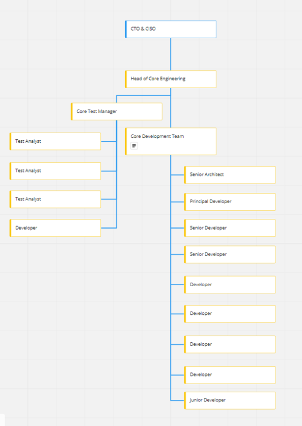

# Core Team - Development Process

## 1 Document History

Table 1: Document Change History

| **Issue Number** | **Description** |
| --- | --- |
| 0.1 | Initial Draft |
| 0.2 | Updates based on review feedback – Additional clarity added to estimation units, delivery managers involvement with JIRA, customer repositories, and the core management team. |

## 2 Team structure

The Glasswall Core team structure is shown in the diagram below

## 3 Development Process Overview

### 3.1 Requirements Gathering

Projects, feature requirements and customer defects are passed on to the core management team, currently consisting of the head of core engineer, test manager and core product owner. Requirements capture and initial high-level design are carried out by the core management team and core software architect(s) and selected engineers where applicable.

Requirements are captured in user stories on the Core Azure DevOps backlog and initially prioritised based on business/customer demand.

Projects are managed via Azure Boards, specifically the Azure Kanban board. The work item types used by the core team are User Stories, Bugs, and Tasks.

The Kanban board is split into one or more &#39;project&#39; swimlanes and a &#39;general&#39; swimlane,

- General – Technical debt and customer defects
- Projects – Internal and external feature requests

User stories for a feature request are grouped into one or more projects depending on estimated sizes. Each project occupies a swimlane and is assigned to a squad made up of developers and QA members.

Customer defect/bugs are directly placed under the &#39;General&#39; swimlane and tackled by members that have not yet been assigned to a project.

### 3.2 Planning and Estimation

### 3.2.1 Work Item Breakdown

User stories are tasked in collaborative tasking sessions. A user story is reviewed and broken down to sub-story and task level by the core team in the planning session.

#### 3.2.2 Estimation

Offline estimation poker is used for estimation via Azure DevOps. Joint sessions are held to go over results and agree on final estimates. The sum of all task estimates gives a total estimate for the user story. The sum of all user story estimates provides the estimate for the project. No estimates are made for bugs. Instead, bug investigations/fixes are time-boxed to 5 days. If not resolved in 5 days, a review is held to determine if work should continue.

### 3.3 Prioritisation

The core management team frequently reviews the core team backlog. Work items are reorganised in priority order with the highest priority items moved to the top of the backlog.

Estimates are reviewed, and projects are initiated based on these discussions. Large projects are broken down into smaller sub-projects (based on the planning and estimation sessions). All projects that are actively worked on are short-lived with a maximum estimate of 30 man-days.

Work items that are ready to be tackled are placed in the &quot;Ready&quot; column of the Kanban board. The work items position within a swimlane determines the order in which items are picked up. Developers pick up the next item to be worked on in priority order.

### 3.4 Development

### 3.4.1 Squad

A squad made up of QA members, software developers and a delivery manager are formed by the core management team to work on a project. A swim lane on the ADO Kanban board is created for each project initiated. It consists of all the work items that must be completed to deliver the project.

A project swim lane has the following naming convention.

- The project name
- The developers and testers assigned to the project
- The delivery manager
- The estimate (in days)
- The project start date

**Example**

&quot; **Squad** : HTML Camera **Team** : Person 1, Person 2 **Delivery Manager** : Person3 **Estimate** : 14 days&quot;

Squads are free to organise any additional planning meetings or meetings that require the expertise and help of team members in another squad.

Besides offering assistance to other squads, members of a squad only work on items within the squad&#39;s swim lane until assigned work has transitioned to the Kanban board&#39;s test column. The delivery manager must notify the core management team when a squad member has completed all assigned work and no longer has work items left to contribute to the squad.

##### 3.4.1.1 Delivery Manager

The delivery manager is responsible for monitoring and tracking the progress of each project. The role involves following.

###### 3.4.1.1.1 Keeping all parties on track and informed

Getting updates on a project&#39;s progress, identifying potential roadblocks, and escalating to the core management team. The delivery manager must provide updates on how the project is progressing at the weekly squad review meeting. Ultimately, to ensure that the team is progressing well against estimates and to the desired outcome. Delivery managers also provide updates to the entire core team at the weekly core meeting.

###### 3.4.1.1.2 JIRA Mappings

Delivery managers are responsible for mapping their projects on JIRA for company-wide visibility and tracking. Ensuring information on JIRA is up to date and in sync with the core development teams Kanban board. The mapping can be done with the help of an Upwork PM **.**

**See the** [**JIRA Mapping section**](#4-jira-mapping) **for more information.**

##### 3.4.1.2 QA Representative

A squad has at least one representative from the QA team (Squad QA owner) to ensure that the necessary QA preparation occurs as work transitions to test. However, test execution can and typically involves multiple members of the QA team.

#### 3.4.2 Bench – General Swimlane

Customer Defects (bugs), investigations (Spikes) and small technical debt work items are grouped and prioritised under the &#39;General&#39; swim lane.

Team members that are not assigned to a specific project (squad) or members that have completed all assigned work in a squad, by default are on the &quot; **Bench**&quot;. A member on the bench picks work from the &quot;General&quot; swimlane of the Kanban board in priority order.

There is always a minimum of two members on the bench at any given time to address customer defects and for continuous reduction of technical debt.

### 3.5 Builds and Branching Overview

#### 3.5.1 Branching

##### 3.5.1.1Source code Management

Source code management is done using Azure DevOps (ADO). The Git version control system is used, and there is one master repository **per product or tool**.

The default Azure DevOps processes are used. More information on this can be found at the following address: [https://docs.microsoft.com/en-us/azure/devops/get-started/?view=azure-devops](https://docs.microsoft.com/en-us/azure/devops/get-started/?view=azure-devops)

##### 3.5.1.2 Branching and Merging

###### 3.5.1.2.1 Branching

Developers branch off from the master branch, and changes **cannot** be made directly on any master branch.

###### 3.5.1.2.2 Merging - Pull Requests

Pull requests are used to review code and give feedback on changes before merging into the master branch. The following conditions must be met for each pull request:

- Every change must be associated with at least 1 work item.
- The pull request requires 2 reviewer approvals.
- All gated check-in tests must pass.
- Where applicable, all unit tests must pass.
- All review comments must be in a resolved state.

#### 3.5.2 Builds

##### 3.5.2.1 Developer Builds

Developers can create a build locally or via Azure DevOps pipelines for any debugging and developer testing purposes.

##### 3.5.2.2 QA Builds

A developer creates a pull request to the master branch when a change is ready for submission to QA. The pull request requires approval from at least 2 reviewers before being committed to master. A numbered build is also triggered in the build pipeline on Azure DevOps. Automated gated check-in tests are conducted as part of the pull request process. Once a code change is committed to the master branch, a build of the master code is automatically triggered. The build output is pushed to a repository for QA testing.

### 3.6 Testing/QA overview

#### 3.6.1 Gated Check-in Tests

The first formal test is a gated check-in test within the build pipeline. The test is triggered when a pull request is made, and reviewed code changes are being pushed to the master branch.

This test comprises functional and memory leak tests to verify that no significant unexpected regression issues have been introduced.

#### 3.6.2 Work Item Testing

QA picks up resolved work items from the Kanban board for re-test and verification. Test cases and execution is managed in Azure DevOps. In most cases, information such as replication steps and test data locations are provided within the work item details. A summary of builds versions that have been tested, execution steps, and results are added to the test task (work item).

#### 3.6.3 Regression Tests

A set of automated regression tests run against builds pushed out to the customer evaluation repositories. The test set has approximately 500 tests, processing approximately 18,000 files. As the test suite matures, and the depth and stability improve, these tests are run against all builds passing the gated check-in tests.

#### 3.6.4 Release Testing

When a release candidate is selected, the following additional tests are carried out for each operating system:

1. Content Management Tests - A standard batch of tests to check that policy files are applied correctly.
2. Analysis Mode Tests – A set of tests to ensure analysis reports are generated correctly across all file types.
3. Manage and Protect Tests – A set of tests to ensure all files a regenerated correctly with the expected regeneration rates across all file types.
4. Export/Import - A set of tests to ensure successful export/import round trips with all expected actions applied to the regenerated files.

The test data sets used for items 2-4 are a 1,000 file set or a 10,000 file set, depending on how critical a release is. Each set is designed to have a wide variety of structures and file sizes for each file type.

#### 3.6.5 Mass File Testing (Volume Testing)

An in-house tool is used to run large volumes of files through the Glasswall engines, and results are stored in a database.

The tool collects details of managed and non-conforming files along with issues, sanitisations, and remediations.

The data set used contains approximately 5 million files comprising a mixture of files expected to be regenerated and files that are not expected to be regenerated. It is a structural coverage set and not fully representational of what may be seen in real life. Volume tests are conducted weekly on the latest build at that point of execution.

### 3.7 Releases

#### 3.7.1 Evaluation Release (Pre-release)

Builds committed to master, e.g., a build that passes the gated check-in tests, can be pushed to the public evaluation repository. Evaluation builds expire after 30 days.

Evaluation builds are pushed to the following repositories at a minimum of once a week.

- [https://github.com/filetrust/sdk-rebuild-eval](https://github.com/filetrust/sdk-rebuild-eval)
- [https://github.com/filetrust/sdk-editor-eval](https://github.com/filetrust/sdk-editor-eval)

#### 3.7.2 Full Releases (Non-Eval)

A release candidate that passes all release testing is published to a private release repository. SDK customers have access to the relevant repositories.

#### 3.7.3 Post-release customer support and software maintenance

Customer support issues that require investigation are added to the development team&#39;s Kanban board and distinctively coloured to highlight customer issues. The Glasswall support team has access to the development board to monitor the progress of each issue.

### 3.8 Support

The support team and core development team have regular meetings to go over current support issues and processes. When issues are resolved, customers are encouraged to take the latest build for the relevant product. In cases where this is not feasible due to clients&#39; compliance accreditation, a patch to an earlier version can also be created and stored in a private repository for that client, by branching off from the master release repository.

## 4 Jira Mapping

Projects on the development Kanban boards are mapped directly to JIRA tickets for tracking purposes, and to provide company-wide visibility of the work carried out by the engineering team(s).

Squad delivery managers are responsible for mapping their projects on JIRA and ensuring information on JIRA is up to date and in sync with the core development teams Kanban board. An example of mapping a project can be found in [section 4.2](#42-example).

### 4.1 JIRA Schema

The schema used by Glasswall projects on JIRA consists of the following ticket types:

**PROGRAM** –The category a project falls into, the categories are: -

- Commercial Opportunities
- Technical Debt
- Support Existing Customers

**PROJECT** - A series of features, stories and tasks that need to be completed to reach a specific outcome.

**FEATURE** – a measurable set of deliverable components in a project.

**STORY** – A small, self-contained unit of development work designed to accomplish a specific goal within a feature.

**TASK -** A piece of technical work that a development team usually performs to build toward a story.

#### 4.1.1 Relationships

1. A _ **PROGRAM** _ type is made of _ **PROJECT** _ types.
2. _ **PROJECT** _ types are made up of _ **FEATURE** _ types.
3. **FEATURE** types are made up of _ **STORY** _ types.
4. _ **STORY** _ types are made up of _ **TASK** _ types.

### 4.2 Example

The core team&#39;s work item types are User Stories, Bugs, and Tasks, which do not necessarily provide a one-to-one mapping to the JIRA schema. Below is an example of a squad project and how it can be mapped to the JIRA ticket types.

Core project and work items

- **Core Project:** Archive support for the Glasswall Export/Import Image Converter
  - **User Story 1:** Extend the Glasswall archive manager to include export and import capability
    - **Task 1:** Some technical work that builds towards the story
    - **Task 2:** Some other technical work that builds towards the story
  - **User Story 2:** Integrate the archive manager into the Glasswall Export/Import Image Converter
    - **Task 3:** Some technical work that builds towards the story
    - **Task 4:** Some other technical work that builds towards the story

Mapping to JIRA

In this example, let us assume that the project is formed from an enquiry or request by a prospective customer. Therefore the selected PROGRAM is &#39;Commercial Opportunity&#39;.

The core project directly maps to the JIRA project. Therefore this can share the same title and description.

Currently, the core team does not use the Feature work item. Features in the core team are captured as user stories, in this particular example we have 2 features:

  - Export/Import modes for the Glasswall Archive Manager
  - Archive support for the Glasswall Export/Import Image Converter

The core user stories and tasks can take on a one-to-one mapping to the JIRA tickets. The structure of the project on JIRA would be as follows:

- **PROGRAM:** Customer Opportunities
  - **PROJECT-1:** Archive support for the Glasswall Export/Import Image Converter
    - **FEATURE-1:** Export/Import modes for the Glasswall Archive Manager
      - **STORY-1:** Extend the Glasswall archive manager to include export and import capability
        - **TASK-1:** Some technical work that builds towards the story
        - **TASK-2:** Some other technical work that builds towards the story
    - **FEATURE-2:** Archive support for the Glasswall Export/Import Image Converter
      - **STORY-2:** Integrate the archive manager into the Glasswall Export/Import Image Converter
        - **TASK-3:** Some technical work that builds towards the story
        - **TASK-4:** Some other technical work that builds towards the story

## 5 Performance Management – Clear Review

Glasswall uses the Clear Review performance management tool to capture and track team and individual objectives, receive and provide feedback to and from team members, and schedule and document regular performance conversations.

Squad projects and essential work items are directly linked to the Clear Review objectives. The timescales for objectives are logged as the estimates determined in the core teams work estimation sessions.

Monthly meetings are held for each core team member to track, review, discuss, and update each team member&#39;s objectives.