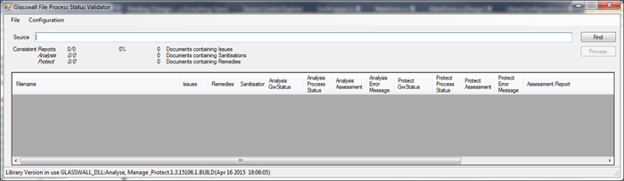
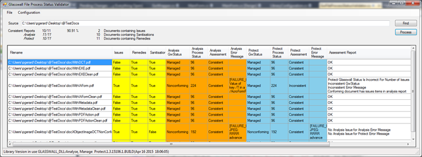

This document needs to be brought in line with the RFC, see

[Request for Comments: Standardisation of Core Team Documentation for Programs and Scripts](https://github.com/filetrust/Glasswall-Documents-Triage/blob/master/rfc_glasswall_core_documentation_format.md).

### Conventions

**Bold** -- This is used for key words that are used in the application
UI.

*Italics* -- This is used to identify extracts from code or log files.

### Usage

The GWFileProcessStatusValidator test application consists of an
executable and DLL. The application is dependent on the Glasswall DLL
being provided in the same folder.

Once running, the user is required to specify a folder that contains the
documents that will be used as a test set. The folder can be selected by
clicking on the **Find** button or dragging the folder from a file
explorer. Once a valid folder is specified in the **Source** text-box,
the **Process** button is enabled.

To start processing the files in the specified folder hierarchy the
**Process** button is clicked. The application will navigate through the
specified folder hierarchy attempting to process each file. The
processing results are shown in the data table displayed in the bottom
half of the UI.

Once processing is completed, the results can be exported to a text
file. The menu option for this feature can be found under the **File**
menu item. The exported results file structure is explained below.

### Configuration

Three pre-set configuration management policies are available. The
required policy can be selected from the **Configuration** menu item.
The available pre-sets are 'Allow', 'Disallow' or 'Sanitisation'. Within
each pre-set, the content management switches for each camera are all
set to the named content management setting.

### Operation

The application processes each file twice, once using Analysis Audit,
then again with Manage & Protect. The Analysis Report is then parsed and
the contents checked against the status results provided by the
Glasswall processing. Where the status values are inconsistent with the
Analysis Report contents assessment reports are generated. In addition
to the status values being compared to the Analysis Report, there are
also comparisons made between the outputs of the two processing modes.

The results of the checks are displayed in the UI in tabular form. The
columns are colour coded to clearly identify the Analysis Report results
(Yellow) the Analysis Process Results (Orange) and the Protect Process
Results (Blue). The following sections describe each of the columns.

|Column Name   |            Description
|---|---|
|Filename |                 The full pathname of the file being analysed.
|Issues  |  **True** if any Issue Items are found in the Analysis Report, **False** otherwise.
|Remedies | **True** if any Remedy Items are found in the Analysis Report, **False** otherwise.
|Sanitisations | **True** if any Sanitisation Items are found in the Analysis Report, **False** otherwise.
|Analysis GwStatus |        Return value from the Glasswall API function GWFileAnalysisAudit.
|Analysis Process Status |  Status value provided by the Glasswall API function GWFileProcessStatus, after the call to GWFileAnalysisAudit.
|Analysis Assessment |      **Consistent** if the **Analysis GwStatus** and **Analysis Process Status** are consistent with contents of the Analysis Report (i.e. **Issues, Remedies** and **Sanitisations).**
|Analysis Error Message | Return value from the Glasswall API function GWFileErrorMsg, after the call to GWFileAnalysisAudit.
|Protect GwStatus |         Return value from the Glasswall API function GWFileProtect.
|Protect Process Status |   Status value provided by the Glasswall API function GWFileProcessStatus, after the call to GWFileProtect.
|Protect Assessment |       **Consistent** if the **Protect GwStatus** and **Protect Process Status** are consistent with contents of the Analysis Report (i.e. **Issues, Remedies** and **Sanitisations).**
|Protect Error Message |    Return value from the Glasswall API function GWFileErrorMsg, after the call to GWFileProtect.
|Assessment Report   |      Report summarising the checks that have been carried out. **OK** if all checks are consistent, a list of inconsistencies otherwise.

### Consistency

The Analysis Assessment and Protect Assessment columns will display
**Consistent** if the **GwStatus** and **Process Status** column entries
are consistent with the Analysis Report entries (**Issues, Remedies**
and **Sanitisations**). This can be summarised as.

- Managed documents should not have any Issue Items.

- The bits of the Process Status bitmap should be set appropriately,
    according to the Analysis Report entries.

The structure and values of the Process Status bitmap and GwStatus can
be found in the Glasswall SDK Helpfile.

Any inconsistencies that are identified between the two processing modes
(Analysis and Protect) will only be reported in the **Assessment
Report** column.

### Results File Format

#### Header

The Header of the results file contains

-   The version of the test tool

-   The version of the Glasswall DLL used to process the files

-   The name of the pre-set used during processing

-   A summary of the test results

#### **Header Example**

    Test Tool version 1.0.5589.27182
    Using library version GLASSWALL_DLL:Analyse, Manage & Protect.1.3.15106.1.BUILD(Apr 16 2015 18:06:05)
    Library Content Management Preset : Sanitise
    Consistent Reports 10/11 90.91 % 

#### **Body**

The body of the report is made up of the test results of those files
that processed and their results found to be inconsistent. The
information provided is the same as displayed on the UI, with each
column separated by tab (\\t) character.

The first line of the body is a header line with the column names. The
results for each inconsistent file are then displayed on subsequent
lines.

The formatting of the results file is such that it can be imported into
a spreadsheet, using the tab at a delimiter.
