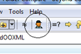
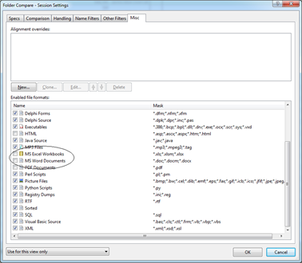
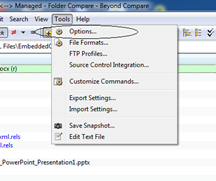
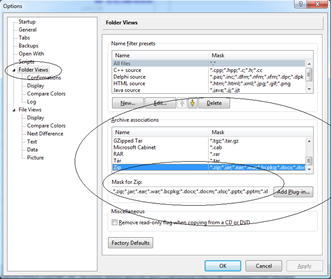
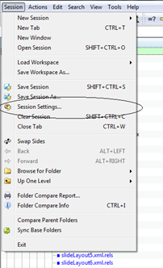
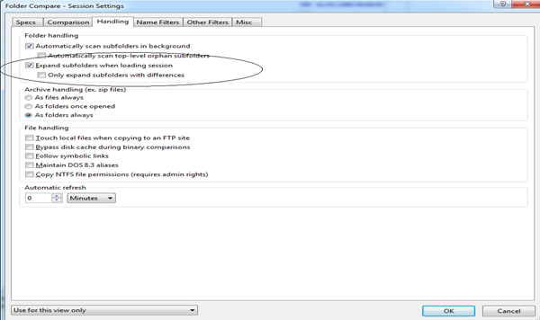

--- 
title: Adding OOXML Support to Beyond Compare
---

Make visible the internal content of files with file extensions .docx, .docm, .xlsx, .pptx, .pptm, and .xlsm using Beyond Compare 3.

## 1 Change the Folder Compare Settings

- Open the **Folder Compare** window

- Untick **Excel** and **Word**.

- In **Enabled file formats** add '.rels' to the list of XML file types

## 2 Change Archive Handling

- Select **Options**:

- Select **Folder Views** and change **Mask for Zip** to:

    *.zip;*.jar;*.ear;*.war;*.bcpkg;*.docx;*.docm;*.xlsx;*.pptx;*.pptm;*.xlsm

## 3 Change Session Settings

Change **Session Settings** to make it easy to expand and see all OCP files fully expanded.

- Open **Session Settings**

- Tick **Expand Subfolders** and select **As folders always** under **Archive Handling**. 
- Select **Also update session defaults** at the bottom.

