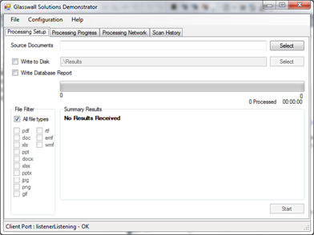
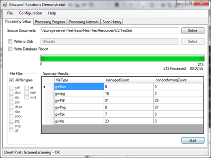
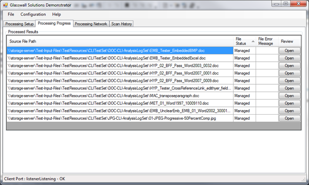
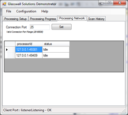
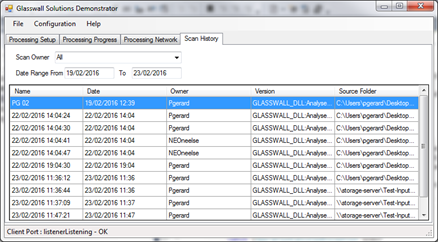
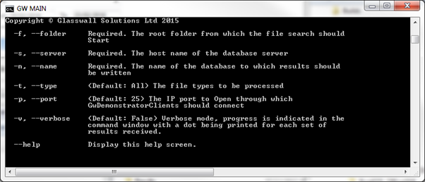

This document needs to be brought in line with the RFC, see

[Request for Comments: Standardisation of Core Team Documentation for Programs and Scripts](https://github.com/filetrust/Glasswall-Documents-Triage/blob/master/rfc_glasswall_core_documentation_format.md).

### Conventions

**Bold** -- This is used for key words that are used in the application
UI.

*Italics* -- This is used to identify extracts from code or log files.

### **DESCRIPTION**

GWDemonstrator is designed to process large numbers of files
quickly. It overcomes the singled threaded nature of the Glasswall DLL
by running a number of processing clients in parallel, all controlled
from the server application and reporting results back to the server
application. Results are persisted to database enabling detailed reports
to be extracted during post-processing.

The GWDemonstrator test application consists of a suite of executables
and associated DLLs. It makes use of the Glasswall DLL, having a
dependency on the Glasswall API and the format of the analysis report.

The GWDemonstrator.exe can operate in two modes: GUI or Command line. If
no arguments are passed in on the command-line then GUI mode is
selected. The user interface is presented as shown below.

### **FILES**
| Executable           | DLLs                 | Purpose              |
|---|---|---
|GWDemonstrator.exe |CommandLine.dll GWDemonstratorDataLayer.dll GWDemonstratorShared.dll System.Data.SqlServerCe.dll|Principle application of the suite that drives the scans and stores the results. |
|GwDemoDBAdministrator.exe|GWDemonstratorDataLayer.dll GWDemonstratorShared.dll |Provides functionality to create and remove analysis database instances on an SQL Server database. | |
| || |
|GWDemonstratorClient.exe|glasswall.classic.dll GWDemonstratorShared.dll |Multiple instances of this client application connect to the GWDemonstrator.exe application providing parallel document processing funcionality.  | |

Processing Setup
----------------

This tab is where the file scanning is configured and started.

| | |
|---|---
| Source Documents      | User configurable to specify the root folder from which processing will start. The location can be type directly, or selected using the 'folder browser' provided by the Select button. The Start button will not be enabled until a valid Source Folder is specified.|
| Write to Disk         | This checkbox enables the user to specify whether the results of the scan should be saved to disk. If this item is selected, a valid output folder must be provided in the        adjacent text box.                          |
| Write Database Report | Each analysis report received from the processing of the documents is stored in the database. If this checkbox is enabled, it is this version of the report that is written to disk (if 'Write to Disk' is enabled). If this checkbox is not enabled, then the original analysis report received from the processing client is written.      |
| File Filter | Any files that are not recognised by Glasswall are reported as **unmanaged**. The checkboxes provided in the **File Filter** group enable any Glasswall recognised file types to be found during the file search.                            |
| Summary Results       | This table (shown in the screenshot below) is updated in real-time as files are processed. If give a report of the number of files of each processed, and whether they were managed or found to be non-conforming.                                                                
| | The progress bar and associated statistics fields are also updated in real-time. The total files statistic may not be accurate until close to the end of processing. This is due to an implementation constraint that stops overloading in the event of extremely large file sets being processed. As a results this field will only ever be a maximum of 500 documents greater than the  **processed documents** field.|
| Start button          | This button is contextual; it is enabled when a valid scan configuration is available, and switches to **Stop** when a scan is in progress.|

### Processing Progress
This tab provides detailed information on the results of the current scan.

Each line of the report represents a file processed whilst searching the
specified folder hierarchy. The file status can either be **Managed** or
**Non-conforming**. In the event of a file being non-conforming, the
error message provided by the Glasswall DLL is logged. This may not be
the only issue in the document. For a detailed description of what was
found in the document the **Review** button will open up a form
displaying an abridged version of the analysis report. The displayed
information includes

- Issue Items
- Sanitisation Items
- Remedy Items

All grouped within their Content Groups. The report form is modal, but
does not affect the progress of the current scan if reports are viewed
whilst the scan is in progress.

### Processing Network

This tab provides information regarding the collection of
**GWDemonstratorClient** applications that have connected to the
**GwDemonstrator** application are and are available to support
processing.

The Connection Port is the TCP port opened
by GwDemonstrator to which the clients should attach. If more than one
instance of GwDemonstrator is running on a single platform, this value
will need to be modified as only one application can open the port.
**GWDemonstratorClient** configuration would have to be set
appropriately if this configuration item is changed. Details of this are
provided in a later section.

### Scan History

Each time the **Processing Setup** tab's **Start** button is pressed, a
new scan is started. This tab provides details of all the scans that are
currently available in the connected database.

For each scan the table displays the following information

|Field  |         Purpose
|---|---
|Name|This is the name of the Scan. It defaults to the datetime stamp of when the scan started. This is an editable field, enabling the user to provide a meaningful name.
|Date|            The date and time at which the scan was started.
|Owner|           The network identity of the user who triggered the scan.
|Version|         The version of Glasswall DLL used to process the scan
|Source Folder|   The root folder of the scan.

The scan list can be filtered using the **Scan Owner** and **Date
Range** fields.

Filtering by **Scan Owner** enables the list to display only those scans
started by the specified owner. The drop-down list is populated from the
displayed scans. Selecting **All** allows the scans from all users to be
displayed.

Filtering by **Date Range** enables the user to define the period in
which the scan started.

### Scan History Options

There are a number of context sensitive menu options available to the
user from this table.

| Menu Item | Purpose                                                 |
|---|---
| Summary   | This provides a brief report of the scan results, similar to that displayed on the **Processing Setup** and **Processing Progress** tabs whilst the scan is in progress.|
| Compare | This is only enabled if two scans are selected. Selecting this menu option displays a form that enables the results of two scans to be displayed. The form has three areas: two areas list the files that are unique to that scan. The third area compares the results of the file processing between the two scans.              |
| | In order to highlight any differences, a checkbox is provided that, when enabled, filters that comparison area to only show the results that differ between scans |
| Edit      | Selecting this option enables the user to modify the scan name. |
| Delete    | Selecting this option enables the scan results to be deleted from the database \[*not yet implemented*\].      |

### Configuration

#### Client application start-up

The GwDemonstratorClient is a command-line application. It is provided
with GwDemonstrator application connection information on the command
line

*GWDemonstratorClient.exe localhost:25*

Where 'localhost' specifies the host of the GwDemonstrator application
and '25' identifies the IP port in use by the GwDemonstrator
application.

'25' is the default port number. If this port is already in use on the
host PC, it may be changed by updating the value in the 'Processing
Network' tab of GwDemonstrator application. The same port number should
then be used on the GwDemonstratorClient command line.

**If no arguments are provided on the command line, then the defaults
shown above will be used.**

If two instances of GwDemonstrator are started on the same PC, the port
number of one will need to be changed.

When the GwDemonstratorClient application starts-up it attempts to
connect to the GwDemonstrator application on the specified port. If the
GwDemonstrator application has not yet been started (or has a different
port number specified) then the client application will poll
continuously.

Once the GwDemonstratorClient connects to the GwDemonstrator application
the GwDemonstrator requests the Glasswall DLL version, which is then
provided by the client. This finishes the start-up sequence.

It is recommended that the number of GwDemonstratorClient instances
running does not exceed the number of cores available on the host PC.

#### GwDemonstrator Command Line Mode

Triggering the GwDemonstrator from the command line with arguments puts
the application into command line mode.

In this mode the application processes the specified folder hierarchy,
inserting the results into the specified database. The screen show above
details the necessary configuration. The GWDemonstratorClient
applications need to be started separately.

#### GwDemonstrator Database Usage

### Selecting Database type

Database selection is available under the Configuration menu item.

The required database is selected from the dropdown list. The
configuration may not be changed once a scan has started.

The default database at start up is the SQL Server Compact Edition
(SSCE).

If the Server SQL 2008 R2 database has already been configured,
selecting the required database from the drop down is the only action
required to switch between databases.

### GwDemonstrator with SQL Server 2008 R2

The GwDemonstrator can be configured to use a Server SQL 2008 R2
database instead of the default SSCE database.

#### Creating the database

SQL Scripts are provided to create an instance of a GwDemonstrator
database and create the necessary tables. It is beyond the scope of this
presentation to give detailed instructions on how to do this. Often the
SQL Server is under the control of a DBA or the IT department. If this
is the case, then it is unlikely that anyone else has sufficient
privileges to create database or tables. These scripts can be provided
to an appropriately privileged individual for them to run.

Any individual who wishes to store results to the SQL Server 200 R2
database will need to have the *db_datawriter* privilege enabled. Any
individual who wishes to extract information from the database will need
to have the *db_datareader* privilege. These privileges should be set up
when the database is created.

When the database has been created, its name and the database hostname
are required in order to configure the GwDemonstrator application.

#### Configuring GwDemonstrator

The database configuration is stored in the application ini file. This
file is only created if the application configuration is changed from
default value. The following steps are required to change to using the
newly created SQL server database.

1.  Start GwDemonstrator application and select the
    *Configuration\|Database* menu option

2.  From the drop down list, select *gwAnalysisSQLServer2008*, and click
    the OK button

3.  Shutdown GwDemonstrator

4.  Open app.ini

5.  Update the *SQLServerSource* and *SQLServerDbName* to the server
    hostname and database name

6.  Restart GwDemonstrator

All subsequent scan information will be written to the specified SQL
server database.

Once the above steps have been completed, switching between the two
database types can be done through the *Configuration\|Database* menu
option. The option is not available whilst scans are in progress.

### GwDemonstrator with SSCE

The SSCE means that processing results can be persisted to a database
without the need for a full SQL Server database being provisioned. It
should be understood that the use of the SSCE for extremely large file
systems this database is not recommended. Nor is it recommended for
scenarios where complicated queries will be required on the scanned
information as only a reduced set of TRANSACT-SQL command is made
available. It is possible to export data from SSCE to a full SQL Server
database (the details of this are beyond the scope of this document).
