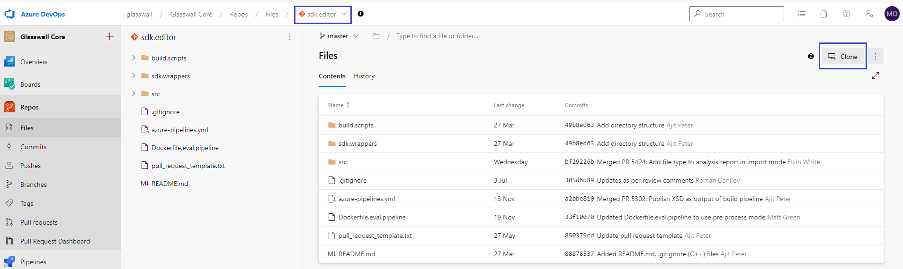
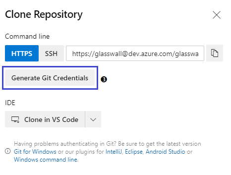
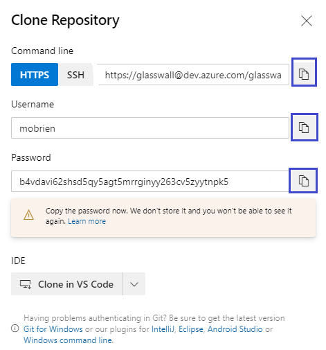

**Note: Start with §2; use §1 only if there are issues.**

## 1 Login to your Linux Virtual Machine.

### 1.1 Setup global Git configuration

Open a terminal session and type the commands:

    git config --global http.proxy 10.10.105.118:8888
    git config --global http.sslVerify false

### 1.2 Change System Settings

Go to **System Preferences** > **Internet and Network** > **Network Proxy**. 
Select **Manual Proxy Configuration** and type `10.10.105.118` with port:8888.

## 2 Clone the Repository

### 2.1 Go to the Azure DevOps site

Go to the Azure DevOps site, select **Repos** > **Files** then select from the drop-down the repo you require **(1)**. Click **Clone** **(2)**. Click [Select Repo and Clone](steps_to_use_devops_on_vm-01-repo_page_and_select_clone.png) to see the image below expanded. 

### 2.2 Generate Git Credentials

Click **Generate Git Credentials** **(3)**.

### 2.3 Copy the Credentials

 In the extended *Clone Repository* dialogue box, for each of the `HTTP`, `Username` and `Password` fields, click the **Copy to clipboard** icon and paste into a text document.

### 2.4 Clone the Repository

Go to the VM and in a terminal window and using the `cd` command, set the current working directory to the directory into which you want to clone the repository. 

Type these commands (replace <...> with the content previously pasted into your text document):

    git config --global user.name <username>
    git config --global user.email <your email address>
    git clone <HTTP address>

You will be prompted for a password. Enter the password you pasted into the text document. Note: The cursor will not move in the terminal window.

The repository should be cloned to your VM.
