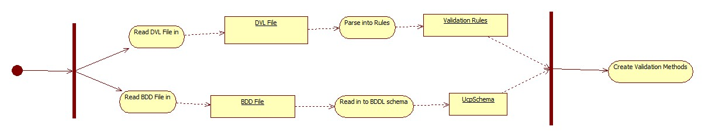

DVL Checker  {#internalDvlChecker}
===========================================

# Author
Steven Warner

# Description
Checks DVL files for syntax errors.

# Location
Can be found at the following location:

- \\\\STORAGE-SERVER\\Development Drive\\Development Tools\\UCP_ToolChain\\dvl_checker.exe

# Context

* Do initial parse of DVL to confirm the raw parser syntax is correct
* Understand the meaning and check the logic of rules against the capabilities of the language
* Generate a csv list of node names verses bddl validation expressions
* Generate a file of validation functions

\diafile "dvl_to_c++.dia" width=100cm

#  Architecture

 width=10cm

#  Modules

* dvl_checker.exe
* dvl_rule_classes.dll
* Antlr4.Runtime.v4.0.dll
* BinaryDOM.dll
* CodeGenerationSupport.dll
* CommandLine.dll
* FileModelling.dll
* ucp_grammar_classes.dll
* ucpSchemaLibrary.dll
* UcpToolSupport.dll
* ucpUtility.dll

#  Usage

DVL_Checker Version  2.1.1.1
Copyright (C) 2013 Glasswall
Usage: dvl_checker -d *dvlfile\|directory of dvl files* \[-o *output directory* -x -r \[-s *schema file* -c \] -i *list of ignored rules*\]
Examples:

Test Single File
dvl_checker -d singleFile.dvl
(e.g.,
 dvl_checker -d sttbfassoc.dvl)

Recurse down a directory testing every file
dvl_checker -d dvl_files_directory -r
(e.g.,
 dvl_checker -d c:\\tfs\\...\\MS-DOC\\validation -r)

Recurse down a directory testing every file and create a crossreference ('expanded_dvl_bddl.csv' file in 'report_directory')
dvl_checker -d dvl_files_directory -r -x -o report_directory
(e.g.,
 dvl_checker -d c:\\tfs\\...\\MS-DOC\\validation -r -x -o c:\\temp\\myoutput)

Recurse down a directory testing every file and create a compiled file ('validation.h' file in
'report_directory')
dvl_checker -d dvl_files_directory -r -o validation_cpp_directory -s schema_file -c
(e.g.,
 dvl_checker -d c:\\tfs\\...\\MS-DOC\\validation -r -o c:\\temp\\myoutput -s
c:\\tfs\\...\\MS-DOC\\WordCoreStreams.bdd -c)

  -d, --dvl                  Required. The name of a dvl file to be parsed. If this is the only parameter, then this does a syntax check and reports to the commandline the result of the parse.
                             If recurse option used, then *filepath* is used as the start of a search down through directories from that point, processing every *.dvl file found.

  -o, --output               Output reports and generated code are sent here.

  -s, --schema               The fully qualified path to the root BDD file (e.g. 'WordCoreStreams.bdd') from which the camera us built. 
                             This will be parsed to find all the structures that require a validation function generated

  -i, --ignore               The full path to the file containing rules to be ignored

  -c, --compile              Cause the validation functions to be  generated and sent to the *output path*

  -x, --crosscheck           Cause the expanded validation BDDL expressions to be  generated and sent to the *output path*

  -r, --recurse              If recurse option used, then *filepath* is used to be the start of a search down through directories from that point, processing every *.dvl file found.

  -t, --trace                Trace mode - for DVL debug only

  -p, --pause                Wait for key press at end

  --no_sort                  Do not sort validation methods

  --no_validation_methods    Create empty validation methods

  --root                     Namespace and prefix for output code file

  --validclasses             File containing names of valid classes - puts #if#def around validation methods not on this list

  --help                     Display this help screen.
