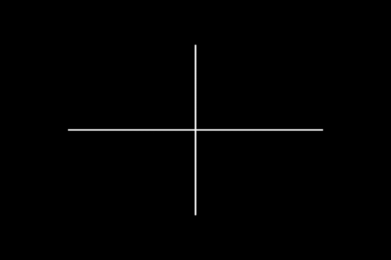
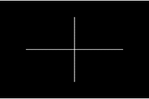
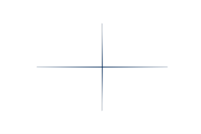
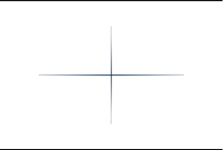

&copy; 2017 Glasswall Solutions Limited 
ALL RIGHTS RESERVED

Information contained herein is the property of Glasswall Limited and is
proprietary and confidential.

### **AUTHOR**
Roman Danilov <rdanilov@glasswallsolutions.com>

### **CREATION DATE**
25 October 2017

### **VERSION**
1

### **DOCUMENT HISTORY**

Table 1: Document Change History

|Issue Date|Issue Number|Author|Description
|---|---|---|---
2017/10/25|1|Roman Danilov|The initial document describing how to convert raw PDF image data into actual images
                                                          

**DOCUMENT DISTRIBUTION**

Table 2: Document Distribution

|Name|Date|
|---|---|
|Forcepoint|2017/11/01|
               
**COPYRIGHT AND CONTACT DETAILS**

The copyright in this work is vested in Glasswall Solutions Limited, and the
document is issued in confidence for the purpose for which it is
supplied. It must not be reproduced in whole or in part or used for
tendering or manufacturing purposes except under agreement or with the
consent in writing of Glasswall Solutions Limited and then only on
condition that this notice is included in any such reproduction. No
information as to the contents or subject matter of this document or any
part thereof arising directly or indirectly there from shall be given
orally or in writing or communicated in any manner whatsoever to any
third part being an individual firm or company or any employee thereof
without the prior consent in writing of Glasswall Solutions Limited.

&copy; 2017 Glasswall Solutions Limited

If there are any questions related to this report, these should be
addressed to: [Roman Danilov](mailto:rdanilov@glasswallsolutions.com).

## **INTRODUCTION**

In this document we will look at how raw PDF image data can be converted
into actual images, modified, and then converted back into raw image
data. PDF image and graphics handling is a substantial topic so this
guide will only focus on the conversion of exported image data from
Glasswall. This document references the PDF specification as it is more
detailed and it covers certain topics that are not included in this
guide. The latest version of the specification can be found at
[www.adobe.com/devnet/acrobat/pdfs/pdf_reference_1-7.pdf](http://www.adobe.com/devnet/acrobat/pdfs/pdf_reference_1-7.pdf).

### **1.1 Prerequisites**

-   The library used for manipulating the images must support 16 bits
    per pixel component operations

-   The accompanying code has been tested with ImageMagick 6.7.8-9 Q16
    and zlib 1.2.7

-   The information in this guide is presented as accurately as
    possible, but some errors may exist

## **2 CONVERTING RAW PDF IMAGE DATA TO ACTUAL IMAGES**

### **2.1 Filters**

Images and other objects stored in PDF can be compressed or encoded with
different algorithms, which in PDF are called filters. Each filter
specifies a different way of encoding or compressing the data, and more
than one filter can be applied to a piece of data. For example, we may
have the following filters applied:

    ASCII85Decode, FlateDecode

This indicates that the data has been compressed with the Deflate
algorithm, and then encoded with the Base85 algorithm. If we wanted to
extract the original data from the PDF document, we would need to decode
it with the Base85 algorithm and then decompress it with the Deflate
algorithm. We would apply the operations in reverse if we were taking
data and placing it in the PDF document.

Some filters also take additional parameters that modify their
behaviour. These parameters will need to be taken into account when
applying the filters otherwise the data will not be transformed
correctly.

More information on filters can be found in section **3.1 Filters**.

To which document do the references refer (above, and below)?

### **2.3 How images are stored in PDF**

Images in PDF are not stored as images, but as image pixel data with
accompanying metadata telling us how the pixel data is meant to be
interpreted. The metadata usually includes how the image is
compressed/encoded, the image width and height in pixels, the image
colour space, and the number of bits per pixel component within the
image. Other metadata may also be included depending on how the image is
stored.

Images encoded with the DCTDecode filter are a slight exception to this
rule as you can take the image data, save it as a JPEG and it can be
opened by an image manipulating programs without any issues. Further
manipulations may still be required such as applying to correct colour
space in order for the image to be rendered correctly. Images encoded
with DCTDecode filter are exported by Glasswall.

The section "**4 Graphics**" on pages **193-386** contains everything
you need to know about image and graphics in PDF, but the most
relevant sections are section "**4.5 Color Spaces**" on pages
**235-289**, and section "**4.8 Images**" on pages **334-355**.

### **2.3 Raw image data conversion example**

The first step to converting raw image data to an actual image is to
read the metadata associated with that image. The metadata is stored in
the "*images*" directory in a file that has the same name as the image,
but with a "*.json*" extension. For example, if we have an image
"*images/img9-0.unknown*" then the metadata will be stored in
"*images/img9-0.json*". The metadata is encoded as a JSON string.

The example PDF document included has the following metadata:

    {
        "Width" : 1153,
        "Height" : 768,
        "Components" : 1,
        "BitsPerComponent" : 8,
        "Length" : 2030,
        "Filter" : ["FlateDecode"],
        "Matte" : [0, 0, 0],
        "ColorSpaceFamily" : "DeviceGray"
    }

We can see that this image is compressed with the Deflate algorithm, it
has dimensions of 1153 by 768, it uses 8 bits per pixel component, and
it is in the grayscale colour space. The length field indicates the
length of the data in bytes within the PDF document. There is also a
Matte attribute, which is used when an image has a mask applied to it. I
am not too sure how the Matte attribute is used since it is actually
related to rendering images, which Glasswall does not do, but for this
case it does not seem to make any difference so we are going to ignore
it. For more information regarding opacity and masking see sections "**7
Transparency**" on pages **513-576**. If we were to convert the image
using the commandline then we would do the following:

    > python Deflate.py inflate img9-0.unknown img9-0.bin
    > convert -depth 8 -size 1153x768 gray:img9-0.bin img9-0.png

The Deflate.py, which can be found in [**Appendix 3.1**](#deflate.py),
is a python script that reads a binary file, inflates or deflates that
file, and writes the output to another file. After inflating the file,
we use the convert utility to change the image from raw grayscale data
to a PNG image. At this point the image can be manipulated as required.
Here is the original image after conversion with a modified version
besides it:

| | |
|---|---
|  | |
|Original Image added to top and bottom| Modified image with 5 pixel border |
                                                                          

After the image has been modified then we can convert it back to the
original format using the following commands:

    > convert img9-0.png gray:img9-0.bin
    > python Deflate.py deflate img9-0.bin img9-0.unknown
    > rm img9-0.bin img9-0.png

Afterwards we can create a zip archive and run it through import mode so
that the modified image is inserted back into the document. The attached
C++ file, which can be found in [**Appendix 3.2**](#main.cpp),
demonstrates how this can be done in a programmatic fashion. Here are
screenshots of the images before and after modification:

| | |
|---|---|
|  | 
|Original PDF image insertion|Modified PDF image after insertion|
                                                                                      

### **2.4 Metadata exported by Glasswall**

This table gives an overview of the general metadata that is exported by
Glasswall. Some metadata is optional since it is dependent upon the
content within the document and so it does not exist in all cases, while
some metadata will always exist.

+----------------+----------------+----------------+----------------+
| **Key**        | **Type**       | **Comment**    | **Optional?**  |
+================+================+================+================+
| Width          | Integer        | The width of   | Required       |
|                |                | the image in   |                |
|                |                | pixels         |                |
+----------------+----------------+----------------+----------------+
| Height         | Integer        | The height of  | Required       |
|                |                | the image in   |                |
|                |                | pixels         |                |
+----------------+----------------+----------------+----------------+
| Co             | String         | The colour     | Optional for   |
| lorSpaceFamily |                | space of the   | image masks    |
|                |                | image. A full  | and images     |
|                |                | list of the    | with JPXDecode |
|                |                | colour spaces  | filter         |
|                |                | can be found   |                |
|                |                | in section     |                |
|                |                | "**4.5.2 Color |                |
|                |                | Space          |                |
|                |                | Families**" on |                |
|                |                | page **237**.  |                |
|                |                | Special        |                |
|                |                | considerations |                |
|                |                | have to be     |                |
|                |                | taken into     |                |
|                |                | account when   |                |
|                |                | the image is   |                |
|                |                | encoded with   |                |
|                |                | the JPXDecode  |                |
|                |                | filter, which  |                |
|                |                | can be found   |                |
|                |                | in section     |                |
|                |                | "**4.8.4 Image |                |
|                |                | D              |                |
|                |                | ictionaries**" |                |
|                |                | on pages       |                |
|                |                | **340-349**    |                |
+----------------+----------------+----------------+----------------+
| Bi             | Integer        | The number of  | Optional for   |
| tsPerComponent |                | bits per pixel | image masks    |
|                |                | component      | and images     |
|                |                |                | with JPXDecode |
|                |                |                | filter. This   |
|                |                |                | value must be  |
|                |                |                | 1 when the     |
|                |                |                | image is an    |
|                |                |                | image mask.    |
|                |                |                | This value is  |
|                |                |                | ignored for    |
|                |                |                | JPXDecode      |
|                |                |                | images         |
+----------------+----------------+----------------+----------------+
| ImageMask      | Boolean        | Indicates      | Optional       |
|                |                | whether this   |                |
|                |                | image is an    |                |
|                |                | image mask.    |                |
|                |                | Default is     |                |
|                |                | **false**      |                |
+----------------+----------------+----------------+----------------+
| ColorS         | String         | This is the    | Optional, but  |
| paceBaseFamily |                | base colour    | exists when    |
|                |                | space that is  | the            |
|                |                | used when the  | Co             |
|                |                | Col            | lorSpaceFamily |
|                |                | ourSpaceFamily | is Indexed     |
|                |                | is an Indexed  |                |
|                |                | colour space   |                |
+----------------+----------------+----------------+----------------+
| ColorSpace     | Integer        | The number of  | Optional, but  |
| BaseComponents |                | components     | exists when    |
|                |                | used to        | the            |
|                |                | represent each | Co             |
|                |                | pixel value    | lorSpaceFamily |
|                |                | within an      | is Indexed     |
|                |                | Indexed        |                |
|                |                | Co             |                |
|                |                | lorSpaceFamily |                |
+----------------+----------------+----------------+----------------+
| Filter         | Array of       | The filters    | Optional       |
|                | Strings        | that the image |                |
|                |                | is encoded or  |                |
|                |                | compressed     |                |
|                |                | with.          |                |
+----------------+----------------+----------------+----------------+
| DecodeParams   | Array of       | Each           | Optional       |
|                | Dictionaries   | dictionary     |                |
|                |                | stores the     |                |
|                |                | parameters of  |                |
|                |                | the filter     |                |
|                |                | that is being  |                |
|                |                | applied to an  |                |
|                |                | image, and the |                |
|                |                | content of the |                |
|                |                | each           |                |
|                |                | dictionary     |                |
|                |                | will be        |                |
|                |                | different      |                |
|                |                | depending on   |                |
|                |                | the filter     |                |
|                |                | used. The      |                |
|                |                | order of the   |                |
|                |                | DecodeParams   |                |
|                |                | will match the |                |
|                |                | order of the   |                |
|                |                | filters. If a  |                |
|                |                | filter does    |                |
|                |                | not take any   |                |
|                |                | parameters     |                |
|                |                | then "null"    |                |
|                |                | will be        |                |
|                |                | written out    |                |
|                |                | instead. For   |                |
|                |                | example, if we |                |
|                |                | have the       |                |
|                |                | following      |                |
|                |                | filters        |                |
|                |                |                |                |
|                |                | \[             |                |
|                |                | "A             |                |
|                |                | SCII85Decode", |                |
|                |                | "C             |                |
|                |                | CITTFaxDecode" |                |
|                |                | \]             |                |
|                |                |                |                |
|                |                | Then our       |                |
|                |                | DecodeParams   |                |
|                |                | might look     |                |
|                |                | something like |                |
|                |                | this           |                |
|                |                |                |                |
|                |                | \[ "null", {   |                |
|                |                | \... } \]      |                |
|                |                |                |                |
|                |                | where          |                |
|                |                | ASCII85Decode  |                |
|                |                | does not take  |                |
|                |                | any            |                |
|                |                | parameters,    |                |
|                |                | but the        |                |
|                |                | CCITTFaxDecode |                |
|                |                | filter does.   |                |
+----------------+----------------+----------------+----------------+

The filter parameters have been left out from this guide since they can
easily be looked up, but they can be found in section "**3.3 Filters**"
on pages **65-90**.

Unfortunately there seems to be a bug within our code, which was only
recently discovered, where images encoded with JBIG2Decode filter are
marked as non-conforming when they contain a reference to the
JBIG2Globals streams. During testing and development the JBIG2Globals
stream was missed out and as a result it is currently not being
exported, but this will be fixed in future versions.

### **2.5 ICC profiles and Indexed colour tables**

Some images have ICC profiles and some images have indexed colour
tables. The data for both of these is also stored in the images
directory with the same name as the image, but with extensions "*.icc*"
for the ICC profile and "*.idx*" for the indexed colour table. Some
image have both an ICC profile and an indexed colour table. The ICC
profiles have already been decoded/decrypted by Glasswall so they can be
applied without requiring any further transformations. The data in the
indexed colour tables is hex encoded and comma separated. Here is a
small sample of how the indexed colour table would look:

    0xff,0xff,0xff,0x00,0x00,0xb4

This has been done for the sake of consistency as the indexed colour
tables can appear in a variety of formats within the PDF document.

### **2.6 Additional information regarding image data manipulation**

Since the image data is stored separately from the image metadata, we
can potentially disregard the metadata and manipulate the image data in
whichever way we want. For example, if we execute the following Python
script:

    import sys
    open('Test.bin', 'wb').write(bytearray(range(0,256)))

We get a file that contains image data that ranges from 0 to 255 with
dimensions of 256 by 1. If we treat the image data as a grayscale image
then we can convert it to a PNG with the following command:

    convert -depth 8 -size 256x1 gray:Test.bin Gray.png

This will produce the following
results:

We can also treat it as RGBA format and convert it as follows:

    > convert -depth 2 -size 256x1 rgba:Test.bin RGBA1.png

This will give us the following results:

We can also potentially do something like this:

    > convert -depth 4 -size 64x1 rgba:Test.bin RGBA2.png

That will give us the following images:

and:

As you can see we get different results depending on what metadata we apply to the image data.

## 3 **APPENDIXES**

### 3.1 **Deflate.py**

    import sys, zlib

    if len(sys.argv) < 4:
        print("Usage: python Deflate.py <inflate | deflate> <input file> <output file>")
        exit(-1)

    inputData = open(sys.argv[2], "rb").read()

    if sys.argv[1] == "inflate":
        print("Inflating from '{0}' to '{1}'".format(sys.argv[2], sys.argv[3]))
        outputData = zlib.decompress(inputData)
    else:
        print("Deflating from '{0}' to '{1}'".format(sys.argv[2], sys.argv[3]))
        outputData = zlib.compress(inputData, 9)

    outputFile = open(sys.argv[3], "wb")
    outputFile.write(outputData)
    outputFile.close()

### 3.2 **main.cpp**

    #include <iostream>
    #include <iterator>
    #include <fstream>
    #include <vector>
    #include <string>
    #include <Magick++.h>

    extern "C"
    {
        #include <zlib.h>

        int GWFileConfigXML(wchar_t *xmlConfig);
        wchar_t * GWFileErrorMsg();
        int GWFileDone();
        int GWFileToMemoryProtectAndImport(wchar_t *inputFilePath, void **outputBuffer, size_t *outputBufferLength);
        int GWFileToMemoryAnalysisProtectAndExport(wchar_t *inputFilePath, void **outputBuffer, size_t *outputBufferLength);
    }

    using namespace std;
    vector<char> ProcessImage(const vector<char> &imageData)
    {
       /* In the real world we would process the image by following these steps:
        * - Extract the metadata from the Analysis report
        * - Extract the icc profile and indexed colour map from the archive if they exist
        * - Apply the PDF filters in the specified order to decompress/decode the image data
        * - Use the metadata along with the icc profile and the indexed colour map to convert the raw data to an actual image
        * - Possibly revert the image back to the raw data if the image was converted to a different format
        * - Apply the filters in reverse order to correctly compress/encode the image data
        * - Replace the exported image with the new image
        * - Run the updated zip archive through Glasswall through import mode
        *
        * In this example everything is hard coded since this is only a proof of concept
        * This image has the following parameters:
        * Width: 1153
        * Height: 768
        * Bits per pixel component: 8
        * Format: gray
        * Filters:
        * - Compressed with Deflate algorithm
        *
        * The image also has a Matte attribute applied to it, which I am not
        * too sure what it does, but in this case it does not make any
        * difference.
        * 
        */

        /* Inflate the image data */

        vector<char> tempBuffer(1024*1024); /* This buffer is big enough for this particular file */

        size_t tempBufferSize = tempBuffer.size();

        uncompress(reinterpret_cast<Bytef*>(tempBuffer.data()),
        &tempBufferSize, reinterpret_cast<const Bytef*>(imageData.data()),
        imageData.size());

        /* In this example we are adding a black 5 pixel border to the top
        and bottom of the image */

        Magick::Geometry geometry(1153, 768);

        Magick::Blob imageBlob(reinterpret_cast<const
        void*>(tempBuffer.data()), tempBufferSize);

        Magick::Image image(imageBlob, geometry, 8, "gray");

        for (size_t column = 0; column < geometry.height(); ++column)
        {
            if (column == 5)
                column = geometry.height() - 5;

            for (size_t row = 0; row < geometry.width(); ++row)
                image.pixelColor(row, column, Magick::Color("White"));
        }

        /* Update the image data with the new image data */
        Magick::Blob imageOutputBlob;
        image.write(&imageOutputBlob);

        /* Deflate the image data */
        tempBuffer.resize(imageOutputBlob.length() * 11/10 + 12);
        tempBufferSize = tempBuffer.size();

        /* We set the compression level higher than the default as the
          default compression gives us a bigger file than the original
         */

        compress2(reinterpret_cast<Bytef*>(tempBuffer.data()),
                  &tempBufferSize,
                  reinterpret_cast<const Bytef*>(imageOutputBlob.data()),
                  imageOutputBlob.length(), 8);

        return vector<char>(tempBuffer.data(), tempBuffer.data() + tempBufferSize);

    } /* End of function ProcessImage */

    int main(int argc, char *argv[])
    {
        Magick::InitializeMagick(*argv);
        static wstring xmlConfiguration(

        L"<?xml version="1.0" encoding="UTF-8"?>\
        <config>\
            <pdfConfig>\
                <acroform>sanitise</acroform>\
                <metadata>sanitise</metadata>\
                <javascript>sanitise</javascript>\
                <actions_all>sanitise</actions_all>\
                <embedded_files>sanitise</embedded_files>\
                <internal_hyperlinks>sanitise</internal_hyperlinks>\
                <external_hyperlinks>sanitise</external_hyperlinks>\
            </pdfConfig>\
        </config>");

        /* Create directory to temporarily hold the intermediate output */
        system("mkdir -p Temp");

        /* Load the xml configuration */
        if (GWFileConfigXML(const_cast<wchar_t*>(xmlConfiguration.c_str())) != 1)
        {
            wcout << GWFileErrorMsg() << endl;
            return GWFileDone();
        }

        /* Export the file to memory */
        size_t exportedBufferLength = 0;
        void * exportedBuffer = nullptr;

        if (GWFileToMemoryAnalysisProtectAndExport(
                const_cast<wchar_t*>(L"Original.pdf"),
                &exportedBuffer,
                &exportedBufferLength) != 1)
        {
            wcout << GWFileErrorMsg() << endl;
            return GWFileDone();
        }

        /* Write the exported buffer to a file */
        ofstream exportedFile("Temp/Exported.zip", ios::out | ios::binary | ios::trunc);
                              exportedFile.write(reinterpret_cast<const char*>(exportedBuffer),
                              exportedBufferLength);
        exportedFile.close();

        /* Extract the image from the zip archive */
        system("unzip -o -q Temp/Exported.zip -d Temp/Exported");

        ifstream imageFile("Temp/Exported/images/img9-0.unknown", ios::binary | ios::in);
        vector<char> imageFileData ((istreambuf_iterator<char>(imageFile)), istreambuf_iterator<char>());
        imageFile.close();

        /* Process the image */
        imageFileData = ProcessImage(imageFileData);

        /* Write out the resulting image */
        ofstream imageOutputFile ("Temp/Exported/images/img9-0.unknown", ios::binary | ios::out | ios::trunc);
        imageOutputFile.write(imageFileData.data(), imageFileData.size());
        imageOutputFile.close();

        /* Create a zip archive with the new image */
        system("cd Temp; zip -r -q \"Exported - modified.zip\" Exported/*; cd ..");

        /* Run the modified zip through import mode */
        size_t importBufferSize = 0;
        void *importBuffer = nullptr;

        if (GWFileToMemoryProtectAndImport(
            const_cast<wchar_t*>(L"Temp/Exported - modified.zip"),
            &importBuffer,
            &importBufferSize) != 1)
        {
            wcout << GWFileErrorMsg() << endl;
            return GWFileDone();
        }

        /* Write out the imported file */
        ofstream importOutputFile("Imported.pdf", ios::binary | ios::out | ios::trunc);
        importOutputFile.write(reinterpret_cast<const char*>(importBuffer), importBufferSize);
        importOutputFile.close();

        system("rm --rf Temp");

        return 0;

    } /* End of function main */

### **3.3 CMakeLists.txt**

    project(PDFImageConversion)
    cmake_minimum_required(VERSION 2.8)
    aux_source_directory(. SRC_LIST)
    add_executable(\{PROJECT_NAME} ${SRC_LIST})
    find_library(libglasswall "glasswall.classic" SHARED IMPORTED REQUIRED)
    find_package(ZLIB REQUIRED)
    find_package(ImageMagick COMPONENTS Magick++ MagickCore REQUIRED)
    include_directories(${ImageMagick_INCLUDE_DIRS})
    include_directories(${ZLIB_INCLUDE_DIRS})
    target_link_libraries(PDFImageConversion ${libglasswall} ${ImageMagick_LIBRARIES} $ZLIB_LIBRARIES})
    set (CMAKE_CXX_FLAGS "-std=gnu++11 -Wall -Wextra \${CMAKE_CXX_FLAGS}")
