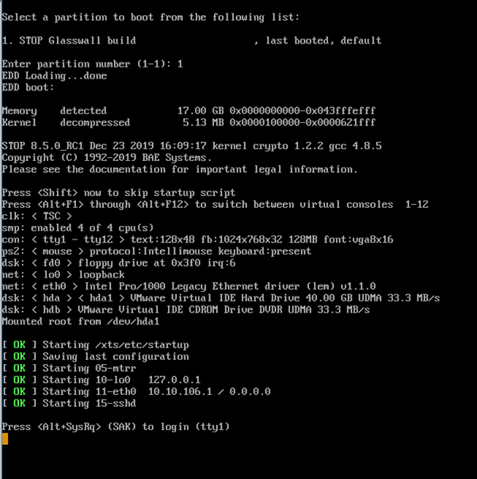
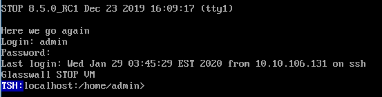
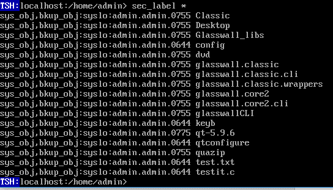
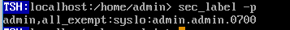
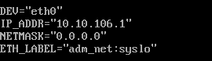
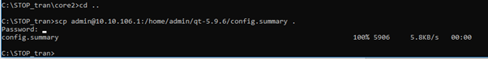
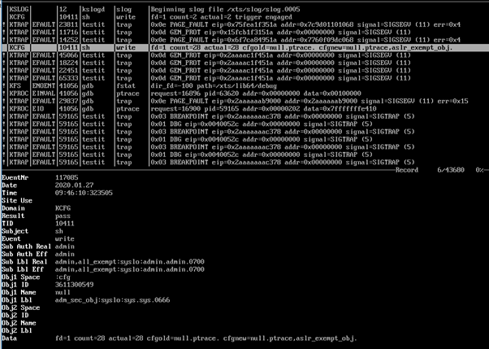
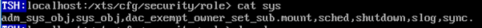
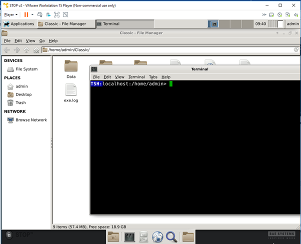

VM Image at : M:\\00-Common\\STOP8.5.0_RC1\\vmImage\\STOP vm 2

Requires VM player 15 to run.

Once you start the image player it will boot up STOP and you should see
a login page like the below:

Hit **Alt+SysRq** to login . userid = admin, password = Glasswall1234.
(Note: On VMware you can also hit the Windows key.)

STOP allows multiple termimal sessions. Use **Alt+F1** to **Alt+F12** to
switch between tty1 and tty12.

On logging in should see something like:

You can scroll up the output in a terminal session (as in Command window)
but first you need to hit **Scroll Lock** to enable this. Use **Scroll&nbsp;
Lock** or **Esc** to get out of scrolling mode so you can issue commands
again.

To pass control back to windows hit **Ctrl+Alt**.

If you hit **Alt+SysRq** you will be logged out.

## **Security labelling**

One of the fundamental differences of STOP is its security settings,
referred to as *security labels*. If you are doing more than just the basics
it is strongly recommended you read sections 5 and 4.2 of the manual.

Security settings are set and read using the **sec_label** command.
**Sec_label** can be applied to object, for example files and directories and
devices or processes.

**Do NOT change sec_labels when running terminal sessions in the X Window System**

Below is an example of checking the sec-labels for the current
directory:

Here is checking the sec_label currently running processes as:

As you are mostly going to be logged in as admin then the following
command will provide enough privileges to do most things:

&nbsp;&nbsp;&nbsp;&nbsp;sec_label -pl admin,all_exempt

This will need to be issued for each terminal session.

## **Changing labels on files**

If you need to change the labels on a file

&nbsp;&nbsp;&nbsp;&nbsp;sec_label -l *filename* *label*

## **Changing the label for processes**

If you need to change the labels on a file

&nbsp;&nbsp;&nbsp;&nbsp;sec_label -p -l *label*

## It's like Linux but...

It's like Linux but different enough to catch you out sometimes. Most
Linux commands will work as you expect.

Most operating system directories that you would expect to be under */* or */usr* are in fact in */xts*.

## **Configuring IP address**

The IP address used by the VM is located in file */xts/etc/startup.d/11-eth0*.

Edit the file to use an IP address on the domain that is not in use. Use
**ping** to find an IP not in use.

To make the change take effect use *shutdown&nbsp;-r* command to restart
the operating system.

**Transferring files to/from host**

As SSH (Secure Shell) is configured using the default port, *scp* (secure copy) can be used to transfer files. There is an *scp* client within Windows 10 that can be used within the command window. You can refer to the man page [scp(1)](https://man7.org/linux/man-pages/man1/scp.1.html) to see all the options, but the basic format needed for most occasions is:

&nbsp;&nbsp;&nbsp;&nbsp;scp \[-r\] *source destination*

Use the **-r** option to recursively copy a directory. To specify a location on the STOP VM it needs to be in the format **userid\@ip_address:/*location***, for example, 

    <admin@10.10.106.1:/home/admin/myfiles>
    
You will be prompted for the password of the STOP userid.

Below is an example of copying from the STOP VM to the current directory:

When using *scp* to copy large numbers of files you can find some files do
not copy and you get an **eother** error on some files. This error is known
and the easiest way to get round it is to zip all the file you want to
transfer and then transfer the zip file.

A more clumsy way to transfer files to STOP is to tell VM player to use
an ISO file as the DVD player and then mount the DVD within STOP
(*mount&nbsp;/dev/hdb /mnt/iso*).

## **Viewing system logs**

Interactions with the operating system are logged and these can be viewed using the **nslogfmt** tool. For every system call a record is created and this can be useful in debugging.

It can be useful to start a new log file before executing a test to make
sure only tasks relevant to your test are in the log. To do this issue
the following commands:

&nbsp;&nbsp;&nbsp;&nbsp;**cd /xts/cfg/slogd** 
&nbsp;&nbsp;&nbsp;&nbsp;**echo 1 \> path_switch_trigger** 

## **The debugger**

The GNU debugger is incorporated into STOP and can be used in debugging
code. You may need to adjust your permissions to get trace information.
The suggested way to do this is to temporarily add the **ptrace**
permission to the null role (see below).

One other suggestion is to add the role **aslr_exempt_obj** so that programs
load at the same virtual address every time

## **Updating Roles**

The role definitions are located at */xts/cfg/security/role*. Each role is
a file of the format:

&nbsp;&nbsp;&nbsp;&nbsp;\<*comma separated list of roles inherits*\>.\<*comma separated additional permissions*\>.

Roles can be updated by editing the file with the additional roles or
permissions required. To see the list of available permissions use the command *cat&nbsp;/xts/cfg/security/requests*.

## **Starting the X Window System**

To start the X Window System type **startx**

**Note:** We've experienced a few odd issues with mouse movements and
control, especially when RDP's to a PC running the VM.

## **Glasswall Locations**

**Classic SO**

All the files needed for Classic are located at
*/home/admin/glasswall.classic*. Within that directory everything is
located in the same place as for Linux. This also includes any
directories with Linux in the name as we did not change them to get this
working.

Note: The makefile has been altered significantly to get the compile
working so beware of editing it.

**Classic CLI**

*/home/admin/glasswall.classic.cli*

**CLI run location + data**

*/home/admin/Classic*

**Qt Framework**

All Qt stuff at: */home/admin/qt-5.9.6*

There is a copy of the compiled libraries in: */xts/qt-5.9.6*.

This installation uses the open source version of QT but there are Linux
specific calls that have been replaces with their STOP equivalent.

To recompile all the Qt libraries without running a **configure**

&nbsp;&nbsp;&nbsp;&nbsp;**cd /home/admin/qt-5.9.6**
&nbsp;&nbsp;&nbsp;&nbsp;**make -j***x*

where *x* is number of processors.

To copy the newly compiled libraries to */xts/qt-5.9.6*

&nbsp;&nbsp;&nbsp;&nbsp;**make install**

The command used to execute the configure on this installation of STOP
is at */home/admin/qt-5.9.6/README-XTS*.

**QuaZIP**

File location: */home/admin/quazip*

Steps to create new compilation of QuaZIP

&nbsp;&nbsp;&nbsp;&nbsp;**/xts/qt-6.9.6/bin/qmake -o Makefile quazip.pro**
&nbsp;&nbsp;&nbsp;&nbsp;**make**

**Core 2**

Release build

&nbsp;&nbsp;&nbsp;&nbsp;/xts/qt-6.9.6/bin/qmake -r -o Makefile core2.pro -spec linux-g++

Debug build

&nbsp;&nbsp;&nbsp;&nbsp;/xts/qt-6.9.6/bin/qmake -r -o Makefile core2.pro -spec linux-g++
CONFIG+=debug CONFIG+=qml_debug

### AUTHOR
Greg Mann <gmann@glasswallsolutions.com>